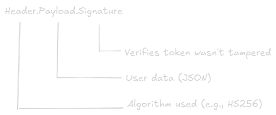
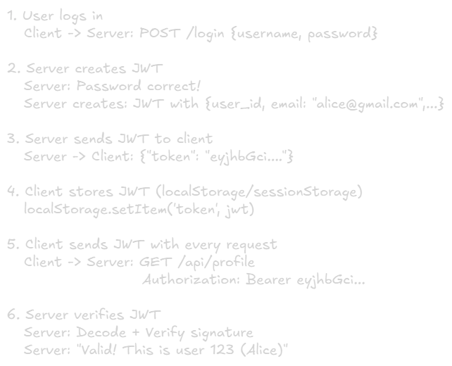

Cookies, Sessions & Authentication
======

## The Stateless Problem
**HTTP is stateless**: the server doesn't remember you between requests.

### The Problem Visualized


**Solution**? We need a way to "remember" the user.

### Analogy
Imagine going to a theme park:
- **No memory system**: You buy a ticket, enter. Next ride, guard asks for ticket again (you already thew it away!).
- **With memory (wristband)**: You get a wristband at entrance. Show it at every ride -> guard knows you paid.

**Wristband = Cookie/Token** 


## Cookies (The Browser's Memory)
A **cookie** is a small piece of data stored in your browser, sent with every request to the same domain.

### How Cookies Work
#### Step 1: Server Sets Cookie
```http
HTTP/1.1 200 OK
Set-Cookie: user_id=12345; HttpOnly; Secure
Set-Cookie: theme=dark; Max-Age=86400

<html>...</html>
```

#### Step 2: Browser Stores Cookie
```http
Browser stores:
- user_id=12345
- theme=dark
```

#### Step 3: Browser Sends Cookie Automatically
```http
GET /profile HTTP/1.1
Host: example.com
Cookie: user_id=12345; theme=dark
```

### Visual Flow


### Cookie Attributes (Security is Critical!)
|Attribute|Purpose|Example|
|:--------|:------|:------|
|HttpOnly|JavaScript can't access (prevents XSS)|`Set-Cookie: id=123; HttpOnly`|
|Secure|Only sent over HTTPS|`Set-Cookie: id=123; Secure`|
|SameSite|CSRF protection|`SameSite=Strict` or `Lax`|
|Max-Age|Expiration time (seconds)|`Max-Age=86400`(1 day)|
|Domain|Which domains can access|`Domain=.example.com`|
|Path|Which paths can access|`Path=/api`|

### Security Example (Must Know!)
```http
BAD (Vulnerable):
Set-Cookie: session_id=abc123

GOOD (Secure):
Set-Cookie: session_id=abc123; HttpOnly; Secure; SameSite=Strict
```

### Real-World Cookies Uses
|Site|What Cookies Store|
|:---|:-----------------|
|Amazon|Shopping cart items (even when not logged in)|
|Youtube|Video watch history, preferences|
|Google|Login session, language preference|
|News sites|"Already read" article tracking|

### Cookie Trade-offs
|✅Pros|❌Cons|
|:------|:-----|
|Automatic (browser handles it)|Size limit (4KB per cookie)|
|Persistent (survives browser close)|Sent with EVERY request (overhead)|
|Server-side validation|Vulnerable if not secured properly|
|Works for traditional web apps|Privacy concerns (tracking)|


## Sessions (Server-Side Memory)
A **session** is server-side storage that remembers user state.

### How Sessions Work


### Session Storage Options
|Storage|Speed|Scalability|Persistence|
|:------|:----|:----------|:----------|
|In-Memory|⚡ Fastest|❌ Single server only|Lost on restart|
|Redis|Very Fast|✅ Shared across servers|✅ Persistent|
|Database|Slower|✅ Shared|✅ Persistent|
|Memcached|Fast|✅ Shared|❌ Not persistent|

### Real-World Session Example (E-commerce)
```javaScript
{
  session_id: "xyz789",
  user: {
    id: 123,
    email: "bob@example.com",
    role: "customer"
  },
  cart: [
    { product_id: 456, quantity: 2 },
    { product_id: 789, quantity: 1 }
  ],
  created_at: "2024-01-15T10:00:00Z",
  expires_at: "2024-01-15T22:00:00Z"
}
```
#### Why this matters:
- User's cart persist across pages.
- Even if user closes browser, cart saved (until expiration).
- Multiple servers can access same session (via Redis).

### Session vs Cookies: What's the Difference?
|Aspect|Cookie|Session|
|:-----|:-----|:------|
|Storage Location|Client (browser)|Server (memory/Redis)|
|Security|Less secure (client-side)|More secure (server-side)|
|Size Limit|4KB|No limit|
|Access|JavaScript can read (unless HttpOnly)|Only server can read|
|Lifespan|Configurable (days/weeks)|Usually shorter (hours)|

### Analogy
- **Cookie**: Hotel key card (you carry it, shows room nubmer).
- **Session**: Hotel database (front desk knows your reservation details).

## Authentication vs Authorization

### Key Difference
|Concept|Question|Example|
|:------|:-------|:------|
|Authentication|"Who are you?"|Login with username/password|
|Authorization|"What can you do?"|Admin can delete posts, user cannot|

### Visual Flow


### Real-World Example (Google Drive)


## JWT (JSON Web Token) - Modern Authentication
**JWT** is a self-contained token that stores user info **inside the token itself**.

### Structure of JWT


#### Decoded JWT Example
```json
// Header
{
  "alg": "HS256",
  "typ": "JWT"
}

// Payload (Your Data)
{
  "user_id": 123,
  "email": "alice@example.com",
  "role": "admin",
  "exp": 1705334400  // Expiration timestamp
}

// Signature (Prevents Tampering)
HMACSHA256(
  base64UrlEncode(header) + "." + base64UrlEncode(payload),
  secret_key
)
```

### How JWT Works


### JWT vs Session Comparison
|Feature|Session + Cookie|JWT|
|:------|:---------------|:--|
|Storage|Server (Redis)|Client (localStorage)|
|Scalability|Needs shared Redis|✅ Stateless (no server storage)|
|Security|✅ Server controls|Can't revoke easily|
|Size|4KB cookie|Larger (1-2KB token)|
|Expiration|Server controls|Must wait for expiry|
|Use Case|Traditional web apps|APIs, microservices, SPAs|

#### notes
- SPAs: Single Page Applications (ex: Gmail, Google Docs, Facebook, Twitter Web, Notion).
- Size: JWTs are larger (around 1-2KB) because they contain an encoded header, payload, and signature. Unlike a simple session ID, which is only a few bytes, but they're still smaller than the 4KB cookie storage limit.

### JWT Security Best Practice

#### ✅DO
- Store JWT in HttpOnly cookie (best) or sessionStorage.
- Use HTTPS only.
- Set short expiration (15-30 min).
- Implement refresh tokens.

#### ❌DON'T
- Store JWT in localStorage (XSS vulnerable).
- Put sensitive data in payload (it's readable!).
- Use weak secret keys.
- Skip expiration check.

### Real-World JWT Users
|Company|Why JWT?|
|:------|:-------|
|Auth0|Authentication service (JWT-based)|
|Firebase|Mobile/web auth (JWT tokens)|
|Stripe|API authentication|
|GitHub API|OAuth flow uses JWT|
|Microservices|Stateless auth across services|

## OAuth 2.0 (Third-Party Login)

**OAuth** lets user log in with Google/Facebook/GitHub without sharing passwords.

### Analogy
You want to print photos at a shop:
- **Bad way**: Give shop your phone password (risky!).
- **Good way (OAuth)**: Shop asks permission to access only photos (limited access).

### OAuth Flow ("Sign in with Google")


### Visual OAuth Flow


### OAuth Roles
|Role|Description|Example|
|:---|:----------|:------|
|Resource Owner|The User|You|
|Client|App requesting access|Your website|
|Authorization Server|Grants tokens|Google/Facebook|
|Resource Server|Stores user data|Google's servers|

### Real-World OAuth Examples
|App|OAuthProvider|What Access?|
|:--|:------------|:-----------|
|Spotify|Login with Facebook|Name, email, friend list|
|Canva|Login with Google|Email, Profile picture|
|Medium|Login with Twitter|Username, email|
|Netlify|Login with GitHub|Repo access (for deployment)|

### OAuth Trade-offs
|Pros|Cons|
|:---|:---|
|User doesn't create new password|Dependency on third-party|
|Less friction (quick signup)|Privacy concernc (data shared)|
|Secure (Google handles auth)|Complexity to implement|
|Social features (import firends)|User locked out if provider down|