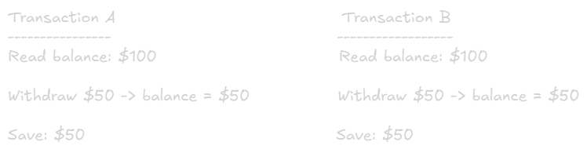

ACID vs BASE
===

## Why This Matters in System Design
The choice between ACID nad BASE affects:
- **Availability** - Can users access the system during failures?
- **Consistency** - Do all users see the same data?
- **Performance** - How fast can the system response?
- **Scalability** - How easily can the system grow?

**Core Trade-off:** Strong consistency vs High availability

# ACID (SQL Databases)
**ACID = Atomicity, Consistency, Isolation, Durability**

Used by: PostgreSQL, MySQL, Oracle, SQL Server

## A - Atomicity
**Concept:** All or nothing. Transaction succeeds completely or fails completely

**Example:**
```sql
BEGIN TRANSACTION;
  UPDATE accounts SET balance = balance - 100 WHERE id = 1;
  UPDATE accounts SET balance = balance + 100 WHERE id = 2;
COMMIT;

-- If either statement fails, BOTH are rolled back
-- Money is never lost or created
```

### Real-World Scenario
- Bank transfer: Debit and credit must both succeed
- E-commerce: Reduce inventory AND create order
- Booking: Reserve seat AND charge customer

### What Happens Without Atomicity:
- Money debited but not credited (lost money)
- Inventory reduced but order failed (lost sale)
- Seat reserved but payment failed (blocked seat)

## C - Consistency
**Concept:** Databse is always in a valid state. All rules/constraint are enforced

**Example:**
```sql
-- Constraint: Balance cannot be negative
ALTER TABLE accounts 
ADD CONSTRAINT positive_balance CHECK (balance >= 0);

-- This transaction will be REJECTED
BEGIN TRANSACTION;
  UPDATE accounts SET balance = balance - 1000 WHERE id = 1;
  -- If balance < 1000, transaction fails
COMMIT;
```

### Consistency Rules:
- Foreign key constraints
- Unique constraints
- Check constraints
- Trigger validations

### Real-World Scenario:
- Cannot delete user if they have active orders
- Email must be unique
- Age must be positive
- Total must equal sum of items

## I - Isolation
**Concept:** Concurrent transactions don't interfere with each other.

**Problem Without Isolation:**


**Result:** Both withdrawals succeed, but balance is $50 (should be $0)

### Isolation Levels
From weakest to strongest:

#### 1. Read Uncommitted (Rarely used)
- Can read uncommitted data form other transactions
- Dirty reads allowed
- Fastest but most dangerous

#### 2. Read Committed (Default in most databases)
- Only reads committed data
- Prevents dirty reads
- Most common for web applications

#### 3. Repeatable Read
- Same read within a transaction returns same result
- Prevents dirty reads and non-repeatable reads
- Good for reports

#### 4. Serializable (strongest)
- Full isolation, transactions appear to run sequentially
- Prevents all anomalies
- Slowest, use for critical financial transactions

#### Example Choosing Isolatioun Level:
```sql
-- Read Committed (default)
SET TRANSACTION ISOLATION LEVEL READ COMMITTED;

-- Serializable (for critical operations)
BEGIN TRANSACTION ISOLATION LEVEL SERIALIZABLE;
  -- Money transfer logic
COMMIT;
```

#### Common Isolation Problems
1. **Dirty Read**
    - Reading ucommitted data
    - Soved by: Read Committed or higher

2. Non-Repeatable Read
    - Same query returns different results within transaction
    - Solved by: Repeatable Read or higher

3. Phantom Read
    - New rows appear in repeated range queries
    - Solved by: Serialiable

## D - Durability
**Concept:** Once committed, data persists even if system crashes

**Implementation:**
- **Write-Ahead Log (WAL)** - Changes logged before applied
- **Replication** - Data copied to multiple servers
- **backups** - Regular snapshots

### Example
```sql
BEGIN TRANSACTION;
  INSERT INTO orders VALUES (...);
COMMIT;  -- At this point, order is guaranteed to persist

-- Even if server crashes immediately after COMMIT,
-- order data will survive
```

### Real-World Importance:
- Financial transactions cannot be lost
- User registrations must persist
- Orders must be recorded
- Audit logs must survive crashes