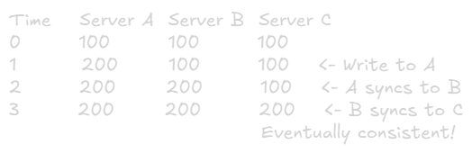
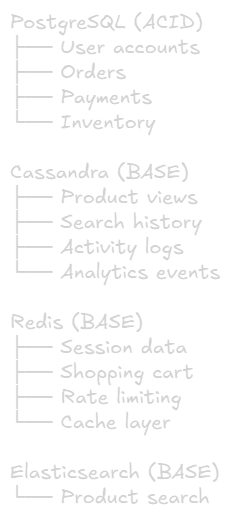
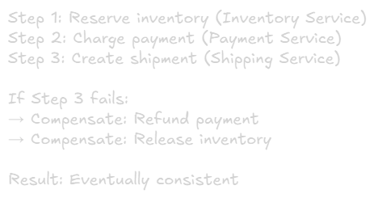

ACID vs BASE
===

## Why This Matters in System Design
The choice between ACID nad BASE affects:
- **Availability** - Can users access the system during failures?
- **Consistency** - Do all users see the same data?
- **Performance** - How fast can the system response?
- **Scalability** - How easily can the system grow?

**Core Trade-off:** Strong consistency vs High availability

# ACID (SQL Databases)
**ACID = Atomicity, Consistency, Isolation, Durability**

Used by: PostgreSQL, MySQL, Oracle, SQL Server

## A - Atomicity
**Concept:** All or nothing. Transaction succeeds completely or fails completely

**Example:**
```sql
BEGIN TRANSACTION;
  UPDATE accounts SET balance = balance - 100 WHERE id = 1;
  UPDATE accounts SET balance = balance + 100 WHERE id = 2;
COMMIT;

-- If either statement fails, BOTH are rolled back
-- Money is never lost or created
```

### Real-World Scenario
- Bank transfer: Debit and credit must both succeed
- E-commerce: Reduce inventory AND create order
- Booking: Reserve seat AND charge customer

### What Happens Without Atomicity:
- Money debited but not credited (lost money)
- Inventory reduced but order failed (lost sale)
- Seat reserved but payment failed (blocked seat)

## C - Consistency
**Concept:** Databse is always in a valid state. All rules/constraint are enforced

**Example:**
```sql
-- Constraint: Balance cannot be negative
ALTER TABLE accounts 
ADD CONSTRAINT positive_balance CHECK (balance >= 0);

-- This transaction will be REJECTED
BEGIN TRANSACTION;
  UPDATE accounts SET balance = balance - 1000 WHERE id = 1;
  -- If balance < 1000, transaction fails
COMMIT;
```

### Consistency Rules:
- Foreign key constraints
- Unique constraints
- Check constraints
- Trigger validations

### Real-World Scenario:
- Cannot delete user if they have active orders
- Email must be unique
- Age must be positive
- Total must equal sum of items

## I - Isolation
**Concept:** Concurrent transactions don't interfere with each other.

**Problem Without Isolation:**


**Result:** Both withdrawals succeed, but balance is $50 (should be $0)

### Isolation Levels
From weakest to strongest:

#### 1. Read Uncommitted (Rarely used)
- Can read uncommitted data form other transactions
- Dirty reads allowed
- Fastest but most dangerous

#### 2. Read Committed (Default in most databases)
- Only reads committed data
- Prevents dirty reads
- Most common for web applications

#### 3. Repeatable Read
- Same read within a transaction returns same result
- Prevents dirty reads and non-repeatable reads
- Good for reports

#### 4. Serializable (strongest)
- Full isolation, transactions appear to run sequentially
- Prevents all anomalies
- Slowest, use for critical financial transactions

#### Example Choosing Isolatioun Level:
```sql
-- Read Committed (default)
SET TRANSACTION ISOLATION LEVEL READ COMMITTED;

-- Serializable (for critical operations)
BEGIN TRANSACTION ISOLATION LEVEL SERIALIZABLE;
  -- Money transfer logic
COMMIT;
```

#### Common Isolation Problems
1. **Dirty Read**
    - Reading ucommitted data
    - Soved by: Read Committed or higher

2. Non-Repeatable Read
    - Same query returns different results within transaction
    - Solved by: Repeatable Read or higher

3. Phantom Read
    - New rows appear in repeated range queries
    - Solved by: Serialiable

## D - Durability
**Concept:** Once committed, data persists even if system crashes

**Implementation:**
- **Write-Ahead Log (WAL)** - Changes logged before applied
- **Replication** - Data copied to multiple servers
- **backups** - Regular snapshots

### Example
```sql
BEGIN TRANSACTION;
  INSERT INTO orders VALUES (...);
COMMIT;  -- At this point, order is guaranteed to persist

-- Even if server crashes immediately after COMMIT,
-- order data will survive
```

### Real-World Importance:
- Financial transactions cannot be lost
- User registrations must persist
- Orders must be recorded
- Audit logs must survive crashes


# BASE (NoSQL Databases)

**BASE = Basically Available, Soft state, Eventually consistent**

Used by: Cassandra, DynamoDB, MongoDB, CoucDB

## Basically Available

**Concept:** System appears to work most of the time, even during failures

### Characteristics:
- Prioritizes availability over consistency
- Partial failures are acceptable
- Degraded performance is OK

### Example:
- Facebook: You can still post even if some features are down
- Amazon: Shopping cart works even if recommendations are slow
- Twitter: Tweets visible even if likes count is delayed

### Trade-off:
- 99.99% availability
- Users might see stale data
- Better than system being completely down

## Soft State

**Concept:** State can change over time without input  (due to eventualy consistency)

### Characteristics:
- Data may be stale temporarily
- Background processes sync data
- No guarantees on read consistency

### Example:
- Cache expiration (data becomes stale)
- DNS propagation (takes time to update globally)
- CDN updates (edge servers sync eventually)

## Eventually Consistent

**Concept:** Given enough time without updates, all replicas converge to the same value.

### Example Timeline:


### Real-World Examples:

#### Instagram Likes:


#### Twitter Follower Count:


#### DNS Updates:


# ACID vs BASE Comparison

|Aspect|ACID|BASE|
|-|-|-|
|Consistency|Strong, immediate|Eventual (seconds/minutes)|
|Availability|May sacrifice for consistency|Prioritized always|
|Performance|Slower (locking coordination)|Faster (optimistic)|
|Scalability|Vertical (limited)|Horizontal(inlimited)|
|Complexity|Simpler application logic|Complex conflict resolution|
|Use Case|Financial, critical data|Social media, analytics|
|Guarantees|Strict|Relaxed|
|Failures|Transaction rollback|Retry, reconciliation|

# When to Use ACID
### 1. Financial Transaction
Money transfers, payments, refunds
- Need: Atomicity, no money lost/created
- Database: PostgreSQL, MySQL

### 2. Inventory management'
Product stock, prevent overselling
- Need: Consistency, accurate counts
- Database: PostgreSQL with row locking

### 3. User Authentication
Login, permissions, account management
- Need: Consistency, security critical
- Database: PostgreSQL, MySQL

### 4. Booking Systems
Hotel rooms, flight seats, appointments
- Need: Prevent double booking
- Database: PostgreSQL with transactions

### 5. Healthcare Records
Patient data, percriptions, medical history
- Need: Accuracy, audit trail
- Database: PostgreSQL with strict ACID

\
**Pattern:** Strong consistency > High availability

# When to USE BASE

### 1. Social Media Feeds
Posts, likes, comments
- Slight delay acceptable
- Database: Cassandra, MongoDB 

### 2. Analytics Dashboards
Metrics, statistics, aggregations
- Eventual accuracy is fine
- Database: Cassandra, ClickHouse

### 3. logging Systems
Application logs, metrics, traces
- Availability critical, consistency less so
- Database: Elasticsearch, Cassandra

### 4. Shopping Cart
Add/remove items (not checkout)
- Temporary inconsistency tolerable
- Database: Redis, DynamoDB

### 5. Recommendation Engines
Product suggestions, content recommendations
- Not mission-critical
- Database: MongoDB, DynamoDB

\
**Pattern:** High availability > Strong consistency

# Hybrid Approaches
Real-World systems often use **both** ACID and BASE

### Example: E-commerce Platform


# Saga Pattern (Distributed Transactions)

For distributed systems that need transaction-like behavior without ACID.

### Example: Order Processing


### Characteristics:
- Multiple service coordinate
- Each step is a local ACID transaction
- Compensating actions for failures
- Eventually consistent overall

# Real-World Examples

## Netflix
|Component|Consistency Model|Database|
|-|-|-|
|Billing|ACID|MySQL
|User profiles|ACID|MySQL
|Viewing history|BASE|Casandra
|Recommendations|BASE|Casandra
|Search index|BASE|Elasticsearch

### Reasoning:
- Billing must be accurate (money involved)
- viewing history can tolerate delays
- Recommendations don't need real-time accuracy

## Uber
|Component|Consistency Model|Database|
|-|-|-|
|Payments|ACID|PostgreSQL
|Trip records|ACID|PostgreSQL
|Driver locations|BASE|Redis, Cassandra
|Surge pricing|BASE|In-memory
|Analytics|BASE|Hadoop

### Reasoning:
- Payment critical (financial)
- Location tracking needs high availability
- Analytics can be eventually consistent

## Instagram
|Component|Consistency Model|Database|
|-|-|-|
|User accounts|ACID|PostgreSQL
|Direct messages|ACID|PostgreSQL
|Feed posts|BASE|Cassandra
|Likes/comments|BASE|Cassandra
|Stories|BASE|Cassandra (24h TTL)

### Reasoning:
- User data msut be consistent
- Feed can tolerate slight delays
- Stories expire anyway (eventual consistency fine)

# Decision Framework

## Question to Ask

### 1. What happens if user sees stale data?
- Critical issue -> ACID
- Minor annoyance -> BASE

### 2. Is availability more important than consistency?
- Yes -> BASE
- No -> ACID

### 3. Do you need to scale horizontally?
- Yes, massively -> BASE
- Vertical scaling OK -> ACID

### 4. Are there financial/legal implications?
- Yes -> ACID
- No -> BASE acceptable

### 5. What's the traffic volume?
- < 10K requests/sec -> ACID likely fine
- 100K request/sec -> Consider BASE

### 6. Can buseiness logic handle eventual consistency?
- Yes -> BASE
- No -> ACID

# Common Misconceptions

## ❌"NoSQL = No Consistency"
- NoSQL can provide consistency (configurable)
- Example: MongoDB with majority writes

## ❌"ACID = Cannot Scale"
- Modern SQL databases can scale (read replicas, sharding)
- Just harder than NoSQL

## ❌"BASE = Always Better for Performance"
- Not true for complex queries
- SQL often faster for joins, aggregations

## ❌"You Must Choose One"
- Most systems use both (polyglot persistence)
- Use the right tool for each job

# Key Takeways
1. **ACID:** Strong consistency, critical data, transactions
2. **BASE:** High availability, scale, eventual consistency
3. **Trade-off:** Consistency vs Availability (CAP Theorem)
4. **Hybrid:** Most large systems use both approaches
5. **Decision:** Based on business requirements, not technology hype

## Remember:
- Start with ACID (SQL) unlkess you have specific reasons not to
- Add BASE (NoSQL) when scaling demands it
- Use polyglot persistence for complex systems