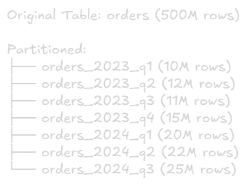
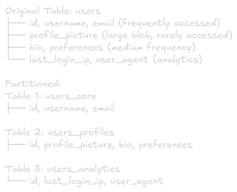
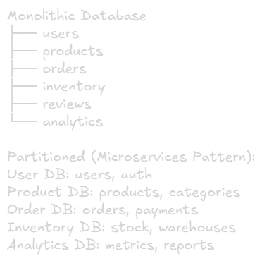
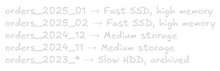
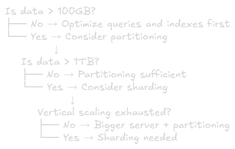

Partitioning Strategies
===

# What is Partitioning
**Definition:** Dividing a large table into smaller, more manageable pieces within the same database instance.

## Key Difference from Sharding:
- **Partitioning:** Within single database server (logical split)
- **Sharding:** Across multiple database servers (physical split)

## Analogy:
- **Partitioning:** Organizing file into folders on your computer
- **Sharding:** Spreading files across multiple computers

# Why Partition?
## Problem with Large Tables

### Problem 1: Slow Queries
```sql
-- Table with 500 million rows
SELECT * FROM orders WHERE order_date = '2025-01-15';
→ Even with index, scanning millions of rows
```

### Problem 2: Maintenance Overhead
```sql
-- Vacuum/analyze takes hours
VACUUM orders;
→ Locks table, affects production
```

### Problem 3: Index Size
500M rows x 100 bytes/row = 50GB table Indexes: 20GB
→ Indexes don't fit in memory, slow lookups

## Benefits of Partitioning
✅ **Query Performance:** Scan only relevant partitions (partition pruning)\
✅ **Easier Maintenance:** Operations on smaller chunks\
✅ **Better Compression:** Archive old data efficiently\
✅ **Faster Backups:** Backup individual partitions\
✅ **Data Lifecycle:** Drop old partitions instead of DELETE

# Types of Partitioning

## 1. Horizontal Partitioning (Most Common)
**Concept:** Split table by rows based on a key

### Example: Orders by Date


### Query Before:
```sql
SELECT * FROM orders WHERE order_date = '2024-05-15';
→ Scans 500M rows
```

### Query After (Partition Pruning):
```sql
SELECT * FROM orders WHERE order_date = '2024-05-15';
→ Only scans orders_2024_q2 partition (22M rows)
→ 95% fewer rows scanned!
```

## 2. Vertical Partitioning
**Concept:** Split table by columns

### Example: User Table


### Benefits:
- Smaller tables → Better cache hit rate
- Separate hot data (frequently accessed) from cold data
- Better I/O performance

**Trade-off:** Need JOIN to get full user data

## 2. Functional Partitioning
**Concept:** Split by business function or domain

### Example: E-commerce


### Benefits:
- Independent scaling
- Team ownership
- Technology flexibility
- Failure isolation

**This is often the first step toward microservices**

# Horizontal Partitioning Strategies

## 1. Range Partitioning
**Concept:** Partition by value ranges

### Example: By Date
```sql
-- PostgreSQL
CREATE TABLE orders (
    order_id BIGINT,
    order_date DATE,
    customer_id INT,
    total DECIMAL
) PARTITION BY RANGE (order_date);

CREATE TABLE orders_2023_q1 PARTITION OF orders
    FOR VALUES FROM ('2023-01-01') TO ('2023-04-01');

CREATE TABLE orders_2023_q2 PARTITION OF orders
    FOR VALUES FROM ('2023-04-01') TO ('2023-07-01');

CREATE TABLE orders_2023_q3 PARTITION OF orders
    FOR VALUES FROM ('2023-07-01') TO ('2023-10-01');
```

### Query:
```sql
SELECT * FROM orders WHERE order_date = '2023-05-15';
→ Only checks orders_2023_q2 partition
```

### Range Partitioning: Pros & Cons
#### Advantages: 
✅ Perfect for time-series data\
✅ Easy to add new partitions (e.g., new month)\
✅ Easy to drop old data (DROP old partition)\
✅ Partition pruning very efficient

#### Disadvantages:
❌ Can have uneven distribution\
❌ Recent partitions may be hotspots\
❌ Requires manual partition management

### Use Cases:
- Log tables (by date)
- Order history (by order_date)
- Event data (by event_time)
- Financial transactions (by transaction_date)

## 2. List Partitioning
**Concept:** Partition by specific values

### Example: By Country
```sql
-- PostgreSQL
CREATE TABLE users (
    user_id BIGINT,
    username VARCHAR,
    country_code VARCHAR
) PARTITION BY LIST (country_code);

CREATE TABLE users_us PARTITION OF users
    FOR VALUES IN ('US');

CREATE TABLE users_eu PARTITION OF users
    FOR VALUES IN ('GB', 'FR', 'DE', 'IT', 'ES');

CREATE TABLE users_asia PARTITION OF users
    FOR VALUES IN ('JP', 'KR', 'CN', 'SG', 'IN');

CREATE TABLE users_other PARTITION OF users
    DEFAULT;
```

### Query:
```sql
SELECT * FROM users WHERE country_code = 'US';
→ Only checks users_us partition
```

### List Partitioning: Pros & Cons
#### Advantages:
✅ Good for categorical data\
✅ Geographic data locality\
✅ Easy to understand mapping

#### Disadvantages:
❌ Uneven distribution possible\
❌ Need to update when adding new values\
❌ Limited to discrete values

### Use Cases:
- Multi-tenant applications (by tenant_id)
- Geographic distribution (by region/country)
- Status-based partitioning (active, archived, deleted)
- Product categories

## 3. Hash Partitioning
**Concept:** Use hash function to distribute data evenly.

### Example: By User ID
```sql
-- PostgreSQL
CREATE TABLE user_sessions (
    session_id BIGINT,
    user_id BIGINT,
    login_time TIMESTAMP
) PARTITION BY HASH (user_id);

CREATE TABLE user_sessions_p0 PARTITION OF user_sessions
    FOR VALUES WITH (MODULUS 4, REMAINDER 0);

CREATE TABLE user_sessions_p1 PARTITION OF user_sessions
    FOR VALUES WITH (MODULUS 4, REMAINDER 1);

CREATE TABLE user_sessions_p2 PARTITION OF user_sessions
    FOR VALUES WITH (MODULUS 4, REMAINDER 2);

CREATE TABLE user_sessions_p3 PARTITION OF user_sessions
    FOR VALUES WITH (MODULUS 4, REMAINDER 3);
```

### Distribution:
user_id = 12345 → hash(12345) % 4 = 1 → user_sessions_p1\
user_id = 67890 → hash(67890) % 4 = 2 → user_sessions_p2

### Hash Partitioning: Pros & Cons
#### Advantages:
✅ Even data distribution\
✅ No hotspot\
✅ Automatic balancing

#### Disadvantages:
❌ Range queries require all partitions\
❌ Repartitioning is difficult\
❌ Less intuitive for queries

### Use Cases:
- Even distribution needed
- No natural partitioning key
- Load balancing critical
- User data (when no geographic grouping)

## 4. Composite Partitioning
**Concept:** Combine multiple partitioning strategies

### Example: Range + Hash
```sql
-- First partition by year (range)
-- Then sub-partition by hash

CREATE TABLE events (
    event_id BIGINT,
    event_time TIMESTAMP,
    user_id BIGINT
) PARTITION BY RANGE (event_time);

-- 2024 partition, sub-partitioned by hash
CREATE TABLE events_2024 PARTITION OF events
    FOR VALUES FROM ('2024-01-01') TO ('2025-01-01')
    PARTITION BY HASH (user_id);

CREATE TABLE events_2024_p0 PARTITION OF events_2024
    FOR VALUES WITH (MODULUS 4, REMAINDER 0);

CREATE TABLE events_2024_p1 PARTITION OF events_2024
    FOR VALUES WITH (MODULUS 4, REMAINDER 1);
```

### Benefits:
- Combine advantages of both strategies
- Time-based archiving + even distribution

# Implementing Partitioning

## PostgreSQL Example: Order Table
```sql
-- Create parent table
CREATE TABLE orders (
    order_id BIGINT NOT NULL,
    customer_id BIGINT,
    order_date DATE NOT NULL,
    status VARCHAR(20),
    total DECIMAL(10,2)
) PARTITION BY RANGE (order_date);

-- Create indexes on parent (inherited by all partitions)
CREATE INDEX idx_orders_customer ON orders(customer_id);
CREATE INDEX idx_orders_status ON orders(status);

-- Create partitions for each quarter
CREATE TABLE orders_2024_q1 PARTITION OF orders
    FOR VALUES FROM ('2024-01-01') TO ('2024-04-01');

CREATE TABLE orders_2024_q2 PARTITION OF orders
    FOR VALUES FROM ('2024-04-01') TO ('2024-07-01');

CREATE TABLE orders_2024_q3 PARTITION OF orders
    FOR VALUES FROM ('2024-07-01') TO ('2024-10-01');

CREATE TABLE orders_2024_q4 PARTITION OF orders
    FOR VALUES FROM ('2024-10-01') TO ('2025-01-01');

-- Insert works transparently
INSERT INTO orders VALUES (1, 100, '2024-05-15', 'completed', 99.99);
-- Automatically goes to orders_2024_q2

-- Query with partition pruning
EXPLAIN SELECT * FROM orders WHERE order_date = '2024-05-15';
-- Shows only orders_2024_q2 is scanned
```

## MySQL Example: Log Table
```sql
-- Create partitioned table
CREATE TABLE logs (
    log_id BIGINT AUTO_INCREMENT,
    log_time TIMESTAMP,
    level VARCHAR(20),
    message TEXT,
    PRIMARY KEY (log_id, log_time)
) PARTITION BY RANGE (UNIX_TIMESTAMP(log_time)) (
    PARTITION p_2024_01 VALUES LESS THAN (UNIX_TIMESTAMP('2024-02-01')),
    PARTITION p_2024_02 VALUES LESS THAN (UNIX_TIMESTAMP('2024-03-01')),
    PARTITION p_2024_03 VALUES LESS THAN (UNIX_TIMESTAMP('2024-04-01')),
    PARTITION p_future VALUES LESS THAN MAXVALUE
);

-- Add new partition
ALTER TABLE logs ADD PARTITION (
    PARTITION p_2024_04 VALUES LESS THAN (UNIX_TIMESTAMP('2024-05-01'))
);

-- Drop old partition (instant, no DELETE needed)
ALTER TABLE logs DROP PARTITION p_2024_01;
```

# Partition Pruning
**Definition:** Database optimizer eliminates partitions that don't contain relevant data

## Example:
```sql
-- Query
SELECT * FROM orders WHERE order_date = '2024-05-15';

-- Without Partition Pruning
Check orders_2024_q1 → No match
Check orders_2024_q2 → Found! (still checks others)
Check orders_2024_q3 → No match
Check orders_2024_q4 → No match

-- With Partition Pruning
order_date '2024-05-15' → Q2 only
→ Skip all other partitions
→ Only scan orders_2024_q2
```

## Performance Impact:
1 billion rows across 20 partitions\
**Without pruning:** Scan 1 billion rows\
**With pruning:** Scan 50 million rows (1 partition)\
→ 20x faster!

# Partition Management Strategies

## Strategy 1: Automatic partition Creation
### Use pg_partman (PostgreSQL Extension)
```sql
-- 1) Install the extension (run once)
CREATE EXTENSION IF NOT EXISTS pg_partman;


-- 2) Create the parent table (example)
-- Note: order_date must exist and be indexed
CREATE TABLE orders (
    id BIGSERIAL PRIMARY KEY,
    order_date DATE NOT NULL,
    customer_id BIGINT,
    amount NUMERIC
) PARTITION BY RANGE (order_date);


-- 3) Register the table with pg_partman
-- native  = use PostgreSQL native partitioning
-- monthly = create 1-month partitions
SELECT partman.create_parent(
    p_parent_table := 'public.orders',
    p_control := 'order_date',
    p_type := 'native',
    p_interval := 'monthly'
);


-- 4) Configure retention
-- Example: keep only the last 3 months
UPDATE partman.part_config
SET retention = '3 months',
    retention_keep_table = false,   -- actually DROP old partitions
    retention_keep_index = false    -- drop their indexes too
WHERE parent_table = 'public.orders';


-- 5) Optional: configure premake (how many future partitions to generate)
-- Default is 4, but let’s say you want 6 future months pre-created
UPDATE partman.part_config
SET premake = 6
WHERE parent_table = 'public.orders';


-- 6) Run maintenance manually once (required)
SELECT partman.run_maintenance();


-- 7) Enable and schedule automatic maintenance
-- Install pg_cron extension (required before scheduling jobs)
CREATE EXTENSION IF NOT EXISTS pg_cron;

-- Schedule Partman maintenance job to run every 5 minutes
SELECT cron.schedule(
    'partman_maintenance_orders',     -- job name
    '*/5 * * * *',                    -- run every 5 minutes
    $$SELECT partman.run_maintenance();$$
);
```
### Benefits:
- No manual intervention
- Never runs out of partitions
- Automatic cleanup


## Strategy 2: Manual Partition Management
### Schedule Job:
```sql
-- Run monthly
DO $$
BEGIN
    -- Create next quarter's partition
    EXECUTE format(
        'CREATE TABLE IF NOT EXISTS orders_%s PARTITION OF orders 
         FOR VALUES FROM (%L) TO (%L)',
        to_char(CURRENT_DATE + interval '3 months', 'YYYY_Q'),
        date_trunc('quarter', CURRENT_DATE + interval '3 months'),
        date_trunc('quarter', CURRENT_DATE + interval '6 months')
    );
END $$;
```

## Strategy 3: Archive Old Partitions
### Instead of DELETE (slow):
```sql
-- Bad: Delete takes hours, generates huge WAL
DELETE FROM orders WHERE order_date < '2023-01-01';

-- Good: Detach partition (instant)
ALTER TABLE orders DETACH PARTITION orders_2022_q4;

-- Move to archive table
ALTER TABLE orders_2022_q4 RENAME TO orders_archive_2022_q4;

-- Or drop entirely
DROP TABLE orders_2022_q4;
```

### Benefits:
- Instant operation (vs hours for DELETE)
- No bloat, no WAL generation
- Can archive to cheap storage

# Querying Partitioned Tables

## Best Practices

### 1. Always Include Partition Key in WHERE
```sql
-- Good: Partition pruning works
SELECT * FROM orders 
WHERE order_date = '2024-05-15' AND customer_id = 100;

-- Bad: Scans all partitions
SELECT * FROM orders WHERE customer_id = 100;
```

### 2. Use Partition-Aligned Indexes
```sql
-- Create local index per partition (automatic in PostgreSQL)
CREATE INDEX idx_orders_customer ON orders(customer_id);
-- Each partition gets its own index
```

### 3. Avoid Cross-Partition Queries When Possible
```sql
-- Expensive: Touches many partitions
SELECT * FROM orders 
WHERE order_date BETWEEN '2023-01-01' AND '2024-12-31';

-- Better: Specific partition
SELECT * FROM orders WHERE order_date = '2024-05-15';
```

# Common Partitioning Patterns

## Pattern 1: Time-Series Data (Hot/Cold)

### Strategy:
- Recent data (hot): Keep in fast storage, query often
- Old data (cold): Move to slow storage, query rarely

### Implementation


### Operations:
```sql
-- Recent data stays hot
CREATE TABLE orders_2025_01 PARTITION OF orders
    FOR VALUES FROM ('2025-01-01') TO ('2025-02-01')
    TABLESPACE fast_ssd;

-- Old data moved to cold storage
ALTER TABLE orders_2023_12 SET TABLESPACE slow_hdd;
```

## Pattern 2: Multi-Tenant Saas

### Strategy:
Partition by tenant_id for isolation

### Operations:
```sql
CREATE TABLE tenant_data (
    id BIGINT,
    tenant_id INT,
    data JSONB
) PARTITION BY LIST (tenant_id);

-- Large tenants get dedicated partitions
CREATE TABLE tenant_data_1001 PARTITION OF tenant_data
    FOR VALUES IN (1001);

CREATE TABLE tenant_data_1002 PARTITION OF tenant_data
    FOR VALUES IN (1002);

-- Small tenants share partitions
CREATE TABLE tenant_data_small PARTITION OF tenant_data
    FOR VALUES IN (2001, 2002, 2003, ...);
```

### Benefits:
- Data isolation
- Per-tenant performance optimization
- Easy tenant migration
- Compliance (data residency)

## Pattern 3: Active vs Archived

### Strategy:
Separate active and archived data

### Operations:
```sql
CREATE TABLE users (
    user_id BIGINT,
    status VARCHAR
) PARTITION BY LIST (status);

CREATE TABLE users_active PARTITION OF users
    FOR VALUES IN ('active', 'pending');

CREATE TABLE users_archived PARTITION OF users
    FOR VALUES IN ('deleted', 'suspended');

-- Most queries only hit active partition
SELECT * FROM users WHERE status = 'active' AND user_id = 123;
```

# Partitioning vs Sharding: When to Use What
|Aspect|Partitioning|Sharding
|-|-|-
|Scope|Single database|Multiple databases
|Complexity|Low-Medium|High
|Scale Limit|Single server|Unlimited
|Use When|< 1TB, optimize first|> 1TB, vertical limit
|Cost|Low|High
|Transparency|Mostly transparent|Application changes

## Decision Flow:


# Partitioning Limitations

## Limitation 1: Foreign Keys
### Problem:
```sql
-- This often doesn't work with partitioning
ALTER TABLE order_items
    ADD FOREIGN KEY (order_id) REFERENCES orders(order_id);
```
### Workaround:
- Enforce in application logic
- Use triggers
- Not partition the referenced table

## Limitation 2: Unique Constraints
### Problem:
```sql
-- Unique constraint must include partition key
ALTER TABLE orders ADD UNIQUE (order_id, order_date);
-- order_date is partition key, so this works

-- This fails (missing partition key)
ALTER TABLE orders ADD UNIQUE (order_id);
```

## Limitation 3: Global Indexes
### Problem:
Some database don't support global indexes across all partitions
### Impact:
- Index on non-partition key requires scanning all partition indexes
- Can slow down queries

# Key Takeaways
1. **Partitioning First:** Try partitioning before sharding
2. **Time-Series:** Range partitioning is perfect for date/time data
3. **Partition Pruning:** Always include partition key in WHERE clause
4. **Maintenance:** Drop old partitions instead of DELETE
5. **Monitoring:** Track per-partition metrics
6. **Plan Ahead:** Automate partition creation/archival
7. **Complexity Trade-off:** Adds complexity, but huge performance gains

## Progression:
1. Single table → Add indexes
2. Still Slow → Add partitioning
3. Single server limit → Add sharding
4. Global Scale → Add replication + sharding