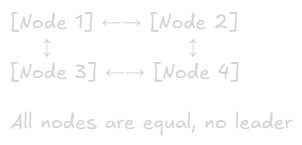

Replication
===

# What is Replication?
**Definition:** Keeping copies of the same data on multiple servers/nodes.

## Core Benefits:
- **High Availability** - System stays up if one server fails
- **Fault Tolerance** - Data survives hardware failures
- **Performance** - Read queries distributed across replicas
- **Geographic Distribution** - Data closer to users globally

# Why Replication Matters in System Design

## Scenario Without Replication
Single Database Server\
├── All reads go here\
├── All writes go here\
└── If this fails → Entire system down

### Problems:
- Single point of failure
- Limited read capacity
- High latency for distant users
- Disaster recovery is difficult

## Scenario With Replication
Primary Database (writes)\
├── Replica 1 (reads - US East)\
├── Replica 2 (reads - US West)\
├── Replica 3 (reads - Europe)\
└── Replica 4 (reads - Asia)

### Benefits:
- No single point of failure
- Distribute read load
- Low latency globally
- Easy backups and disaster recovery

# Replication Strategies

## 1. Single-Leader Replication (Master-Slave)

### Architecture:

### How It Works:
1. All wrtites go to the leader
2. Leader logs changes to replication log
3. Follower pull changes and apply them
4. Reads can go to any follower

### Replication Methods:

#### a) Synchronous Replication
Client → Write to Leader → Wait for all followers to confirm → Respond to client

- **Pros:** Strong consistency, no data loss
- **Cons:** Slower writes, leader waits for slowest follower
- **Use:** Critical data (financial transactions)

#### b) Asynchronous Replication
Client → Write to Leader → Respond immediately → Followers sync later

- **Pros:** Fast writes, leader doesn't wait 
- **Cons:** Potential data loss if leader fails, eventual consistency
- **Use:** Most web applications (default MySQL, PostgreSQL)

#### c) Semi-Synchronous (Hybrid)
Wait for at least 1 follower, rest async

- **Pros:** Balance between speed and safety 
- **Cons:** More complex
- **Use:** Production systems with good balance

### Pros & Cons of Single-Leader

#### Advantages:
✅Simple to understand and implement\
✅Easy to scale reads (add more followers)\
✅Consistent writes (single source of truth)\
✅Built-ain to most databases

#### Disadvantages
❌Single point of failure for writes\
❌Follower can have stale data (replication lag)\
❌Cannot scale writes (all go to one leader)\
❌Failover can be complex

### Use Cases:
- Most web applications
- Read-heavy workloads
- When strong consistency for reads is not critical
- Examples: Instagram feeds, Twitter timelines, e-commerce product listings

### Popular Implementation
- MySQL (Master-Slave replication)
- PostgreSQL (Streaming replication)
- MongoDB (Replice Sets with primary)

## 2. Multi-Leader Replication (Master-Master)

### Architecture:

### How It Works:
1. Multiple nodes accept writes
2. Each leader replicates to others
3. Writes propagate to all leaders
4. Conflict resolution needed

### Conflict Example:
User A (US) updates price to $10\
User B (EU) updates price to $15\
→ Both leaders accept writes\
→ Conflict! Which value wins?

### Conflict Resolution Strategies:

#### a) Last Write Wins (LWW)
Compare timestamp, keep latest → Simple but can lose data

#### b) Application-Level Resolution
Application decides based on business logic → Most flexible but complex

#### c) Merge Values
Combine both changes if possible → Example: Shopping cart (merge items)

### Pro & Cons of Multi-Leader
#### Advantages:
✅ Better performance for globally distributed writes\
✅ Can write to nearest leader (low latency)
✅ Resilient to datacenter failures
✅ Better write scalability

#### Disadvantages
❌ Complex conflict resolution
❌ Eventual consistency (writes take time to propagate)
❌ Data conflicts can occur
❌ Harder to reason about

### Use Cases:
- Multi-datacenter deployments
- Offline-first application (mobile apps)
- Collaborative editing tools
- Examples: Google Docs, CouchDB apps, Notion

### Popular Implementation
- MySQL (with MySQL Group Replication)
- PostgreSQL (BDR - Bi-Directional Replication)
- CouchDB (built-in multi-leader)

## 3. Leaderless Replication (Peer-to-Peer)

### Architecture:

### How It works:
1. Client writes to multiple nodes in parallel
2. Read from multiple nodes and reconcile
3. Use quorum to determine success

### Quorum Configuration:
N = Total replicas (e.g., 3)\
W = Write quorum (e.g., 2)\
R = Read quorum (e.g., 2)

Rule: W + R > N guarantees consistency

### Example:
Write to 3 nodes:\
├── Node 1: Success\
├── Node 2: Success\
├── Node 3: Failed

W = 2, so write succeeds (2 out of 3)

### Read Repair:
Read from 3 nodes:\
├── Node 1: value = "hello" (v2)\
├── Node 2: value = "hello" (v2)\
├── Node 3: value = "hi" (v1)

Return "hello" (majority), update Node 3

### Pros & Cons of Leaderless

#### Advantages:
✅ High availability (no single leader)\ 
✅ No failover needed\
✅ Handles network partitions well\
✅ Good write scalability

#### Disadvantages:
❌ Eventual consistency\
❌ Complex client logic\
❌ Conflict resolution needed\
❌ Higher operational complexity

### Use Cases:
- High available systems (tolerates node failures)
- Distributed systems with partitioning
- Shopping carts, session stores
- Examples: Amazon DynamoDB, Cassandra

### Popular Implementation:
- Cassandra
- DynamoDB
- Riak

## Replication Strategies Comparison
|Aspect|Single-Leader|Multi-Leader|Leaderless|
|-|-|-|-|
|Consistency|Strong (on leader)|Eventual|Eventual|
|Write Scalability|Limited|Good|Excellent|
|Read Scalability|Excellent|Excellent|Goood|
|Complexity|simple|Medium|High|
|Conflict Resolution|None needed|Required|Required|
|Use Case|Read-heavy|Multi-datacenter|High availability|

# Replication Lag

**Definition:** Time delay between write on leader and appearing on follower.

## Types of Inconsistencies:

### 1. Read-After-Write Inconsistency
User posts comment → Reads immediately → Comment not visible yet  

#### Solution:
- Read from leader for user's own data
- Track last update time, read from leader if recent
- Use sticky sessions (same user → same follower)

### 2. Monotonic Reads Problem

User refresh page:\
Request 1 → Follower A (has update) →  Sees comment\
Request 2 → Follower B (lagging) →  Comment dissapears!

#### Solution:
- Sticky sessions (same user → same replica)
- Read from leader for critical data
- Timestamp-based routing