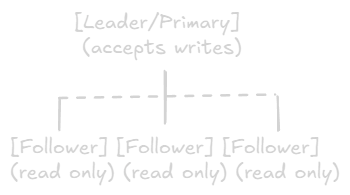

Replication
===

# What is Replication?
**Definition:** Keeping copies of the same data on multiple servers/nodes.

## Core Benefits:
- **High Availability** - System stays up if one server fails
- **Fault Tolerance** - Data survives hardware failures
- **Performance** - Read queries distributed across replicas
- **Geographic Distribution** - Data closer to users globally

# Why Replication Matters in System Design

## Scenario Without Replication
Single Database Server\
├── All reads go here\
├── All writes go here\
└── If this fails → Entire system down

### Problems:
- Single point of failure
- Limited read capacity
- High latency for distant users
- Disaster recovery is difficult

## Scenario With Replication
Primary Database (writes)\
├── Replica 1 (reads - US East)\
├── Replica 2 (reads - US West)\
├── Replica 3 (reads - Europe)\
└── Replica 4 (reads - Asia)

### Benefits:
- No single point of failure
- Distribute read load
- Low latency globally
- Easy backups and disaster recovery

# Replication Strategies

## 1. Single-Leader Replication (Master-Slave)

### Architecture:

### How It Works:
1. All wrtites go to the leader
2. Leader logs changes to replication log
3. Follower pull changes and apply them
4. Reads can go to any follower

### Replication Methods:

#### a) Synchronous Replication
Client → Write to Leader → Wait for all followers to confirm → Respond to client

- **Pros:** Strong consistency, no data loss
- **Cons:** Slower writes, leader waits for slowest follower
- **Use:** Critical data (financial transactions)

#### b) Asynchronous Replication
Client → Write to Leader → Respond immediately → Followers sync later

- **Pros:** Fast writes, leader doesn't wait 
- **Cons:** Potential data loss if leader fails, eventual consistency
- **Use:** Most web applications (default MySQL, PostgreSQL)

#### c) Semi-Synchronous (Hybrid)
Wait for at least 1 follower, rest async

- **Pros:** Balance between speed and safety 
- **Cons:** More complex
- **Use:** Production systems with good balance

### Pros & Cons of Single-Leader

#### Advantages:
✅Simple to understand and implement\
✅Easy to scale reads (add more followers)\
✅Consistent writes (single source of truth)\
✅Built-ain to most databases

#### Disadvantages
❌Single point of failure for writes\
❌Follower can have stale data (replication lag)\
❌Cannot scale writes (all go to one leader)\
❌Failover can be complex

### Use Cases:
- Most web applications
- Read-heavy workloads
- When strong consistency for reads is not critical
- Examples: Instagram feeds, Twitter timelines, e-commerce product listings

### Popular Implementation
- MySQL (Master-Slave replication)
- PostgreSQL (Streaming replication)
- MongoDB (Replice Sets with primary)