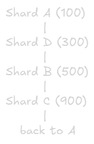
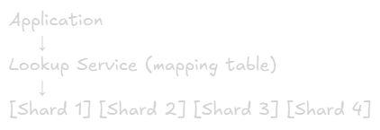

Sharding
==

# What is Sharding?
**Definition:** Splitting a large database into smaller, independent pieces (shards) across multiple servers

**Key Concept:** Each shard contains a subset of the total data

**Visual:**\
Before Sharding (vertical Scaling):\
[Single Database - 10 TB]\
└── All data in one server

After Sharding (Horizontal Scaling):\
[Shard 1: 2TB] [Shard 2: 2TB] [Shard 3: 2TB] [Shard 4: 2TB] [Shard 5: 2TB]\
└── Data distributed across 5 servers

# Why Sharding? 

## Problem: Database Limits
**Storage Limit:**\
Database growing to 10TB+ → Single server disk capacity maxed out

**Performance Limit:**\
Millions of queries per second → Single server CPU/memory exhausted

**Cost Limit:**\
Vertical scaling becomes exponentially expensive → Going from 32 cores to 64 cores might cost 3x more

## Solution: Sharding
**Benefits:**
- **Horizontal Scaling:** Add more servers instead of bigger servers
- **Better Performance:** Distribute load across multiple servers
- **Cost Effective:** Cheaper to add commodity servers
- **Geographic Distribution:** Data closer to users globally

# When to Shard?

## Consider Sharding When:
✅ Database size > 1TB and growing\
✅ Query throughput hitting single server limits\
✅ Response times degrading despite optimization\
✅ Storage costs becoming prohibitive\
✅ Need geographic data distribution

## Don't Shard If:
❌ Database < 100GB (optimize first)\
❌ Can use read replicas instead\
❌ Can partition within single database\
❌ Application not ready (complex changes needed)\
❌ Team lacks operational expertise

**Rule of Thumb:** Delay sharding as long as possible. It adds significant complexity

# Sharding Strategies

## 1. Range-Based Sharding (Key Range)
**Concept:** Split data based on ranges of a key

### Example: User IDs
Shard 1: user_id 1 - 1,000,0000\
Shard 2: user_id 1,000,001 - 2,000,0000\
Shard 3: user_id 2,000,001 - 3,000,0000\
Shard 4: user_id 3,000,001 - 4,000,0000

### Example: Timestamps
Shard 1: 2022-01-01 to 2022-12-31
Shard 2: 2023-01-01 to 2023-12-31
Shard 3: 2024-01-01 to 2024-12-31
Shard 4: 2025-01-01 to 2025-12-31

### Example: Geographic
Shard 1: Users A-F (by last name)
Shard 2: Users G-M
Shard 3: Users N-S
Shard 4: Users T-Z

### Pros & Cons of Range-Based Sharding
#### Advantages:
✅ Easy to implement\
✅ Range queries efficient (all data on one shard)\
✅ Easy to add new shards (just extend range)\
✅ Natural for time-series data
#### Disadvantages:
❌ Uneven data distribution (hotspots)\
❌ Popular rangesd overloaded
❌ Requires rebalancing as data grows

### Use Cases:
- Time-series data (logs, metrics, events)
- Sequential IDs
- When range queries are common

### Example Problem:
Users registered in 2023: 5 million (shard 4 overloaded)\
Users registered in 2020: 100,000 (Shard 1 underutilized)

## 2. Hash-Based Sharding
**Concept:** Use hash function to determine which shard data belongs to.

**Formula:**\
shard_id = hash(key) % num_shards

### Example:
user_id = 12345\
hash(12345) = 98765432\
98765432 % 4 = 0\
→ Store in Shard 0

### Distribution:
hash(user_id) % 4:\

User 1001 → Shard 1
User 1002 → Shard 2 
User 1003 → Shard 3 
User 1004 → Shard 0 
User 1005 → Shard 1

### Pros & Cons of Hash-Based Sharding
#### Advantages:
✅ Even data distribution\
✅ No hotspot (data spread uniformly)\
✅ Simple to implement\
✅ Predictable load balancing

#### Disadvantages:
❌ Range queries require checking all shards\
❌ Resharding is expensive (changes hash output)\
❌ Related data may be split across shards

### Use Cases:
- User profiles
- Product catalogs
- Any data with uniform access patterns

### Resharding Problem:
currently: 4 shards\
hash(user_id) % 4 = shard

Add 1 shard (now 5 total):\
hash(user_id) % 5 = different shard!

→ almost all data needs to move!

## 3. Consistent Hashing
**Concept:** Minimize data movement when adding/removing shards

### How It Works:
Hash Ring(0 to 2^32):

Shard A: position 100
Shard B: position 500
Shard C: position 900

User 1234 → hash = 250 →  goes to Shard B (next clockwise)\
User 56778 → hash = 700 → goes to Shard C (next clockwise)

### Adding Shard:
Add Shard D at position 300\
Only keys between 250 - 300 need to move! (from shard B to shard D)\
All other data stays put

### Visual:

### Pros & Cons of Consistent Hashing
#### Advantages: 
✅ Minimal data movement when resharding\
✅ Even distribution with virtual nodes\
✅ Elastic scaling (add/remove nodes easily)

### Disadvantages:
❌ More complex to implement\
❌ Range queries still require all shards\
❌ Virtual nodes add overhead

### Use Cases:
- Distributed caches (Redis, Memcached)
- Distributed databases (Cassandra, DynamoDB)
- Conten delivery networks

### Popular Implementation:
- Amazon DynamoDB
- Apache Cassandra
- Riak
- Memcached

## 4. Directory-Based Sharding (Lookup Service)
**Concept:** Maintain a lookup table that maps keys to shards

### Architecture

### Lookup Table:
|User ID|Shard|
|-|-|
|1-1000|1|
|1001-2000|2|
|2001-5000|3|
|5001+|4|

### Query Process
1. Application quries lookup services: "Which shard has user 1500?"
2. Lookup service responds "Shard 2"
3. Application queries shard 2

### Pros & Cons of Directory-Based Sharding
#### Advantages:
✅ Flexible (change mapping anytime)\
✅ Easy to rebalance data\
✅ Can optimize for access patterns\
✅ No algorithmic constraints

#### Disadvantages:
❌ Lookup service is single point of failure\
❌ Extra latency (additional Hop)\
❌ Lookup service can become bottleneck\
❌ More operational complexity

### Use Cases:
- Complex sharding logic
- Frequent rebalancing needed
- Multi-tenant application (tenant → shard mapping)

### Example: Multi-Tenants Saas
|Tenant|Shard|
|-|-|
|Company A|1|
|Company B|1|
|Company C|2|
|Company D|3|

Large tenants can get didcated shards