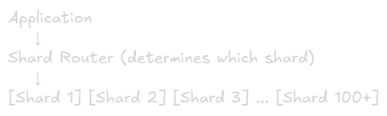

Sharding
==

# What is Sharding?
**Definition:** Splitting a large database into smaller, independent pieces (shards) across multiple servers

**Key Concept:** Each shard contains a subset of the total data

**Visual:**\
Before Sharding (vertical Scaling):\
[Single Database - 10 TB]\
└── All data in one server

After Sharding (Horizontal Scaling):\
[Shard 1: 2TB] [Shard 2: 2TB] [Shard 3: 2TB] [Shard 4: 2TB] [Shard 5: 2TB]\
└── Data distributed across 5 servers

# Why Sharding? 

## Problem: Database Limits
**Storage Limit:**\
Database growing to 10TB+ → Single server disk capacity maxed out

**Performance Limit:**\
Millions of queries per second → Single server CPU/memory exhausted

**Cost Limit:**\
Vertical scaling becomes exponentially expensive → Going from 32 cores to 64 cores might cost 3x more

## Solution: Sharding
**Benefits:**
- **Horizontal Scaling:** Add more servers instead of bigger servers
- **Better Performance:** Distribute load across multiple servers
- **Cost Effective:** Cheaper to add commodity servers
- **Geographic Distribution:** Data closer to users globally

# When to Shard?

## Consider Sharding When:
✅ Database size > 1TB and growing\
✅ Query throughput hitting single server limits\
✅ Response times degrading despite optimization\
✅ Storage costs becoming prohibitive\
✅ Need geographic data distribution

## Don't Shard If:
❌ Database < 100GB (optimize first)\
❌ Can use read replicas instead\
❌ Can partition within single database\
❌ Application not ready (complex changes needed)\
❌ Team lacks operational expertise

**Rule of Thumb:** Delay sharding as long as possible. It adds significant complexity

# Sharding Strategies

## 1. Range-Based Sharding (Key Range)
**Concept:** Split data based on ranges of a key

### Example: User IDs
Shard 1: user_id 1 - 1,000,0000\
Shard 2: user_id 1,000,001 - 2,000,0000\
Shard 3: user_id 2,000,001 - 3,000,0000\
Shard 4: user_id 3,000,001 - 4,000,0000

### Example: Timestamps
Shard 1: 2022-01-01 to 2022-12-31
Shard 2: 2023-01-01 to 2023-12-31
Shard 3: 2024-01-01 to 2024-12-31
Shard 4: 2025-01-01 to 2025-12-31

### Example: Geographic
Shard 1: Users A-F (by last name)
Shard 2: Users G-M
Shard 3: Users N-S
Shard 4: Users T-Z

### Pros & Cons of Range-Based Sharding
#### Advantages:
✅ Easy to implement\
✅ Range queries efficient (all data on one shard)\
✅ Easy to add new shards (just extend range)\
✅ Natural for time-series data
#### Disadvantages:
❌ Uneven data distribution (hotspots)\
❌ Popular rangesd overloaded
❌ Requires rebalancing as data grows

### Use Cases:
- Time-series data (logs, metrics, events)
- Sequential IDs
- When range queries are common

### Example Problem:
Users registered in 2023: 5 million (shard 4 overloaded)\
Users registered in 2020: 100,000 (Shard 1 underutilized)

## 2. Hash-Based Sharding
**Concept:** Use hash function to determine which shard data belongs to.

**Formula:**\
shard_id = hash(key) % num_shards

### Example:
user_id = 12345\
hash(12345) = 98765432\
98765432 % 4 = 0\
→ Store in Shard 0

### Distribution:
hash(user_id) % 4:\

User 1001 → Shard 1
User 1002 → Shard 2 
User 1003 → Shard 3 
User 1004 → Shard 0 
User 1005 → Shard 1

### Pros & Cons of Hash-Based Sharding
#### Advantages:
✅ Even data distribution\
✅ No hotspot (data spread uniformly)\
✅ Simple to implement\
✅ Predictable load balancing

#### Disadvantages:
❌ Range queries require checking all shards\
❌ Resharding is expensive (changes hash output)\
❌ Related data may be split across shards

### Use Cases:
- User profiles
- Product catalogs
- Any data with uniform access patterns

### Resharding Problem:
currently: 4 shards\
hash(user_id) % 4 = shard

Add 1 shard (now 5 total):\
hash(user_id) % 5 = different shard!

→ almost all data needs to move!

## 3. Consistent Hashing
**Concept:** Minimize data movement when adding/removing shards

### How It Works:
Hash Ring(0 to 2^32):

Shard A: position 100
Shard B: position 500
Shard C: position 900

User 1234 → hash = 250 →  goes to Shard B (next clockwise)\
User 56778 → hash = 700 → goes to Shard C (next clockwise)

### Adding Shard:
Add Shard D at position 300\
Only keys between 250 - 300 need to move! (from shard B to shard D)\
All other data stays put

### Visual:


### Pros & Cons of Consistent Hashing
#### Advantages: 
✅ Minimal data movement when resharding\
✅ Even distribution with virtual nodes\
✅ Elastic scaling (add/remove nodes easily)

### Disadvantages:
❌ More complex to implement\
❌ Range queries still require all shards\
❌ Virtual nodes add overhead

### Use Cases:
- Distributed caches (Redis, Memcached)
- Distributed databases (Cassandra, DynamoDB)
- Conten delivery networks

### Popular Implementation:
- Amazon DynamoDB
- Apache Cassandra
- Riak
- Memcached

## 4. Directory-Based Sharding (Lookup Service)
**Concept:** Maintain a lookup table that maps keys to shards

### Architecture


### Lookup Table:
|User ID|Shard|
|-|-|
|1-1000|1|
|1001-2000|2|
|2001-5000|3|
|5001+|4|

### Query Process
1. Application quries lookup services: "Which shard has user 1500?"
2. Lookup service responds "Shard 2"
3. Application queries shard 2

### Pros & Cons of Directory-Based Sharding
#### Advantages:
✅ Flexible (change mapping anytime)\
✅ Easy to rebalance data\
✅ Can optimize for access patterns\
✅ No algorithmic constraints

#### Disadvantages:
❌ Lookup service is single point of failure\
❌ Extra latency (additional Hop)\
❌ Lookup service can become bottleneck\
❌ More operational complexity

### Use Cases:
- Complex sharding logic
- Frequent rebalancing needed
- Multi-tenant application (tenant → shard mapping)

### Example: Multi-Tenants Saas
|Tenant|Shard|
|-|-|
|Company A|1|
|Company B|1|
|Company C|2|
|Company D|3|

Large tenants can get dedicated shards

# Sharding Key Selection
**Critical Decision:** Choosing the right sharding key affects performance, scalability, and complexity

## Good Sharding Keys
### Characteristics:
- High cardinality (many unique values)
- Even distribution
- Immutable (doesn't change)
- Commonly used in queries

### Examples:
- **User ID** - Good for user-centric apps
- **Tenant ID** - Good for SaaS multi-tenant
- **Product ID** - Good for e-commerce
- **Time-based ID** (with hash) - Good for logs/events

## Bad Sharding Keys
### Examples:
#### 1. Low Cardinality:
Country Code (only ~200 values)\
→ Cannot create more than 200 shards\
→ Uneven distribution (US has 300M users, Vatican has 800)

#### 2. Timestamp Alone:
created_at as shard key\
→ All new data goes to one shard (hotspot)\
→ Old shards sit idle

#### 3. Mutable Fields:
user.status (active/inactive)\
→ If status changes, need to move data between shards

#### 4. Sequential IDs Without Hashing:
Auto-Increment ID\
→ Latest data always on same shard (hotspot)

# Handling Cross-Shard Queries
## Problem: Data Spread Across Shards
### Simple Query (Single Shard):
```sql
-- Easy: user_id is shard key
SELECT * FROM users WHERE user_id = 12345;
→ Direct to one shard
```
### Complex Query (Multiple Shards):
```sql
-- Hard: Need to check all shards
SELECT * FROM users WHERE email = 'john@example.com';
→ Query all 10 shards, merge results
```

## Solutions for Cross-Shard Queries
### 1. Scatter-Gather
**Process:**
1. Send query to all shards
2. Each shard returns results
3. Application merges and returns

**Example:**
```python
def search_users(email):
    results = []
    for shard in all_shards:
        shard_results = shard.query("SELECT * FROM users WHERE email = ?", email)
        results.extend(shard_results)
    return results
```
**Pros:** Simple, works for any query\
**Cons:** SLow (latency = slowest shard), expensive (all shards queried)

### 2. Denormalization
**Store duplicated data to avoid cross-shard queries**

**Example:**\
Users table (sharded by user_id)\
Orders table (sharded by order_id)

Problem: "Get all orders for user 123" requeries scatter-gather

Solution: Duplicate orders in user's shard\
Users table:
- user_id (shard_key)
- user_orders (denormalized list of orders)

**Pros:** Fast queries\
**Cons:** Data duplication, consistency challenges

### 3. Service-Oriented Architecture
**Split into microservices with dedicated databases**

**Example:**\
Users Service (sharded by user_id)\
Orders Service (sharded by order_id)\
Search Service (Elasticsearch - indexes from both)

Query flow:
1. search service maintains index
2. Query Search Service for "user 123 orders"
3. Returns order_ids
4. Fetch details from Order Service

### 4. Application-Level Joins
**Fetch from multiple shards, join in application**

**Example:**
```python
# Get user from User Service
user = user_service.get(user_id=123)

# Get orders from Order Service using user_id
orders = order_service.get_by_user(user_id=123)

# Join in application
user.orders = orders
return user
```
**Pros:** Flexible
**Cons:** More application complexity, multiple round trips

# Challenges and Solutions
## Challenge 1: Uneven Data Distribution (Hotspots)
### Problem:
Shard 1: 10GB, 1000 QPS
Shard 2: 50GB, 10,000 QPS (celebrity user)
Shard 3: 10GB, 1000 QPS

### Solutions:
#### a) Better Sharding Key
Instead of: user_id\
Use: hash(user_id) for even distribution

#### b) Further Shard Hot Partitions
Split Shard 2 into Shard 2a and 2b

#### c) Dedicated Shards for Hot Data
Celebrity users → Dedicated shrad with more resources

## Challenge 2: Resharding
### Problem:
Started with 4 shards\
Now need 8 shards\
→ Need to move ~50% of data

### Solutions:
#### a) Plan Ahead
Start with more shards than needed\
Use virtual shards (e.g., 256) mapped to physical shards (e.g., 4)

#### b) Use Consistent Hashing
Only ~1/n data moves when adding nth shard

#### c) Double Writes During Migration
1. Write to old shard
2. Write to new shard
3. Migrate existing data
4. Switch reads to new shard
5. Drop old shard

## Challenge 3: Distributed Transactions
### Problem:
Transfer money: User A (Shard 1) → User B (Shard 2)\
Need atomicity across shards

### Solutions:
#### a) Avoid Cross-Shard Transactions
Shard by something that keeps related data together\
e.g., Both users in same account → same shard

#### b) Two-Phase Commit (2PC)
Coordinator asks all shards: "Can you commit?"\
If all say yes → Coordinator: "Commit!"\
If all say no → Coordinator: "Abort!"

**Cons:** Slow, coordinator is bottleneck, blocking

#### c) Saga Pattern
Local transactions + compensating actions
1. Deduct from user A (Shard 1)
2. Add to User B (Shard 2)
3. If step 2 fails → Compensate: Refund User A

## Challenge 4: Auto-Incrementing IDs
### Problem:
Multiple shards generating IDs → Collisions!

### Solutions:
#### a) UUID/GUID
Globally unique, no coordination needed\
Cons: Large (128-bit), not sequential

#### b) Snowflake ID (Twitter)
64-bit ID:
- Timestamp (41 bits)
- Shard ID (10 bits)
- Sequence (12 bits)

Pros: Time-ordere, unique, efficient

#### c) Database Sequence with Offset
Shard 1: 1, 4, 7, 10, 13... (start 1, increment 3)\
Shard 2: 2, 5, 8, 11, 14... (start 2, increment 3)\
Shard 3: 3, 6, 9, 12, 15... (start 3, increment 3)

# Real-World Sharding Examples

## Instagram
### Sharding Strategy:
- Sharded by user_id (logical shards: 1000s)
- PostgreSQL (multiple shards)
- Stored photos: Sharded by photo_id

### Architecture:


## Uber
### Sharding Strategy:
- Trips sharded by city_id
- Users sharded by user_id
- Lookup service for city → shard mapping

### Reasoning:
- Most queries are city-specific
- Keeps related data (trips in same city) together

## Discord
### Sharding Strategy:
- Messages sharded by (channel_id, message_id)
- Cassandra for horizontal scaling
- Consistent hashing

### Reasoning:
- Channel messages always together
- Easy to scale per-channel

# Sharding Checklist
## Before Sharding:
1. **Optimize First**
    - Added indexes
    - Optimized queries
    - Used caching
    - Tried read replicas
2. **Plan Sharding Key**
    - High cardinality
    - Even distribution
    - Immutable
    - Matches query patterns
3. **Application Changes**
    - Shard-aware routing
    - Handle cross-shard queries
    - Distributed ID generation
    - Monitoring per shard
4. **Operational Readiness**
    - Backup strategy per shard
    - Monitoring and alerting
    - Resharding plan
    - Team training

# Sharding Anti-Patterns
## ❌ Anti-Pattern 1: Premature Sharding
"We migh need to scale in the future"\
→ Adds complexity too early

## ❌ Anti-Pattern 2: Wrong Sharding Key
Shard by timestamp → All new data on one shard

## ❌ Anti-Pattern 3: Cross-Shard Joins
Frequently joining across shards\
→ Performance nightmare

## ❌ Anti-Pattern 4: Ignoring Hotspots
One shard gettinbg 80% of traffic\
→ Defeats purpose of sharding

# Key Takeaways
1. **Delay Sharding:** Optimize and use replicas first
2. **Choose Key Wisely:** Shard key is most critical decision
3. **Even Distribution:** Avoid hotspots
4. **Avoid Cross-Shard:** Design to minimize cross-shard queries
5. **Plan for Growth:** Start with more logical shards than physical
6. **Monitoring:** Track per-shard metrics
7. **Complexity:** Sharding adds significant operational overhead