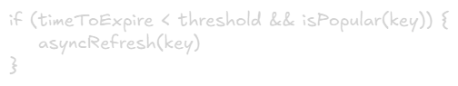
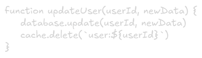
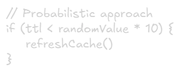
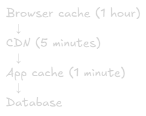
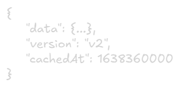

Cache Invalidation
===

# The Problem
> "There are only two hard things in Computer Science: cache invalidation and naming things." —  Phil Karlton

Cache invalidation is the process of removing or updating stale data from cache when the underlying data changes. Without proper invalidation, users see outdated information.

# Why It's Hard
- **Consistency:** Keep cache synchronized with source of truth
- **Timing:** When to invalidate? Too early = cache misses, too late = stale data
- **Distributed Systems:** Multiple cache servers need coordination
- **Dependencies:** One change might affect multiple cached items

# Invalidation Strategies

## 1. Time-Based Invalidation (TTL)
**How it works:** Set expiration time on cached data

### Pros:
- Simple to implement
- Predictable behavior
- Reduces stale data risk

### Cons:
- Still serves stale data until expiration
- Arbitrary TTL values (too short = many caches misses, too long = stale data)

### Best for: 
- Data that changes predictably, non-critical staleness

### TTL Selection Guide:
- User profiles: 5-15 minutes
- Product catalogs: 1-5 minutes
- Static content: 1 day to 1 year
- Real-time data: 10-60 seconds

## 2. Event-Based Invalidation
**How it works:** Invalidate immediately when data changes

### Pros:
- Always fresh data
- No arbitrary TTL decisions

### Cons:
- More complex
- Potential race conditions
- Need to know all cache keys affected

### Best for:
- Critical data, data with unpredictable changes

### Implementation Patterns:
- Direct invalidation in application code
- Event listeners/webhooks
- Database triggers
- Message queues (publish-subscribe)

## 3. Write-Through Invalidation
**How it works:** Update cache and database together

### Pros:
- Cache always consistent
- No separate invalidation logic

### Cons:
- Write latency (double write)
- Atomicity challenges

### Best for:
- High read, moderate write workloads

## 4. Refresh-Ahead
**How it works:** Proactively refresh popular items before expiration

### Pros: 
- No cache miss penalty for hot data
- Better user experience

### Cons:
- Complex implementation
- Wasted resources on unpopular items

### Best for:
- Predictable hot data, expensive computations

# Invalidation Patterns

## Pattern 1: Delete on Write

**Simple but effective** — Next read will fetch fresh data

## Pattern 2: Update on Write
\
**Faster reads** but risk of inconsistency if DB write fails

## Pattern 3: Versioning
\
**No deletion needed** — Old versions expire naturally

## Pattern 4: Tag-Based Invalidation
\
**Bulk invalidation** — Good for related items

# Handling Distributed Caches
**Problem: Multiple Cache Nodes**\
When you have multiple cache servers, invalidation must reach all nodes

## Solution 1: Invalidation via Pub/Sub

**Redis Pub/Sub, AWS SNS, Kafka** work well for this

## Solution 2: Consistent Hashing
Route same keys to same cache node — Reduces invalidation complexity but single point of failure per key

## Solution 3: Cache Proxy Layer
Central invalidation service that manages all cache nodes

# Common Invalidation Challenges

## Challenge 1: Race Conditions
> Thread 1: Read from DB → Write to cache (stale data)\
> Thread 2: Update DB → Delete from cache

**Solutions:** Use cache versioning or locking

## Challenge 2: Thundering Herd
Cache expires → Many request hit DB simultaneously

### Solutions:
- Use locks (only one request fetches)
- Stale-while-revalidate (serve stale while refreshing)
- Probabilistic early expiration

## Challenge 3: Cascading Invalidations
Changing one item invalidates many other (e.g., changing product price affects category pages, serch results, recommendations)

### Solutions:
- Dependency tracking
- Lazy invalidation (invalidate on access)
- Accept some staleness

## Challenge 4: Partial Failures
Some cache nodes invalidate, others don't

### Solutions:
- Retry logic with exponential backoff
- Eventually consistent approach
- Health checks and monitoring

# Invalidation Strategies by Use Case
|Use Case|Strategy|Reason
|-|-|-|
User sessions|TTL (10-30 min)|Security + natural expiration
Product prices|Event-based|Crtiical accuracy
Article content|TTL (5-10 min) + manual|Balance freshness and load
Static assets|Long TTL (1 year)+ versioned URLs|Never changes
Real-time feeds|Short TTL (30s) or event-based|Freshness critical
Analytics data|TTL (5-10 min)|Eventual consistency OK

# Best Practice

## 1. Choose the Right Strategy
- Critical data → Event-based invalidation
- Non-critical data → TTL-based
- Hybrid apporach often best (TTL + event-based)

## 2. Design for Failure
- Cache invalidation can fail
- Have fallback to source of truth
- Monitor invalidation lag

## 3. Use Layered Invalidation
\
Each layer has different TTL

## 4. Version Your Data
Include version/timestamp in cached data:\

## 5. Monitor Staleness
Track time difference between cache and source

## 6. Grace Degradation
If cache invalidation fails, server stale data with warning rather than crashing

# Implementation Checklist
- Define invalidation strategy per data type
- Implement invalidation logic
- Add monitoring for stale data
- Handle race conditions
- Test distributed invalidation
- Add retry logic
- Document TTL values and reasons
- Set up alerts for invalidation failures

# Red Flags
- Hardcoded TTL values without justification
- No Monitoring of cache staleness
- Synchronous invalidation in request path
- No handling of invalidation failures
- Cache keys not following a pattern

# Key Takeaway
Perfect invalidation is impossible in distributed systems. Choose the strategy that balance your needs for freshness, preformance, and complexity. When in doubt, start with simple TTL-based invalidation