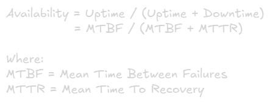
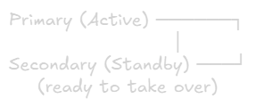
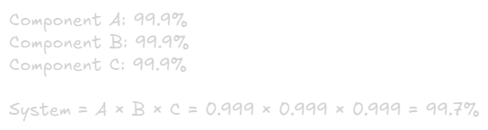
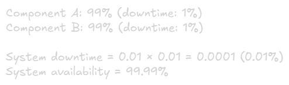
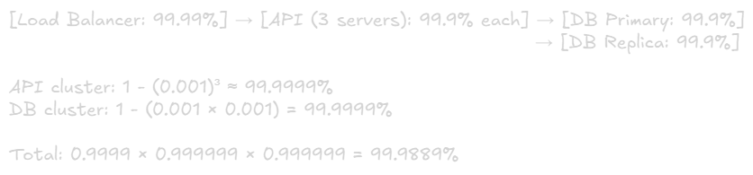
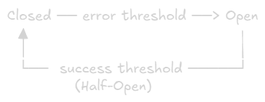

Availability Concepts
===

# What is Availability?
**Definition:** The proportion of time a system is operational and accessible

**Formula:**\


**Example:**
- Uptime: 8,759 hours/year
- Downtime: 1 hour/year
- Availability: 8,759 / (8,579 + 1) = 99.98%

# The Nines of Availability
|Availability|Downtime/Year|Downtime/Month|Downtime/Week|Use Case|
|-|-|-|-|-|
|90% (one nine)|36.5 days|3 days|16.8 hours|Internal tools
|99% (two nines)|3.65 days|7.2 hours|1.68 hours|Basic websites
|99.9% (three nines)|8.76 hours|43.8 minutes|10.1 minutes|Standard Saas
|99.99% (four nines)|52.56 minutes|4.38 minutes|1.01 minutes|Business-critical 
|99.999% (five nines)|5.26 minutes|26.3 seconds|6 seconds|Financial systems
|99.9999% (six nines)|31.5 seconds|2.63 seconds|0.6 seconds|Mission-critical

**Note:** Each additional nine costs exponentially more

# High Availability (HA) vs Fault Tolerance

## High Availability
**Goal:** Minimize downtime through redundancy and quick recovery

**Characteristics:**
- Brief service interruptions acceptable
- Automatic failover (seconds to minutes)
- Cost-effective
- Some data loss acceptable

**Example:**
- Primary database fails
- Failover to replica in 30 seconds
- 30 seconds of downtime

## Fault Tolerance
**Goal:** Zero downtime through complete redundancy

**Characteristics:**
- No service interruption
- Instant failover (miliseconds)
- Expensive
- No data loss

**Example:**
- Active-active setup
- Both systems running simultaneously
- Failure is transparent

## Comparison
|Aspect|High Availability|Fault Tolerance|
|-|-|-|
|Downtime|Seconds/minutes|None (instant)
|Cost|Moderate|Very high
|Complexity|Medium|High
|Data loss|Possible|None
|Use case|Most applications|Critical systems

# Components of Availability

## 1. Redundancy

### Active-Passive (Hot Standby)


**Characteristics:**
- Secondary is ready but not serving traffic
- Failover time: seconds to minutes
- Cost-effective
- Most commong approach

**Example:** Database primary with read replica promoted on failure

### Active-Active (Load Balanced)


**Characteristics:**
- All nodes serve traffic
- No failover needed (instant)
- Better resource utilization
- More complex

**Example:** Multiple API servers behind load balancer

### N + 1 Redundancy
> Required capacity: 100 units\
> Deploy: 101 units (1 extra)

**Characteristics:**
- One extra component beyond mininmum needed
- Survives single failure
- Balance between cost and reliability

### N + 2 Redundancy
> Required capacity: 100 units\
> Deploy: 102 units (2 extra)

**Characteristics:**
- Survives two simultaneous failures
- Higher availability'
- Higher cost

## 2. Failover Mechanisms

### Health Checks
**Purpose:** Detect failures quickly

**Types:**

#### Passive Health Checks
Monitor Actual traffic:
> Request fails → Mark server unhealthy\
> After X failures → Remove from pool

#### Active Health Checks
Periodic probing:
> Every 5 seconds: Send ping\
> If no response → Mark unhealthy

**Best Practice:** Use both

### Failover Types:

#### Automatic Failover
1. Detect failure (health check fails)
2. Promote standby to primary
3. Update DNS/routing
4. Resumre operations

Time: 30 seconds - 5 minutes

#### Manual Failover
1. Human detects issue
2. Human decision to failover
3. Execute failover procedure
4. Verify and monitor

Time: Minutes to hours

**Use automatic for most systems, manual for critical decisions

## 3. Load Balancing

### Purpose:
- Distribute traffic across servers
- Remove failed servers from pool
- Add new servers dynamically

### Algorithms:

#### Round Robin
> Request 1 → Server A\
> Request 2 → Server B\
> Request 3 → Server C\
> Request 4 → Server A

**Pros:** Simple, even distribution\
**Cons:** Ignores server load

#### Least Connections
> Server A: 10 connections\
> Server B: 5 connections\
> Server C: 8 connections
>
> Next request → Server B

**Pros:** Better for uneven load\
**Cons:** More complex

#### Weighted Round Robin
> Server A: weight=3 (powerful)\
> Server B: weight=1 (weak)
>
> Traffic split: 75% to A, 25% to B

**Pros:** Accounts for capacity\
**Cons:** Manual tuning needed

#### Least Response Time
Route to server with fastest response time

**Pros:** Best user experience\
**Cons:** Complex, requires monitoring

### Load Balancer Types:

#### Layer 4 (Transport)
- Routes based on IP/port
- Fast (no packet inspection)
- Protocol-agnostic

#### Layer 7 (Application)
- Routes based on content (URL, headers)
- Can do SSL termination
- More intelligent routing
- Slower than layer 4


## 4. Geographic Distribution

### Multi-Region Deployment

#### Benefits:
✅ Disaster recovery (entire region fails)\
✅ Lower latency (user → nearest region)\
✅ Compliance (data residency)\
✅ Load distribution

#### Challenges:
❌ Data synchronization complexity\
❌ Higher costs (multiple regions)\
❌ Consistency vs availability trade-off\
❌ Operational complexity

### Strategies:

#### Active-Passive Geo
> Primary Region (US-East) → Serves all traffic\
> Secondary Region (EU-West) → Standby only

**Use:** Disaster recovery

#### Active-Active Geo
> US Region─┐\
> ------------------ Global Load Balancer\
> EU Region─┘

**Use:** Global applications, low latency

# Measuring Availability

## Key Metrics

### 1. Uptime Percentage
> Uptime % = (Total Time - Downtime) / Total Time x 100

### 2. MTBF (Mean Time Between Failures)
> MTBF - Total Uptime / Number of Failures
>
> Example:\
> 8,760 hours uptime, 2 failures\
> MTBF = 8,760 / 2 = 4,380 hours

### 3. MTTR (Mean Time To Recovery)
> MTTR = Total Downtime / Number of Failures
>
> Example:\
> 2 hours total downtime, 4 failures\
> MTTR = 2 / 4 = 0.5 hours (30 minutes)

### 4. MTTF (Mean Time To Failure)
> MTTF = Total Operating Time / Number of Failures
>
> Similar to MTBF but for non-repairable systems

### 5. Failure Rate
> Failure Rate = 1 / MTBF
>
> Example:\
> MTBF = 1000 hours\
> Failure Rate = 0.01 failures/hour

## Calculating System Availability

### Series System (All components must work)


**Each component reduces overall availability**

### Parallel System (Any component can work)


**Redundancy daramatically improves availability**

### Mixed System Example:


# Availability Design Patterns

## 1. Circuit Breaker
**Purpose:** Prevent cascading failures

**States:**
1. **Closed:** Normal operation, requests pass through
2. **Open:** Failure threshold reached, reject requests immediately
3. **Half-Open:** Test if service recovered



**Example:**
```go

var ErrCircuitOpen = errors.New("circuit breaker is open")

// State represents the current state of the circuit breaker
type State string

const (
	CLOSED    State = "CLOSED"    // Normal operation
	OPEN      State = "OPEN"      // Requests are rejected
	HALF_OPEN State = "HALF_OPEN" // Trial state to test recovery
)

type CircuitBreaker struct {
	mu              sync.Mutex
	failures        int
	threshold       int
	timeout         time.Duration
	state           State
	lastFailureTime time.Time
}

// NewCircuitBreaker creates a new circuit breaker instance
func NewCircuitBreaker(threshold int, timeout time.Duration) *CircuitBreaker {
	return &CircuitBreaker{
		threshold: threshold,
		timeout:   timeout,
		state:     CLOSED,
	}
}

// Call executes the given function if the circuit allows it
func (cb *CircuitBreaker) Call(fn func() error) error {
	cb.mu.Lock()

	// If the circuit is OPEN, check whether timeout has elapsed
	if cb.state == OPEN {
		if time.Since(cb.lastFailureTime) > cb.timeout {
			// Allow a trial request
			cb.state = HALF_OPEN
		} else {
			cb.mu.Unlock()
			return ErrCircuitOpen
		}
	}

	cb.mu.Unlock()

	// Execute the function outside the lock
	err := fn()

	cb.mu.Lock()
	defer cb.mu.Unlock()

	if err != nil {
		cb.onFailure()
		return err
	}

	cb.onSuccess()
	return nil
}

// onSuccess resets the circuit breaker after a successful call
func (cb *CircuitBreaker) onSuccess() {
	cb.failures = 0
	cb.state = CLOSED
}

// onFailure records a failure and opens the circuit if threshold is exceeded
func (cb *CircuitBreaker) onFailure() {
	cb.failures++
	cb.lastFailureTime = time.Now()

	if cb.failures >= cb.threshold {
		cb.state = OPEN
	}
}
```

## 2. Retry with Exponential Backoff
**Purpose:** Handle transient failures without overwhelming system

**Strategy:**
> Attempt 1: Immediate\
> Attempt 2: Wait 1s\
> Attempt 3: Wait 2s\
> Attempt 4: Wait 4s\
> Attempt 5: Wait 8s

**With Jitter:** Add randomness to prevent thundering herd
> Wait time = base_dealy x ( 2 ^ attempt) + random(0,1)

**Example:**
```go
// TransientError represents a retryable error
var TransientError = errors.New("transient error")

// RetryWithBackoff retries the given function using exponential backoff
func RetryWithBackoff(fn func() error, maxAttempts int) error {
	for attempt := 0; attempt < maxAttempts; attempt++ {
		err := fn()
		if err == nil {
			return nil
		}

		// Only retry on transient errors
		if !errors.Is(err, TransientError) {
			return err
		}

		// Last attempt: give up
		if attempt == maxAttempts-1 {
			return err
		}

		// Exponential backoff with jitter
		delay := time.Duration(1<<attempt)*time.Second +
			time.Duration(rand.Float64()*float64(time.Second))

		time.Sleep(delay)
	}

	return nil
}
```

## 3. Bulkhead Pattern
**Purpose:** Isolate resource to prevent one failure from affecting everything

**Analogy:** Ship compartments - one leak doesn't sink entire ship

**Example:**
> Thread Pool A (50 threads): Critical API calls\
> Thread Pool B (30 threads): Background jobs\
> Thread Pool C (20 threads): Analytics
>
> If Pool C exhausts threads, Pools A & B unaffected

## 4. Graceful Degradation
**Purpose:** Maintain partial functionality during failures

**Strategies:**
- Serve cached data when database is down
- Disable non-critical features
- Return approximate results
- Queue writes for later processing

**Example:**
```go
// ServiceUnavailable represents a downstream failure
var ServiceUnavailable = errors.New("ml service unavailable")

// GetUserRecommendations returns personalized recommendations,
// or falls back to popular items when the ML service is unavailable.
func GetUserRecommendations() ([]string, error) {
	recs, err := getMLRecommendations()
	if err != nil {
		if errors.Is(err, ServiceUnavailable) {
			// Graceful degradation: return popular items
			return getPopularItems(), nil
		}
		return nil, err
	}

	return recs, nil
}

// Simulated ML service call
func getMLRecommendations() ([]string, error) {
	return nil, ServiceUnavailable
}

// Fallback strategy
func getPopularItems() []string {
	return []string{
		"popular-item-1",
		"popular-item-2",
		"popular-item-3",
	}
}

```

## 5. Rate Limiting
**Purpose:** Prevent overload and ensure availability for everyone

**Techniques:**

#### Token Bucket
> Bucket capacity : 100 tokens\
> Refill rate: 10 tokens/second
>
> Request arrives:
> - If tokens available: Consume 1, allow request
> - If bucket empty: Reject request

#### Leaky Bucket
> Requests enter bucket (queue)\
> Prcess at fixed rate\
> If bucket full: Reject new requests

#### Fixed Window
> Allow 1000 requests per minute\
> Reset counter every minute

#### Sliding Window
> Track requests in rolling time window\
> More accurate than fixed window

# Availability Best Practices

## 1. Design for Failure
**Assume everything will fail:**
- Servers crash
- Networks partition
- Disks fill up
- Dependencies become unavailable

**Mitigation:**
- Build redundancy from day one
- Test failure scenarios regularly
- Automate recovery

## 2. Eleminate Single Points of Failure (SPOF)
**Common SPOFs:**
- Single database
- Single load balancer
- Single availability zone
- Single region
- Dependencies without fallbacks

**Solution:** Redundancy at every layer

## 3. Monitor Everything
**Key Metrics:**
- Uptime percentage
- Request success rate
- Latency (p50, p95, p99)
- Error rates
- Resource utilization

**Alerting:**
- Set thresholds based on SLOs
- Alert on trends, not just absolutes
- Reduce noise (smart grouping)

## 4. Practice Failure Recovery
**Chaos Engineering:**
- Randomly kill servers (Chaos Monkey)
- Inject latency
- Simulate network partitions
- Test during business hours

**Game Days:**
- Schedulde failure scenarios
- Practice runbooks
- Measure MTTR

## 5. Implemena SLIs, SLOs, and SLAs

### SLI (Service Level Indicator)
**What you measure:**
- Uptime: 99.95%
- Latency: p95 < 200ms
- Error rate: < 0.1%

### SLO (Service Level Objective)
**Internal target:**
- Uptime: 99.99%
- Latency: p99 < 500ms
- Error rate: <0.5%

### SLA (Service Level Agreement)
**Contract with customers:**
- Uptime: 99.5% (with penalties)
- Response time: < 1s
- Support response: < 4 hours

**Relationship:** SLA < SLO < actual performance (error budget)

## 6. Capacity Planning

**Factors:**
- Current load
- Growth rate
- Peak vs average
- Seasonality
- Redundancy needs

**Strategies:**
- Over-provision (typically 20-50% headroom)
- Auto-scaling
- Load testing
- Gradual rollouts

# Available Anti-Patterns

## ❌ Anti-Pattern 1: Cascading Failures
> Service A fails → Service B overhelmed → Service C fails

**Fix:** Circuit breakers, rate limiting, timeouts

## ❌ Anti-Pattern 2: Retry Storms
> Service down → All clients retry → Service more overleaded

**Fix:** Exponential backoff, jitter, circuit breakers

## ❌ Anti-Pattern 3: Thundering Herd
> Response time increases gradually → Nobody notices → Outage

**Fix:** Stale-while-revalidate, lock-based cache refresh

## ❌ Anti-Pattern 4: Ignoring Degradation
> Response time inncreases gradually → Nobody notices → Outage

**Fix:** Monitor latency percentiles, alert on trends

## ❌ Anti-Pattern 5: Synchronous Dependencies
> User request → Service A → Service B → Service C\
> Any failure = request fails

**Fix:** Async processing, message queues, eventual consistency

# Real-World Examples

## Example 1: Netflix
**Availability:** 99.99%

**Strategies:**
- Multi-region active-active
- Chaos engineering (Chaos Monkey)
- Circuit breakers (Hystrix)
- Bulkheads (isolated thread pools)
- Graceful degradation

## Example 2: AWS
**Availability:** 99.99% (per region)

**Strategies:**
- Multiple availability zones
- Cross-region replication
- Health checks every few seconds
- Auto-scaling
- Load balancing

## Example 3: Google Search
**Availability:** 99.999%+ 

**Strategies:**
- Globally distributed
- Massive redundancy
- Instant failover
- Predictive replacement
- Multiple layers of caching

# Cost vs Availability

## Trade-offs:
|Nines|Downtime/Year|Relative Cost|Suitable For|
|-|-|-|-|
|99%|3.65 days|1x (baseline)|Internal tools
|99.9%|8.76 hours|2-3x|Most Saas
|99.99%|52 minutes|5-10x|Business-critical
|99.999%|5 minutes|20-50x|Financial systems

**Each additional nine costs ~3-5x more**

## Where to Invest:
**High ROI:**
- Automated failover
- Health checks
- Basic redundancy (active-passive)
- Monitoring and alerting

**Medium ROI:**
- Multi-region deployment
- Active-active setup
- Advanced monitoring

**Low ROI (unless critical):**
- Six nines availability
- Custom hardware
- Dedicated network infrastructure

# Key Takeaways
1. **Availability is expensive:** Each nine costs exponentially more
2. **Redundancy is key:** Eleminate single points of failure
3. **Measure everything:** MTBF and MTTR are critical metrics
4. **Design for failure:** Assume everything will fail
5. **Practice recovery:** Regular failure drills improve MTTR
6. **Set realistic SLOs:** Balance cost and customer needs
7. **Automate recovery:** Human intervention is slow
8. **Monitor proactively:** Catch issues before they become outages

## Quick Decision Guide:
- Internal tools: 99% (2 nines)
- Standard SaaS: 99.9% (3 nines)
- Business-critical: 99.99% (4 nines)
- Financial/health: 99.999% (5 nines)

## Remember:
- Perfect availability (100%) is impossible and infinitely expensive
- Focus on MTTR as much as MTBF (recover fast)
- Availability is a business decision, not just technical
- Test your assumptions with real failure scenarios 
