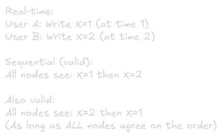
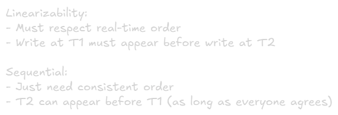
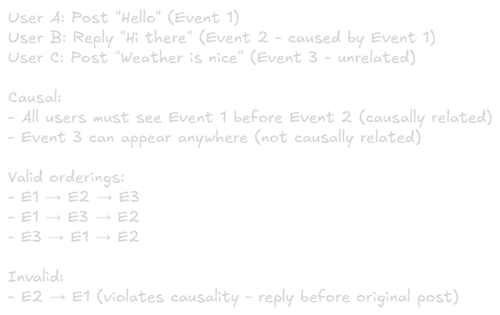
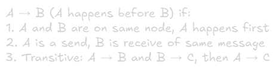
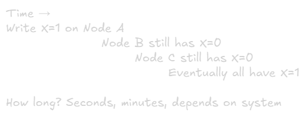
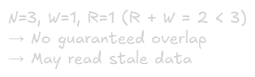
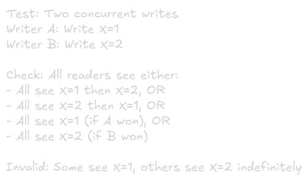

Consistency Models
===

# What are Consistency Models?
**Definition:** Rules that define how and when writes become visible to readers in a distributed system\

**Spectrum:** From strongest (most restrictive) to weakest (most flexible)


# Why Consistency Models Matter
**Trade-offs:**
- **Strong consistency:** Easy to reason about, but slower and less available
- **Weak consistency:** Fast and highly available, but complex application logic

**Impact on:**
- System design decisions
- Database choise
- Application complexity
- User experience

# Strong Consistency Models

## 1. Linearizability (Strongest)
**Definition:** Operations appear to execute atomically and in real-time order

**Guarantee:** Once a write completes, all subsequent reads see that write (no going back in time)

### Characteristics:
- Operations have real-time ordering
- System behave like a single copy
- Once updated, everyone sees the update
- Acts as if there's one centralized database

### Example:


**Once write completes, EVERYONE sees new value immediately**

### Pros & Cons:
**Advantages:** 

✅ Easiest to reason about (behaves like single machine)\
✅ No surprises for developers\
✅ Correct by default

**Disadvantages:**

❌ Highest latency (must coordinate)\
❌ Lowest availability (blocks during failures)\
❌ Poor performance at scale

### Use Cases:
- Distributed locks
- Leader election
- Coordination services
- Critical sections
- Any system where operations must be globally ordered

### Examples:
- **etcd** (with quorum reads)
- **ZooKeeper**
- **Consul**
- Google **Spanner** (with TrueTime)

### Implementation:
- Consensus algorithm (Raft, Paxos)
- Synchronous replication with quorums
- Distributed transactions (2PC, 3PC)

## 2. Sequential Consistency

**Definition:** Operations appear to execute in some sequential order, but not necessarily real-time order

**Guarantee:** All nodes see operations in the same order, but order may differ from real-time

### Characteristics:
- Global total order of operations
- Order must be consistent across al nodes
- But order can differ from actual execution time

### Example:


### Difference from Linearizability:


### Pros & Cons:
**Advantages:**\
✅ Easier to implement than linearizability\
✅ Better performance (no strict time ordering)\
✅ Still relatively simple to reason about

**Disadvantages:**\
❌ Can be confusing (operations reordered)\
❌ Still requires coordination\
❌ Not as intuitive as linearizability

### Use Cases:
- Systems where order matters but timing doesn't
- Replicated state machinse
- Some database replication

### Examples:
- Some configurations of distributed databases
- Certain memory models in multiprocessor systems

## 3. Causal Consistency

**Definition:** Operations that are causally related must be seen in the same order by all nodes

**Guarantee:** If A causes B, everyone sees A before B. Unrelated operations can be seen in different orders

### Characteristics:
- Preserves cause-and-effect relationship
- Concurrent (unrelated) operations can appear in any order
- Weaker than sequential, stronger than eventual

### Example:


### Happens-Before Relationship:


### Pros & Cons:

**Advantages:**\
✅ Natural for many applications (preserves casuality)\
✅ Better availability than sequential consistency\
✅ Good balance between consistency and performance\
✅ Intuitive for users (cause before effect)

**Disadvantages:**\
❌ More complex to implement (track causality)
❌ Requires metadata (vector clocks, version vectors)
❌ Not all operations are ordered

### Use Cases:
- Social media (comments on posts)
- Collaborative editing
- Message threads
- Any system with cause-effect relationships

### Examples:
- **COPS** (Clusters of Order-Preserving Servers)
- **Cassandra** (with certain configurations)
- **DynamoDB** (conditional writes)
- Facebook's **TAO**

### Implementation Techniques:
- **Vector clocks:** Track causality
- **Lamport timestamps:** Logical time
- **Dependency tracking:** Explicit relationships

# Weak Consistency Models

## Eventual Consistency (Weakest)

**Definition:** If no new updates are made, eventually all replicas converge to the same value

**Guarantee:** Eventually consistent, but no guarantee when

### Characteristics:
- No ordering guarantees
- Reads may return stale data
- System becomes consistent "eventually"
- Confilcts must be resolved

### Example:


### Types of Eventual Consistency:

#### a) Read-Your-Writes
**Guarantee:** User sees their own writes immediately
\
**Implementation:** Route user reads to same replica where they wrote

#### b) Monotonic Reads
**Guarantee:** If you read a value, you won't see older values later\
\
**Implementation:** Sticky sessions (same user → same replica)

#### c) Monotonic Writes
**Guarantee:** Writes from same user are applied in order\
\
**Implementation:** Track write dependencies, sequence numbers

#### d) Writes-Follow-Reads
**Guarantee:** Writes that follow reads see effect of those reads
\

### Conflict Resolution Strategies:

#### Last-Write-Wins (LWW)
- Use timestamp
- Latest timestamp wins
- Simple but can lose data\


#### Vector Clocks
- Track causality
- Detect concurrent writes
- Application resolves conflicts\


#### Application-Level Resolution
- Shopping cart: Merge items
- Text editor: Use operational transforms
- Social: Keep both versions, let user choose

#### CRDTs (Conflict-free Replicated Data Types)
- Mathematical properties guarantee convergence
- No application-level resolution needed
- Examples: counters, sets, maps

### Pro & Cons:
**Advantages:**\
✅ Highest availability\
✅ Best performance (no coordination)\
✅ Scales horizontally easily\
✅ Tolerates network partitions well\ 
✅ Low latency (local writes)

**Disadvantages:**\
❌ Complex application logic (handle conflicts)\
❌ Can serve stale data\
❌ No guarantees on convergence time\
❌ Requires conflict resolution\

### Use Cases:
- Shopping carts
- Social media feeds
- Analytics/metrics
- DNS
- Caches
- Session storage

### Examples:
- **Cassandra** (default)
- **DynamoDB** (default)
- **Riak**
- **CouchDB**
- DNS system

# Consistency Model Comparison
|Model|Ordering|Performance|Complexity|Use Case|
|-|-|-|-|-|
|Linearizability|Real-time order|Slowest|Simplest|Coordination, locks
|Sequential|Total order|Slow|Simple|Replicated state machines
|Causal|Causal order|Medium|Medium|Social media, collaboration
|Eventual|No guarantees|Fastest|Complex|High availability systems

# Tunable Consistency

Some databases allow choosing consistency per operation:

## Cassandra Example:
```sql
-- Strong consistency (CP)
SELECT * FROM users WHERE id=123 
USING CONSISTENCY QUORUM;

-- Eventual consistency (AP)
SELECT * FROM users WHERE id=123 
USING CONSISTENCY ONE;
```

## MongoDB Example:
```js
// Linearizable reads
db.users.find().readConcern("linearizable")

// Eventual reads
db.users.find().readConcern("local")
```

## DynamoDB Example:
```js
// Strong consistency
dynamodb.getItem({ ConsistentRead: true })

// Eventual consistency (default)
dynamodb.getItem({ ConsistentRead: false })
```

# Quorum-Based Consistency

**Formula:** R + W > N ensures strong consistency

- **N:** Total replicas
- **W:** Write quorum (nodes that must acknowledge write) 
- **R:** Read quorum (nodes that must respond to read)

## Examples:

### Strong Consistency:


### Eventual Consistency:


### Write-Optimized


### Read-Optimized


# Consistency in Real Systems

## Example 1: Instagram
|Feature|Model|Reasoing|
|-|-|-|
|User account|Linearizable|Critical data
|Direct messages|Causal|Order matters
|Feed posts|Eventual|Availability critical
|Like counts|Eventual|Approximate is OK

## Example 2: Banking
|Feature|Model|Reasoing|
|-|-|-|
|Balance checks|Linearizable|Must be accurate
|Transaction history|Sequential|Order important
|ATM locations|Eventual|Static data

## Example 3: Collaborative Docs (Google Docs)
|Feature|Model|Reasoing|
|-|-|-|
|Text editing|Causal + CRDT|Preserves intent
|Cursor positions|Eventual|Low stakes
|User presence|Eventual|Approximate OK

# Implementing Consistency Models

## Linearizability Implementation
```go
type LinearizableStore struct {
	mu   sync.Mutex
	data map[string]interface{}
}

func NewLinearizableStore() *LinearizableStore {
	return &LinearizableStore{
		data: make(map[string]interface{}),
	}
}

func (s *LinearizableStore) Read(key string) (interface{}, bool) {
	s.mu.Lock()
	defer s.mu.Unlock()

	v, ok := s.data[key]
	return v, ok
}

func (s *LinearizableStore) Write(key string, value interface{}) {
	s.mu.Lock()
	defer s.mu.Unlock()

	s.data[key] = value
}

```
**Problem:** Singe point of contention (slow)

## Eventual Consistency Implementation:
```go
type Replica interface {
	AsyncWrite(key string, value string)
	Read(key string) (string, bool)
}

type EventuallyConsistentStore struct {
	replicas []Replica
}

func NewEventuallyConsistentStore(replicas []Replica) *EventuallyConsistentStore {
	rand.Seed(time.Now().UnixNano())
	return &EventuallyConsistentStore{replicas: replicas}
}

func (s *EventuallyConsistentStore) Write(key, value string) string {
	// Fire-and-forget async writes
	for _, r := range s.replicas {
		go r.AsyncWrite(key, value)
	}
	return "OK" // no waiting, no guarantees (yet)
}

func (s *EventuallyConsistentStore) Read(key string) (string, bool) {
	// Read from any replica
	r := s.replicas[rand.Intn(len(s.replicas))]
	return r.Read(key)
}
```
**Problem:** May read stale data

# Testing Consistency Models 

## Linearizability Testing:
- Use **Jepsen** framework
- Inject network partitions
- Check if operations can be linearized

## Consistency Verification


# Common Mistakes

## ❌ Mistake 1: Assuming Strong Consistency
```py
# Dangerous assumption
user.balance -= 100
if user.balance < 0:  # May read stale balance!
    raise InsufficientFunds()
```
**Fix:** Use transactions or explicit consistency

## ❌ Mistake 2: Ignoring Replication Lag
```py
# User updates profile
update_profile(user_id, new_data)

# Immediately redirect and read
profile = get_profile(user_id)  # May be stale!
```
**Fix:** Read-after-write consistency or read from primary

## ❌ Mistake 3: Not Handling Conflicts
```py
# Two users edit same document
# No conflict resolution = data loss
```
**Fix:** Implement merge strategy or use CRDTs

# Key Takeaways
1. **Spectrum of consistency:** Stronger = slower | Weaker = faster
2. **Linearizability:** Strongest, easiest to use, poorest performance
3. **Eventual consistency:** Weakest, best performance, requires conflict handling
4. **Causal consistency:** Sweet spot for many applications
5. **Choose based on requirements:** Not all data needs same consistency
6. **Test thoroughly:** Consistency bugs are subtle
7. **Document your choice:** Make it explicit in code

# Decision Guide:
- Financial/critical data → Linearizable
- User interactions with dependencies → Causal
- Analytics/metrics → Eventual
- Mixed system → Use different models for different data

# Remember:
- Consistency models are guarantees, not implementations
- Same database can offer multiple models
- Application complexity increases with weaker consistency
- Monitor and measure actual consistency in production