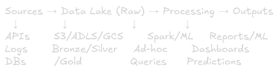
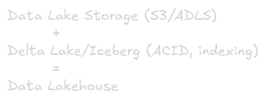

Data Lake
===

# What is a Data Lake?
**Definition:** Centralized repository that stores raw, unprocessed data in its native format (structured, semi-structured, unstructured) at any scale.

## Key Characteristics:
- **Stores raw data** (no pre-processing)
- **Schema-on-read** (define schema when querying)
- **Flexible** (any format: JSON, CSV, Parquet, images, logs)
- **Scalable** (petabytes of data)
- **Cost-effective** (cheap storage like s3)
- **ELT approach** (Extract → Load → Transform)

## Architecture:


# Data Lake Zones (Medallion Architecture)
**Pattern:** Progressively improve data quality through layers

## Bronze Layer (Raw)
**Purpose:** Landing zone for raw data

### Characteristics:
- Exact copy from source (immutable)
- Append-only
- Any format
- Minimal validation

**Example:** Raw JSON logs, CSV files as uploaded

**Storage:** JSON, CSV, Parquet

## Silver Layer (Cleansed)
**Purpose:** Cleaned and validate data

### Transformations:
- Remove duplicates
- Handle nulls
- Standardized formats (dates, phones)
- Data type fixes
- Basic quality checks

**Example:** Parsed logs, filtered invalid records

**Storage:** Parquet (compressed, columnar)

## Gold Layer (Curated)
**Purpose:** Business-ready data

### Transformations:
- Aggregations (daily, monthly summaries)
- Business metrics (KPIs, revenue)
- Feature engineering for ML
- Optimized for specific use cases

**Example:** Daily sales by region, customer 360 views

**Storage:** Parquet, Delta Lake, or Data Warehouse tables

## Data Flow Example:
```sql
-- Bronze: Raw data
{"user_id": "123", "event": "click", "timestamp": "2024-12-26T10:00:00Z"}

-- Silver: Cleaned
user_id | event | timestamp           | date
123     | click | 2024-12-26 10:00:00 | 2024-12-26

-- Gold: Aggregated
date       | total_clicks | unique_users
2024-12-26 | 1500000     | 50000
```

# Schema-on-Read vs Schema-on-Write

## Schema-on-Write (Data Warehouse)

- Schema defined before loading
- Slower ingestion (validaiton overhead)
- Fast, predictable queries
- Fixed structure
  
**When to use:** Known use cases, structured data, need speed

## Schema-on-Read (Data Lake)

- Schema defined when querying
- Fast ingestion (no validation)
- Flexible (any format)
- Slower queries

**When to use:** Unkown use cases, diverse data, exploration\
**Trade-off:** Flexibility vs Performance

# File Formats

## Row-Oriented (OLTP)
- **CSV:** Human-readable, inefficient
- **JSON:** Flexible, nested data, large size

**Use Case:** Bronze layer, small datasets

## Column-Oriented (OLAP)
- **Parquet:** Compressed, columnar, fast aggregations
- **ORC:** Similiar to Parquet, optimized for Hive

### Benefits:
- 5-10x compression
- Read only needed columns
- Fast analytical queries

**Use Case:** Silver/Gold layers

**Example:**
```py
# Bad: CSV (1GB)
df.write.csv("path/")

# Good: Parquet (100MB, 10x smaller + faster queries)
df.write.parquet("path/")
```

## Transactional Formats (Modern Lakehouse)
- **Delta Lake:** ACID on S3/ADLS
- **Apache Iceberg:** Table format with time travel
- **Apache Hudi:** Incremental processing

### Features:
- ACID transactions
- Time travel (query history)
- Schema evolution
- Upserts/deletes
  
**Use Case:** Production data lakes (Silver/Gold)
# Popular Data Lake Solutions

## 1. AWS: S3 + Glue + Athena
- **S3:** Object storage 
- **Glue:** Data catalog + ETL
- **Athena:** SQL queries on S3 (pay per query)

**Use Case:** AWS-native, cost-sensitive

## 2. Azure ADLS Gen2 + Databricks
- **ADLS Gen2:** Hierarchical storage
- **Databricks:** Spark processing + Delta Lake
- **Synapse:** Analytics service

**Use Case:** Microsoft ecosystem, enterprises

## 3. Google Cloud Storage (GCS) + BigQUery
- **GCS:** Object storage
- **BigQuery:** Serverless warehouse (can query GCS)
- **Dataproc:** Managed Spark

**Use Case:** Google Cloud, serverless preference

## 4. Databricks Lakehouse (Modern Choice)
- Multi-cloud (AWS/Azure/GCP)
- Delta Lake built-in
- Unified BI + ML platform

**Use Case:** Moder data platforms, best-in-class


# Data Lake Challenges & Solutions

## 1. Data Swamp 
**Problem:** Unorganized data → impossible to find/use

### Causes:
- No metadata
- No ownership
- No documentation

### Solutions:
- Metadata catalog (Glue, Purview, Atlas)
- Naming conventions: s3://lake/bronze/source/table/year=2024/
- Clear ownership (data teams)
- Automated data profiling

## 2. Performance Issues
**Problem:** Slow queries on raw data

### Solutions:
- Use Parquet (not CSV/JSON)
- Partition by date: /year=2024/month=12/day=26/
- Optimize file sizes (128MB-1GB per file)
- Use Delta Lake for indexing

### Example:
```py
# Partition for fast queries
df.write \
    .partitionBy("year", "month", "day") \
    .parquet("s3://lake/silver/events/")

# Query only Dec 2024
spark.read.parquet("s3://lake/silver/events/") \
    .filter("year=2024 AND month=12")
```

## 3. Security and Governance
**Problem:** Sensitive data exposed

### Solutions:
- Fine-grained access (column-level, permissions)
- Encryption: at rest + in transit
- Data masking for PII
- Audit logs (who accessed what)

### Example - Data Masking:
```sql
-- Create masked view
CREATE VIEW customers_masked AS
SELECT 
    customer_id,
    CONCAT(LEFT(email, 3), '***@***.com') as email,
    CONCAT('***-', RIGHT(phone, 4)) as phone
FROM customers;
```

## 4. Data Quality
**Problem:** Inconsistent, invalid data

### Solutions:
- Validation at Silver layer
- Data quality framework (Great Expectations)
- Automated monitoring
- Reject bad records to quarantine

# Data Lake vs Data Warehouse
|Aspect|Data Lake|Data Warehouse|
|-|-|-|
|Data|All types|Structured only|
|Schema|Schema-on-read|Schema-on-write|
|Speed|Ingestion fast, queries slow|Ingestion slow, queries fast|
|Cost|Cheap|Expensive|
|Use Case|ML, exploration|BI, reporting|
|Users|Data scientist|Business analyst|
|Example|S3, ADLS|Redshift, Snowflake|


# Data Lakehouse (Modern Hybrid)
**Definition:** Combines lake flexibility + warehouse performance

## How:


## Features:
- Store raw data (like lake)
- ACID transaction (like warehouse)
- Fast queries (like warehouse)
- Low cost (like lake)

## Technologies:
- Databricks Delta Lake
- Apache Iceberg
- Apache Hudi

## Benefits:
- Single platform for BI + ML
- No data duplication
- Best of both worlds

# Best Practices

## 1. Always Use Medallion Pattern
Bronze → Silver → Gold (clear quality progression)

## 2. Chose Right File Format
> Bronze: Any format (CSV, JSON)\
> Silver: Parquet (compressed, columnar)\
> Gold: Delta Lake (ACID + performance) 

## 3. Partition Smart
Default: Parititon by date (most common query pattern)

## 4. Governance from Day 1
- Metadata catalog
- Clear ownership
- Access policies
- Retention rules

## 5. Monitor Key Metrics
- Storage costs
- Query performance (p95)
- Data freshness
- Pipeline Success rate

# When to Use Data Lake

## Choose Data Lake When:
✅ Need to store diverse data types\
✅ Unkonw future use cases\
✅ ML/data science workloads\
✅ Streaming data\
✅ Cost-sensitive\
✅ Need flexibility

## Examples:
- IoT sensor data
- Application logs
- Social media feeds
- Images/videos 
- ML training data
- Clickstream analytics

# Real-World Examples

## Netflix
**Data Lake:** AWS S3
- Viewing history (billions of events)
- ML training data for recommendations

**Processing:** Spark on EMR\
**Cost:** ~$0.023/GB/month

## Uber
**Data Lake:** GCS
- Trip data, GPS coordinates
- Real-time event streaming

**Analytics:** BigQuery\
**Processing:** Spark + Flink

## Airbnb
**Lakehouse:** Databricks Delta Lake
- Listing data, booking events
- Unified platform for BI + ML

# Quick Decision Guide
## Data Lake When:
- Diverse data (structured + unstructured)
- ML/exploration workloads
- Cost-sensitive
- Unkown future queries

## Data Warehouse when:
- Only stuctured data
- Known BI/reporting use cases
- Fast queries critical
- Consistency required

## Data Lakehouse when:
- Need both BI + ML
- Want single platform
- Modern projects
- Best of both worlds

# Key Takeaways
1. **Medallion:** Bronze (raw) → Silver (cleaned) → Gold (curated)
2. **Schema-on-read:** Load any foramt, define schema at query time
3. **File Formats:** CSV/JSON → Parquet → Delta Lake (quality progression)
4. **Partitioning:** By date (most common) for query performance
5. **Avoid Swamp:** Metadata catalog + governance + organization
6. **Modern Trend:** Data Lakehouse = Lake + Warehouse combined
7. **Cost:** $0.023/GB/month (S3) vs $25+/TB/month (warehouse)

**Remember:** Data lake prioritize **flexibility & cost** over performance. For fast queries, transform to Parquet and use partitioning
