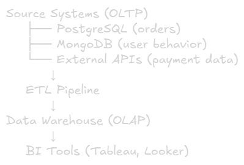
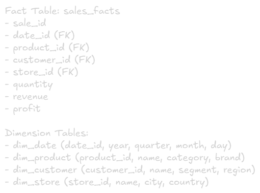
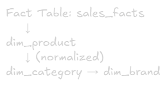
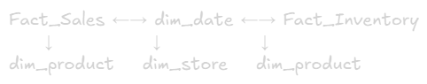

Data Warehouse
===

# What is a Data Warehouse?
**Definition:** Centralized repository that stores structured, processed data from multiple sources optimized for analysis and reporting

## Key Characteristics:
- **Structured Data** (schemas enforced)
- **ETL processed** (cleaned, transformed)
- **Optimized for queries** (fast aggregations)
- **Historical data** (time-series)
- **Single source of truth** for analytics

## Architecture Flow:


# Data Warehouse Architecture Layers

## 1. Staging Layer
**Purpose:** Temporary landing zone fro raw data from source systems

### Characteristics:
- Data stored in original source format
- Exact copy of source data
- Minimal transformation
- Used for data quality checks
- Typically truncated after ETL completes

### Example:
```sql
-- Staging table
CREATE TABLE staging_orders (
    order_id INT,
    customer_id INT,
    order_date DATE,
    amount DECIMAL,
    -- Loaded as-is from source
);
```

## 2. Integratiion/ODS Layer (Optional)
**ODS = Operational Data Store**

**Purpose:** Support operational reporting with current or near real-time data

### Characteristics:
- Time-sensitive business data for current operations
- Subject-oriented (by business area)
- Support tactical decisions
- Usually normalized (3NF schema)
- Bridge between OLTP and warehouse

**Use Case:** "What happened in the last hour?" - operational queries

### Difference from Warehouse:
- ODS: Current/recent data, data overwritten and changes frequently
- Warehouse: Historical data, static data for archiving and historical analysis

## 3. Data Warehouse Layer
**Purpose:** Historical, integrated data optimized for analysis

### Characteristics:
- Star/Snowflake schema
- Slowly Changing Dimensions (SCD)
- Time-variant data
- Non-volatile (historical records preserved)

## 4. Data Mart Layer
**Purpose:** Subset of warehouse focused on specific business function or department

### Example:


### Benefits:
- Faster queries on smaller datasets optimized for specific needs
- Department-specific schemas
- Security/access control by department
- Cost-effective with less storage and computational power

# Data Warehouse Schema Design

## 1. Star Schema (Most Common)
**Structure:** One fact table surrounded by dimension tables

### Example: E-commerce Analytics


**Pros:**\
✅Simple queries (fewer joins)\
✅Fast query performance\
✅Easy to understand

**Cons:**\
❌Data redundancy in dimensions\
❌More storage needed

**Use Case:** Most business intelligence applications

## 2. Snowflake Schema
**Structure:** Normalized dimension tables (dimensions split into sub-dimensions)

### Example:


**Pros:**\
✅Less storage (normalized)\
✅Better data integrity

**Cons:**\
❌More complex queries (more joins)\
❌Slower query performance

**Use Case:** When storage is expensive, complex hierarchies

## 3. Galaxy Schema (Fact Constellation)
**Structure:** Multiple fact tables sharing dimension tables

### Example:


**Use Case:** Enterprise data warehouse with multiple business process

# Slowly Changing Dimension (SCD)
**Example:** Custoer moves to new address, product price changes

## SCD Types:

### Type 0: Retain Original
Attributes never change, assigned to values described as 'Original'

**Use Case:** Birth date, social security number, zip codes

### Type 1: Overwrite
Overwrites old with new data, does not track historical data

**Example:**
```sql
-- Customer moves
UPDATE dim_customer 
SET address = '456 New St', city = 'Boston'
WHERE customer_id = 123;

-- Old address lost forever
```

**Pros:** Simple, less storage\
**Cons:** No history tracking

**Use Case:** Fix typos, unimportant attributes

### Type 2: Add New Row (Most Common)
Maintains history by creating new rows when data changes, with each record having timestamp or version number

**Example:**
```sql
-- Customer record history
customer_key | customer_id | address      | city    | valid_from | valid_to   | is_current
-------------|-------------|--------------|---------|------------|------------|------------
1            | 123         | 123 Old St   | NYC     | 2023-01-01 | 2024-06-30 | N
2            | 123         | 456 New St   | Boston  | 2024-07-01 | 9999-12-31 | Y
```

**Pros:** Full history, point-int-time queries\
**Cons:** More storage, more complex queries

**Use Case:** Customer addresses, employee positions, product categories

**Query for sepcific date:
```sql
-- Find customer info as of June 2024
SELECT * FROM dim_customer
WHERE customer_id = 123
  AND '2024-06-15' BETWEEN valid_from AND valid_to;
```

### Type 3: Add New Column
Tracks changes using separate columns, preserves limited history with new attributes

**Example:**
```sql
customer_id | current_address | previous_address | address_change_date
------------|-----------------|------------------|--------------------
123         | 456 New St      | 123 Old St       | 2024-07-01
```

**Pros:** Simple queries, fixed storage\
**Cons:** Limited history (only previous value)

**Use Case:** Track one previous value (previous job title, previous status)

### Type 4: Add History Table
Current data in main table, full history in separate table

**Example:**
```sql
-- dim_customer (current only)
customer_id | address      | city    | updated_at
------------|--------------|---------|------------
123         | 456 New St   | Boston  | 2024-07-01

-- dim_customer_history (all changes)
history_id | customer_id | address      | city    | change_date
-----------|-------------|--------------|---------|-------------
1          | 123         | 123 Old St   | NYC     | 2023-01-01
2          | 123         | 456 New St   | Boston  | 2024-07-01
```

**Pros:** Clean current view, unlimited history\
**Cons:** Requires joins for historical queries

**Use Case:** Large dimensions with frequent changes

# Fact Table Types

## 1. Transaction Fact Table
**Granularity:** One row per transaction/event

### Example: Sales transactions
```sql
sale_id | date_key | product_key | customer_key | quantity | amount
--------|----------|-------------|--------------|----------|--------
1       | 20241220 | 501         | 1001         | 2        | 50.00
2       | 20241220 | 502         | 1002         | 1        | 25.00
```

### Characteristics:
- Most detailed (atomic level)
- Sparse (empty cells common)
- Large volume
- Additive measures

**Use Case:** Individual orders, clicks, logins

## 2. Periodic Snapshot Fact Table
**Granularity:** One row per period (day/week/month)

### Example: Daily account balance
```sql
account_key | date_key | balance | transactions_count | total_deposits
------------|----------|---------|-------------------|----------------
1001        | 20241220 | 5000.00 | 3                 | 200.00
1001        | 20241221 | 5100.00 | 2                 | 150.00
```

### Characteristics:
- Regular time intervals
- Dense (no gaps)
- Include calculated values
- Semi-additive measures (can't sum balance across time)

**Use Case:** Inventory levels, account balances, website metrics

## 3. Accumulating Snapshot Fact Table
**Granularity:** One row per process/lifecycle, updated as process progress

### Example: Order fulfillment pipeline
```sql
order_key | order_date_key | payment_date_key | ship_date_key | delivery_date_key | days_to_ship
----------|----------------|------------------|---------------|-------------------|-------------
101       | 20241201       | 20241201         | 20241203      | 20241205          | 2
102       | 20241202       | 20241202         | NULL          | NULL              | NULL
```
## Characteristics:
- Multiple date stamps (lifecycle stages)
- Rows updated (not just inserted)
- Tracks progress through pipeline
- Lag calculations (days between stages)

**Use Case:** Order processing, loan applications, support tickets

# Column-Oriented Storage
**Why Column Storage for Analytics?**

## Row-Oriented (OLTP):
>Row 1: [id=1, name="John", age=25, city="NYC", salary=50000]
>
>Row 2: [id=2, name="Jane", age=30, city="LA", salary=60000]
>
>Row 3: [id=3, name="Bob", age=35, city="NYC", salary=70000]

## Column-Oriented (OLAP):
>Column id:     [1, 2, 3]\
>Column name:   ["John", "Jane", "Bob"]\
>Column age:    [25, 30, 35]\
>Column city:   ["NYC", "LA", "NYC"]\
>Column salary: [50000, 60000, 70000]

## Benefits for Analytics:
✅**Better compression** (similar data together)\
✅**Faster aggregations (only read needed columns)\
✅**Efficient for queries** like: `SELECT AVG(salary) WHERE city='NYC'`

```sql
-- Only reads 'salary' and 'city' columns
SELECT AVG(salary) FROM employees WHERE city = 'NYC';

-- Row storage: reads entire rows (wasteful)
-- Column storage: reads only 2 columns (efficient)
```
# Data Warehouse Performance Optimization

## 1. Partitioning
**Strategy:** Split large tables into smaller, manageable pieces

### Common partition keys:
- Date/time (most common)
- Geography (region, country)
- Product category

### Example:
```sql
-- Partition by month
CREATE TABLE sales (
    sale_id BIGINT,
    sale_date DATE,
    amount DECIMAL
) PARTITION BY RANGE (sale_date) (
    PARTITION p_2024_01 VALUES FROM ('2024-01-01') TO ('2024-02-01'),
    PARTITION p_2024_02 VALUES FROM ('2024-02-01') TO ('2024-03-01'),
    PARTITION p_2024_03 VALUES FROM ('2024-03-01') TO ('2024-04-01')
);
```

### Benefits:
- Query only relevant partitions (partition pruning)
- Fasteer data loading
- Easier maintenance (drop old partitions)

## 2. Materialized Views
**Concept:** Pre-computed query results stored as table

### Example:
```sql
-- Expensive query computed once
CREATE MATERIALIZED VIEW monthly_sales AS
SELECT 
    DATE_TRUNC('month', sale_date) as month,
    product_category,
    SUM(amount) as total_sales,
    COUNT(*) as order_count
FROM sales
GROUP BY month, product_category;

-- Fast queries on materialized view
SELECT * FROM monthly_sales WHERE month = '2024-12-01';
```

### Benefits:
- Extremely fast queries (pre-computed)
- Reduce compute on warehouse

### Trade-offs:
- Extra storage
- Need refresh strategy (daily, hour, on-demand)

## 3. Indexing

### Common indexes in warehouse:
**Bitmap indexes** (low cardinality columns);
```sql
CREATE BITMAP INDEX idx_gender ON customers(gender);
-- Good for: gender, status, category (few distinct values)
```

**B-tree indexes** (high cardinality):
```sql
CREATE INDEX idx_customer_id ON sales(customer_id);
-- Good for: IDs, dates, foreign keys
```

## 4. Compression
**Column storage + compression = huge savings**

### Example compression ratios:
- Integer columns: 10:1 to 20:1
- String columns: 5:1 to 10:1
- Date columns: 15:1 to 30:1

### Benefits:
- Less storage costs
- Faster I/O (less data to read)
- More data fits in memory

## 5. Short Keys / Clustering
**Concept:** Physical ordering of data on disk

### Example (Redshift):
```sql
CREATE TABLE sales (
    sale_date DATE,
    customer_id INT,
    amount DECIMAL
) SORTKEY(sale_date);
```

### Benefits:
- Range queries faster (data co-located)
- Better compression (similar values together)
- Partition pruning more effective

## 6. Distribution Keys (MPP Systems)
**Concept:** How data is distributed across nodes

### Strategies:
**Even Distribution**\
Distribute rows evenly (round-robin)\
**Use Case:** Small tables, no join patterns

**Key Distribution**\
Distribute by specific column\
**Use Case:** Large fact tables, join optimization

### Example:
```sql
-- Distribute both tables by customer_id
CREATE TABLE orders DISTSTYLE KEY DISTKEY(customer_id);
CREATE TABLE customers DISTSTYLE KEY DISTKEY(customer_id);

-- Join executes locally on each node (no network shuffle)
SELECT * FROM orders o
JOIN customers c ON o.customer_id = c.customer_id;
```

### All Distribution
Replicate entire table to all nodes\
**Use Case:** Small dimension tables (< 1M rows)

# Popular Data Warehouse Solutions

## 1. Amazon Redshift
**Type:** Cloud-based, column-oriented

### Features:
- Massively parallel processing (MPP)
- SQL interface
- Integrates with AWS ecosystem
- Scalable (resize clusters)

**Pricing:** Pay per hour of cluster runtime

**Use Case:** AWS-heavy companies, medium to large scale

## 2. Google BigQuery
**Type:** Serverless, column-oriented

### Features:
- Serverless (no infrastructure management)
- Extremely fast (petabyte-scale)
- Pay per query (no idle costs)
- Integrates with GCP

**Pricing:** Pay per data scanned

**Use Case:** Startups to enterprise, variable workloads

## 3. Snowflake
**Type:** Cloud-agnostic, column-oriented

### Features:
- Multi-cloud (AWS, Azure, GCP)
- Separate storage and compute
- Automatic scaling
- Time trave (query historical data)

**Pricing:** Storage + compute separately

**Use Case:** Multi-cloud strategy, financial services

## 4. Apache Hive (Open Source)
**Type:** SQL on Hadoop

### Features:
- Built on Hadoop ecosystem
- HiveQL (SQL-like)
- Good for batch processing

**Use Case:** Large datasets, cost-sensitive, on-premise

# Data Warehouse vs OLTP Database
|Aspect|OLTP Database|Data Warehouse|
|-|-|-|
|**Purpose**|Day-to-day operations|Analysis, reporting
|**Queries**|Simple, fast (ms)|Complex, slower (seconds)
|**Users**|Many concurrent|Fewer, batch jobs
|**Data Volume**|Current data|Historical data
|**Schema**|Normalized (3NF)|Denormalized (star/snowflake)
|**Updates**|Frequent INSERT/UPDATE/DELETE|Mostly INSERT (batch loads)
|**Optimization**|Write-optimized|Read-optimized
|**Storage**|Row-oriented|Column-oriented
|**Example**|PostgreSQL, MySQL|Redshift, BigQuery, Snowflake


# When to Use Data Warehouse

## Use Data Warehouse When:
✅Need fast, complex analytical queries\
✅Business intelligence and reporting\
✅Structured, cleaned data\
✅SQL-based analysis\
✅Consistent schema\
✅Regulatory compliance (audit trails)

## Examples:
- Sales dashboards
- Financial reporting
- Customer segmentation
- Trend analysis
- KPI tracking