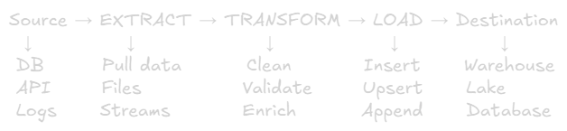

ETL and Data Pipelines
===

# What is ETL?
**ETL = Extract, Transform, Load**

**Definition:** Process of moving data from source systems to destination systems with transformation in between

## Core Steps:


# ETL vs ELT

## ETL (Traditional)
> Extract → Transform (outside) → Load

### Process:
- Pull data from source
- Transform in **staging server** (external compute)
- Load clean data to warehouse

### When to use:
- Warehouse compute is expensive
- Complex transformation needed
- Legacy systems
- On-premise infrastructure

### Pros:
✅ Clean data arrives in warehouse\
✅ Less warehouse compute needed\
✅ Works with limited warehouse resources

### Cons:
❌ Needed separate transformation infrastructure\
❌ Slower loading (transformation overhead)
❌ Less flexible (schema defined upfront)

## ELT (Modern Cloud)
> Extract → Load (raw) → Transform (in warehouse)

### Process:
- Pull data from source
- Load raw data directly to warehouse
- Transform using **warehouse compute power**

### When to use:
- Cloud warehouse (Redshift, BigQuery, Snowflake)
- Want leverage warehouse power
- Fast loading needed
- Schema flexibility required

### Pros:
✅ Fast loading (no transformation delay)\
✅ Leverage powerful warehouse compute\
✅ Raw data available for reprocessing\
✅ Schema flexibility 

### Cons:
❌ Higher warehouse compute costs\
❌ Raw data takes storage\
❌ Complex to manage transformations

## Comparison Table:
|Aspect|ETL|ELT|
|-|-|-|
|**Transform Where**|Before load (staging)|After load (warehouse)
|**Loading Speed**|Slower|Faster
|**Warehouse Load**|Lower|Higher
|**Best for**|Limited resources|Cloud warehouses
|**Flexibility**|Lower|Higher|
|**Example**|On-premise → Warehouse|S3 → BigQuery

**Modern Trend:** Most cloud platforms use **ELT** (BigQuery, Snowflake, Databricks)

# Data Pipeline Patterns

## 1. Batch Processing
**Definition:** Process large volumes of data at scheduled intervals

### Characteristics:
- Run on schedule (hourly, daily, weekly)
- Process large volumes
- Higher latency (minutes to hours)
- More resource-efficient

### Example:
> Every day at 2 AM:
> 1. Extract orders from last 24 hours
> 2. Transform and aggregate
> 3. Load to warehouse
> 4. Refresh dashboards

### Use Cases:
- Daily/monthly reports
- Historical analysis
- Payroll processing
- End-of-day reconciliation

### Tools:
- Apache Airflow
- AWS Glue
- Azure Data Factory
- dbt

### Pros:
✅ Simple to implement\
✅ Cost-effective (batch resources)\
✅ Handle large volumes well\
✅ Retry logic easier

### Cons:
❌ Data not real-time (hours old)\
❌ Latency in insights\
❌ Fixed schedule

## 2. Streaming Processing (Real-Time)
**Definition:** Process data continuously as it arrives

### Characteristics:
- Continuous processing
- Low latency (seconds)
- Event-driven
- More complex

### Example:
> Continuous:\
> User clicks ad → Kafka → Transform → Real-time dashboard\
> (< 1 second latency)

### Use Cases:
- Fraud detection
- Real-time recommendations
- Stock trading
- IoT sensor monitoring
- Live dashboards

### Tools:
- Apache Kafka
- Apache Flink
- AWS Kinesis
- Spark Streaming

### Pros:
✅ Real-time insights (seconds)\
✅ Immediate actions\
✅ Always fresh data

### Cons:
❌ More complex\
❌ Higher infrastructure costs\
❌ Harder to debug\
❌ Exactly-once processing challenging

## 3. Micro-Batch (Hybrid) 
**Definition:** Small batches processed frequently (every few minutes)

### Characteristics:
- Balance between batch and streaming
- Near real-time (1-5 minutes latency)
- Simpler than pure streaming

### Example:
> Every 5 minutes:\
> Process last 5 minutes of events

### Use Cases:
- Near real-time dashboards
- Social media analytics
- E-commerce metrics

### Tools:
- Spark Streaming (DStreams)
- Apache  Flink (micro-batching mode)

### Pros:
✅ Near real-time (good enough for many cases)\ 
✅ Simpler than pure streaming\
✅ Lower cost than streaming

### Cons:
❌ Not true-real-time\
❌ Still has latency

## Pattern Comparison:
|Aspect|Batch|Micro-Batch|Streaming|
|-|-|-|-|
|Latency|Hours|Minutes|Seconds|
|Complexity|Low|Medium|High|
|Cost|Low|Medium|High|
|Use Case|Reports|Near real-time|Real-time|

### Rule of Thumb:
- Need same-day data? → Batch
- Need data withing 5 minutes? → Micro-batch
- Need data within seconds? → Streaming

# ETL Phases in Detail

## 1. Extract
**Goal:** Get data from source systems

### Sources:
- **Databases:** PostgreSQL, MySQL, MongoDB
- **APIs:** REST, GraphQL
- **Files:** CSV, JSON, Parquet
- **Streams:** Kafka, Kinesis
- **SaaS:** Salesforce, Google Analytics

### Extraction Methods:

#### Full Extraction
Pull all data every time
```sql
SELECT * FROM orders;
```
**Pros:** Simple\
**Cons:** Inefficient, slow

#### Incremental Extraction (Most Common)
Pull only new/changed data
```sql
SELECT * FROM orders
WHERE updated_at > '2024-12-25 00:00:00';
```
**Pros:** Efficient, fast\
**Cons:** Need to track last run

#### Change Data Capture (CDC)
Capture database changes in real-time
> Database → CDC Tool → Stream Changes

**Tools:** Debezium, AWS DMS

**Pros:** Real-time, no polling\
**Cons:** Complex setup

## 2. Transform
**Goal:** Clean, validate, enrich data

**Common Transformation:**

### Data Cleaning
```py
# Remove duplicates
df.drop_duplicates()

# Handle nulls
df.fillna(0)

# Fix data types
df['date'] = pd.to_datetime(df['date'])

# Standardize
df['phone'] = df['phone'].str.replace('[^0-9]', '')
```

### Data Validation
```py
# Reject invalid records
if not email.contains('@'):
    reject_record()

# Check ranges
if age < 0 or age > 120:
    reject_record()
```

### Data Enrichment
```py
# Add derived fields
customer_ltv = sum(orders.amount)

# Lookup dimensions
city = geocode_zipcode(zipcode)

# Calculate metrics
conversion_rate = purchases / visits
```

### Data Aggregation
```sql
-- Daily summaries
SELECT 
    DATE(order_date) as date,
    COUNT(*) as order_count,
    SUM(amount) as total_revenue
FROM orders
GROUP BY date;
```

## 3. Load
**Goal:** Insert data into target system

**Loading Strategies:**

### Full Load
Replace entire table

```sql
TRUNCATE TABLE dim_products;
INSERT INTO dim_products SELECT * FROM staging;
```
**Use Case:** Small tables, rebuild needed

### Incremental Load
Insert only new records

```sql
INSERT INTO fact_sales
SELECT * FROM staging
WHERE sale_id NOT IN (SELECT sale_id FROM fact_sales);
```
**Use Case:** Large tables, append-only

### Upsert (Merge)
Insert new, update existing

```sql
MERGE INTO customers AS target
USING staging AS source
ON target.id = source.id
WHEN MATCHED THEN UPDATE
WHEN NOT MATCHED THEN INSERT;
```
**Use Case:** Dimension tables, updates frequent

# Best Practices

## 1. Idempotency
**Rule:** Running pipeline multiple times = same result

```py
# Bad: Incremental without checks
INSERT INTO sales VALUES (...);

# Good: Idempotent upsert
MERGE INTO sales ...
```
**Why:** Safe to retry, no duplicates

## 2. Incremental Processing
**Rule:** Only process new/changed data

```py
# Track last run
last_run = get_last_run_timestamp()

# Extract only new data
new_data = source.query(f"WHERE updated_at > '{last_run}'")

# Update after success
set_last_run_timestamp(current_time)
```
**Why:** Faster, cheaper, scalable

## 3. Data Quality Checks
```py
# Extract: Check source
if not source_db.is_connected():
    alert_team()

# Transform: Validate data
if null_percentage > 5%:
    alert_team()

# Load: Verify counts
if target_count != source_count:
    alert_team()
```
**Why:** Catch issues early

## 4. Error Handling
```py
try:
    extract_data()
    transform_data()
    load_data()
    log_success()
except Exception as e:
    log_error(e)
    send_alert(e)
    retry_with_backoff()
```
**Why:** Pipelines will fail, handle gracefully

## 5. Monitoring & Alerting

### Key Metrics:
- Pipeline success rate (target: >99%)
- Run duration (track p95)
- Data freshness (time since last update)
- Row counts (source vs target)

### Alerts:
- Pipeline failure
- Data quality issues
- SLA violations
- Unusual data volume

# Popular ETL Tools

## 1. Apache Airflow
**Type:** Workflow orchestration

### Features:
- Python-based DAGs (Directed Acyclic Graph)
- Scheduling
- Monitoring
- Retry logic

**Use Case:** Complex pipelines, Python users

### Example:
```py
from airflow import DAG
from airflow.operators.python import PythonOperator

dag = DAG('etl_daily', schedule='@daily')

extract = PythonOperator(task_id='extract', python_callable=extract_fn)
transform = PythonOperator(task_id='transform', python_callable=transform_fn)
load = PythonOperator(task_id='load', python_callable=load_fn)

extract >> transform >> load  # Dependencies
```

## 2. dbt (Data Build Tool)
**Type:** SQL transformation framework

### Features:
- SQL-based transformations
- Version control (Git)
- Testing
- Documentation

**Use Case:** Analytics engineering, SQL transformations

### Example:
```sql
-- models/daily_sales.sql
{{ config(materialized='table') }}

SELECT 
    DATE(order_date) as date,
    SUM(amount) as revenue
FROM {{ ref('staging_orders') }}
GROUP BY date
```

## 3. Apache Spark
**Type:** Distributed processing

### Features:
- Batch and streaming
- Python/Scala/Java APIs
- Handles large datasets

**Use Case:** Big data processing

## 4. Fivetran / Stitch
**Type:** Managed ELT (SaaS)

### Features:
- Pre-built connectors (150+)
- Automatic schema changes
- No-code setup

**Use Case:** Quick setup, non-technical teams

## 5. AWS Glue
**Type:** Serverless ETL

### Features:
- Auto-scaling
- Data catalog
- PySpark-based

**Use Case:** AWS-native

# Common Challenges & Solutions

## Challenge 1: Schema Changes
**Problem:** Source schema changes → pipeline breaks

### Solutions:
- Schema versioning
- Flexible parsing
- Alert on schema drift
- Test with new schema before deploy

## Challenge 2: Data Volume Growth
**Problem:** Pipeline too slow for growing data

### Solutions:
- Optimize queries (indexes, partitions)
- Incremental processing
- Parallel processing
- Scale infrastructure

## Challenge 3: Data Quality
**Problem:** Bad data in = bad data out

### Solutions:
- Validation at each stage
- Data quality framework (Great Expectations)
- Quarantine bad records
- Alert on quality issues

## Challenge 4: Dependency Management
**Problem:** Pipeline B depends on Pipeline A

### Solutions:
- Use orchestrator (Airflow)
- Define dependencies explicitly
- Sensors to wait for upstream
- Retry with backoff

# Real-World Example: E-commerce Analytics

## Goal: Daily sales dashboard

### Sources:
- PostgreSQL (orders, customers)
- MongoDB (product catalog)
- Stripe API (payments)

### Pipeline (Airflow):
```py
# DAG Definition
dag = DAG('ecommerce_etl', schedule='@daily', start_date='2024-01-01')

# Tasks
extract_orders = PostgresOperator(
    task_id='extract_orders',
    sql='SELECT * FROM orders WHERE date = {{ ds }}'
)

extract_products = MongoOperator(
    task_id='extract_products',
    query={'updated': {'$gte': '{{ ds }}'}}
)

extract_payments = HttpOperator(
    task_id='extract_payments',
    endpoint='https://api.stripe.com/payments'
)

transform_data = PythonOperator(
    task_id='transform',
    python_callable=transform_fn
)

load_warehouse = SnowflakeOperator(
    task_id='load',
    sql='INSERT INTO fact_sales SELECT * FROM staging'
)

# Dependencies
[extract_orders, extract_products, extract_payments] >> transform_data >> load_warehouse
```

### Transformation Logic:
```py
def transform_fn():
    # Join data
    sales = orders.merge(products, on='product_id')
    sales = sales.merge(payments, on='order_id')
    
    # Clean
    sales = sales.dropna(subset=['customer_id'])
    sales['amount'] = sales['amount'].astype(float)
    
    # Enrich
    sales['revenue'] = sales['quantity'] * sales['price']
    sales['profit'] = sales['revenue'] * 0.3  # 30% margin
    
    # Aggregate
    daily_sales = sales.groupby('date').agg({
        'order_id': 'count',
        'revenue': 'sum',
        'profit': 'sum'
    })
    
    return daily_sales
```

### Results:
- Runs daily at 2 AM
- Processes ~1M orders/day
- Loads to Snowflake in ~10 minutes
- Power Tableau dashboard

# Quick Decision Guide

## Choose Batch When:
- Daily/hourly reports OK
- Large volumes
- Simple implementation needed
- Cost-sensitive

## Choose Streaming When:
- Real-time insights required (<1 second)
- Fraud detection, recommendations
- Event-driven architecture
- Can handle complexity

## Choose Micro-Batch When:
- Near real-time OK (1-5 minutes)
- Balance cost and latency
- Simpler than streaming

## Choose ETL When:
- Limited warehouse compute
- Complex transformations
- On-premise 

## Choose ELT When:
- Cloud warehouse (Redshift, BigQuery) 
- Want flexibility
- Fast loading needed

# Key Takeaways
1. **ETL:** Transform before load (traditional)
2. **ELT:** Load then transform (modern cloud)
3. **Batch:** Process on schedule (hours latency)
4. **Streaming:** Process continuously (seconds latency)
5. **Idempotency:** Safe to retry, no duplicates
6. **Incremental:** Only process new data
7. **Monitoring:** Success rate, freshness, quality
8. **Tools:** Airflow (orchestrate), dbt (transform), Spark (big data), Kafka (Streaming)

**Remember:** Start simple (batch ETL), add complexity only when needed (streaming, ELT)
