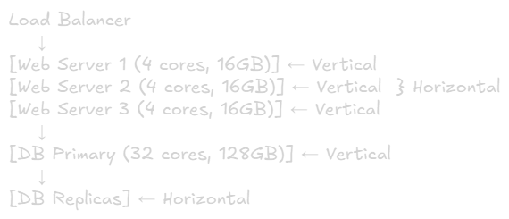

Horizontal vs Vertical Scaling
===

# Overview
Scaling is the process of adding capacity to handle increased load. There are two fundamental approaches: vertical (scaling up) and horizontal (scaling out).

# Vertical Scaling (Scale Up)

## Definition
Adding more power to existing machines (CPU, RAM, disk)

## Characteristics
- **Single machine** gets more resources
- **No architectural changes** needed
- **Simple** to implement initially

## Pros
- No code change required
- Simpler architecture (no distributed complexity)
- Data consistency is easier (single source)
- Inter-process communication is fast

## Cons
- **Hard limit:** Physical hardware constraints
- **Single point of failure** (SPOF)
- **Downtime** required for upgrades
- **Expensive** at high specs (cost scales non-linearly)
- Limited by vendor hardware availability

## When to Use
- Early stages / MVP
- Monolithic applications
- Legacy System hard to refactor
- Database requiring ACID guarantees

# Horizontal Scaling (Scale Out)

## Definition
Adding more machines to distribute the load

## Characteristics
- **Multiple machines** work together
- **Load distribution** across nodes
- **Requires architectural planning**

## Pros
- **Near infinite scalability** (add more machines)
- **High availability:** No single point of failure
- **No downtime:** Add/remove nodes dynamically
- **Cost-effective:** Use commodity hardware
- **Geographic distribution** possible

## Cons
- **Complex architecture** (load balancers, service discovery)
- **Data consistency** challenges (CAP theorem)
- **Network latency** between nodes
- **Operational complexity** (monitoring, deployment)
- Application must be **stateless or handle state distribution**

## When to Use
- High traffic applications
- Need for high availability
- Microservice architecture
- Cloud-native applications
- Global user base

# Key Differences
|Aspect|Vertical|Horizontal|
|-|-|-|
|**Approach**|Bigger machine|More machines|
|**Limit**|Hardware ceiling|Nearly unlimited|
|**Cost**|Exponential|Linear|
|**Availability**|SPOF risk|Resilient|
|**Complexity**|Low|High|
|**Downtime**|Required|Not required|

# Practical Example

## E-commerce Site Load Growth

**Stage 1: Small** (1k users/day)
- Single server with web + DB
- Solution: Vertical scaling (8GB → 16GB RAM)

**Stage 2: Growing** (50K users/day)
- Server hitting limits
- Solution: Horizontal scaling
  - Load balancer
  - 3 web servers
  - Separate DB server

**Stage 3: Scale** (1M+ users/day)
- Solution: Full horizontal
  - Auto-scalling web servers
  - Database replication (read replicas)
  - Caching layer (Redis)
  - CDN for static assets

# Hybrid Approach
Most real system use **both:**
1. **Vertical:** Scale databases first (they're harder to distribute)
2. **Horizontal:** Scale stateless web/app servers
3. **Combination:** Horizontal clusters where each node is reasonably sized

## Example Architecture

# Critical Concepts for System Design

## Load Balancer (Required for Horizontal)
Distributes traffic across multiple servers
- Round-robin, least connections, **IP** hash
- Health checks to avoid dead nodes

## Statelessness (Key for Horizontal)
Applications shouldn't store session data locally
- Use external cache (Redis, Memcached)
- Database for persistent state
- Enables any server to handle any request

## Database Scaling
- **Vertical:** Easiest first step
- **Read replicas:** Horizontal for reads
- **Sharding:** Horizontal for writes (complex)

# Quick Decision Guide

## Choose Vertical when:
- Starting out / scmall scale
- Budget is limited initially
- Simplicity is priority
- Upgrading is faster than refactoring

## Choose Horizontal when:
- Need high availability
- Traffic is unpredictable
- Scale beyond single machine limits
- Building for long-term growth

## Red flags requiring Horizontal:
- "We're down every time we upgrade"
- "Server hits 100% CPU during peak hours"
- "Can't find hardware specs we need"
- "Need 99.99% uptime"

# Remember
> Start with vertical scaling for simplicity, **but design for horizontal** from the start. It's cheaper to add RAM early than to refactor monolith later.

The goal isn't to choose one forever, it's to know when to transaltion and how to design systems that can scale horizontally when needed