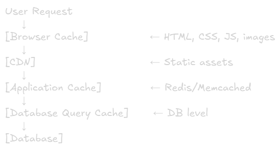
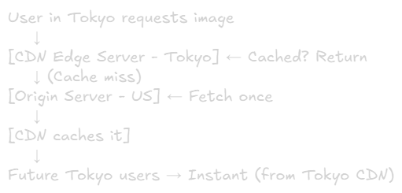
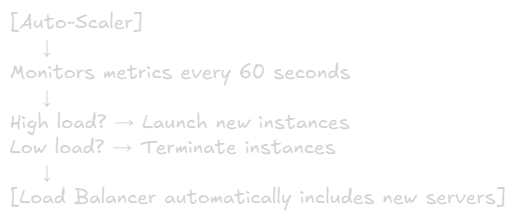
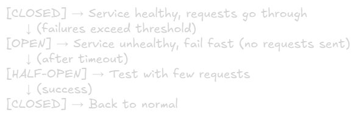
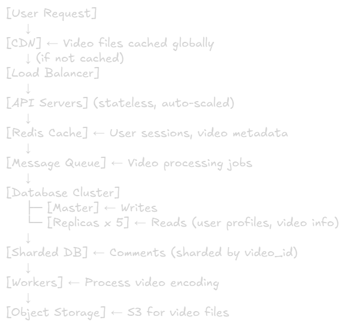
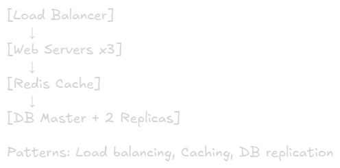
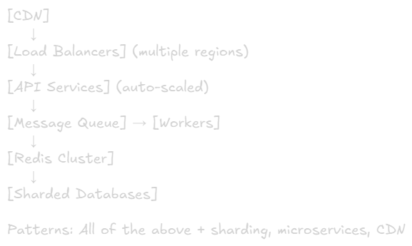

Scaling Patterns
===

# Overview
Scaling patterns are proven architectural approaches to handle growth. These patterns solve specific bottlenecks as your system scales.

# 1. Load Balancing
Distribute incoming traffic across multiple servers

## How It Works


## Algorithms

### Round Robin
- Distributes requests sequentially
- Simple, even distribution
- Use when: have equal capacity

### Least Connections
- Routes to server with fewest active connections
- Use when: Requests have variable duration

### IP Hash
- Same client → same server (based on IP)
- Use when: Need session affinity

### Weighted Round Robin
- Distribute based on server capacity
- Use when: Servers have different specs

## Key Concepts
- **Health checks:** Remove unhealthy servers from pool
- **Layer 4 (TCP):** Fast, basic routing
- **Layer 7 (HTTP):** Smart routing based on content (path, headers)

## Example Use Case
E-commerce site with 3 web servers:
- Load balancer receives user request
- Routes to server with least connections
- If server fails health check →  route to healthy servers
- Use never notice the failure

# 2. Caching
Store frequently accessed data in fast storage to reduce load on database/backend

## Cache Layers


## Caching Strategies

### Cache-Aside (Lazy Loading)
1. Check cache → Hit? Return
2. Miss? Query DB
3. Store in cache
4. Return to user
   
**Best for:** Read-heavy workloads

### Write-Through
1. Write to cache
2. Write to DB (synchronously)
3. Return to user

**Best for:** Data consistency critical

### Write-Behind (Write-Back)
1. Write to cache
2. Return to user immediately
3. Write to DB asynchronously (batched)

**Best for:** Write-heavy workloads\
**Risk:** Potential data loss

### Refresh-Ahead
Automatically refresh popular items before they expire

**Best for:** Predictable access patterns

## Cache Invalidation
The hardest problem in computer science
1. **TTL (Time To Live):** Auto-expire after X seconds
2. **Event-based:** Invalidate when data changes
3. **Manual:** Clear specific keys when needed

### Example: Product Page
```js
// Check cache first
let product = await cache.get(`product:${id}`);

if (!product) {
  // Cache miss - query DB
  product = await db.query('SELECT * FROM products WHERE id = ?', id);
  
  // Store in cache for 1 hour
  await cache.set(`product:${id}`, product, 3600);
}

return product;
```
**Impact:** 1000 req/sec → only 10 DB queries/sec (if 99% cache hit rate)

# 3. Database Replication
Create copies of database to distribute read load and improve availability

## Master-Slave (Primary-Replica)


### Characteristics
- Master handles all writes
- Replicas handle reads
- Data replicated asynchronously (usually)

### Benefits
- Scale reads horizontally
- High availability (failover to replica) 
- Geographic distribution

### Trade-offs
- Replication lag (eventual consistency)
- Writes don't scale (single master)

## Master-Master (Multi-Master)


### Benefits
- Write scaling
- No sinle point of failure

### Trade-offs
- Conflict resolution needed
- Complex to manage

## Example: Social Media Feed
>Write: Post creation → Master DB\
>Read: Feed queries → Load balanced across 5 read replicas\
>Result: Handle 10K reads/sec, 100 writes/sec

# 4. Database Sharding
Split database horizontally across multiple servers. Each shard contains subset of data

## Sharding Strategies

### By Range (e.g., User ID)
>Shard 1: Users 1-1M\
>Shard 2: Users 1M-2M\
>Shard 3: Users 2M-3M

**Problem:** Uneven distribution (hotspots)

### By Hash (User ID % N)
> hash(user_id) % 3\
> → Shard 0, 1, or 2

✅ **Even distribution**\
❌ **Adding shards** = re-sharding everything


### By Geography
> US users → US Shard\
> EU users → EU Shard
> Asia users → Asia Shard

✅**Low Latency**\
✅**Data residency**

### By Entity Type
>Shard 1: Users table\
>Shard 2: Posts table
>Shard 3: Comments table

### Challenges
- **Cross-shard queries:** Slow (neeed to query shards)
- **Distributed transactoins:** Complex
- **Re-sharding:** Paintful as you grow
- **Hotspots:** Popular users/data overload one shard

### Example: Instagram
Shard by User ID:
- User 12345 → Shard 5
- All their posts, likes, followers, Shard 5
- Query "show user's posts" → single shard (fast!)
- Query "Show global trending" → all shards (slow)

**Whent to shard:** When single DB can't handle write load (~10k writes/sec)

# 5. Microservices Pattern
Break monolith into independent services that can scale independently

## Structure


## Benefits
- Scale services independently (scale Orders during Black Friday)
- Technology flexibility (different languages per service)
- Team autonomy (separate teams per service)
- Fault isolation (Orders down ≠ whole system down)

## Trade-offs
- Network latency (inter-service calls)
- Distributed tracing needed
- Data consistency challenges
- Operational complexity
- More moving parts

## When to use
- ❌ **Don't start with mciroservices** (premature optimization)
- ✅ Move to microservices when: 
  - Team > 10-15 developers
  - Clear bounded contexts
  - Different scaling needs per feature
  - Monolith deployment is painful

# 6. Content Delivery Network (CDN)
Cache static content geographically close to users

## How It Works


## What to Cache
- Images, videos
- CSS, JavaScript
- Static HTML pages
- API responses (with short TTL)

## Benefits
- Reduce latency (geographically close)
- Reduce origin server load
- Handle traffic spikes
- DDoS protection

## Example: YouTube
> Video uploaded → Origin servers\
> User watch → Served from nearest CDN\
> Result: Milliseconds vs seconds of latency

# 7. Message Queue (Async Processing)
Decouple services and handle tasks asynchronously

## Pattern


## Use Cases

### Email Sending
> User signs up\
> → Add "send welcome email" to queue\
> → Return success immediately\
> → Worker picks up job and sends email

### Image Processing
> User uploads photo\
> → Store original\
> → Add "resize image" jobs to queue\
> → Workers generate thumbnails\
> → Update DB when done

### Order Processing
> User places order\
> → Queue: [Check inventory, Charge payment, Send notification, Update analytics]\
> → Each task processed by specialized workers

## Benefits
- Better user experience (fast response)
- Resilience (retry fialed jobs)
- Scale workers independently
- Handle traffic spikes (queue buffers load)

## Pattern: Dead Letter Queue
> Job fails 3 times → Move to Dead Letter Queue\
> → Alert engineers\
> → Manual investigation

# 8. Database Partitioning (Vertical)
Split tables into different databases based on access patterns

## Example: E-commerce
>[User DB]       ← Users, Auth\
>[Product DB]    ← Products, Categories\
>[Order DB]      ← Orders, Transactions\
>[Analytics DB]  ← Logs, Events

## Benefits
- Optimize each DB for its workload
- Isolate failures
- Independent scaling
- Different DB tech per use case (SQL for orders, NoSQL for logs)

## Trade-off
- Joins across databases impossible
- Distributed transactions
  
# 9. Auto-Scaling
Automatically adjust number of servers based on load

## Metrics to Scale On
- **CPU usage** > 70% → add servers
- **Request rate** > 100/sec → add servers
- **Queue depth** > 100 → add workers
- **Response time** > 500ms → add servers

## Pattern


## Best Practices
- Scale up quickly (2-5 minutes)
- Scale down slowly (avoid thrashing)
- Have minimum and maximum limits
- Use multiple metrics (not just CPU)

# 10. Circuit Breaker Pattern
Prevent cascading failures when a service is down

## States


## Example
```js
// Circuit breaker wraps API call
const result = await circuitBreaker.call(() => 
  externalAPI.getUserData(userId)
);

// If externalAPI is down:
// - First 5 failures → keeps trying
// - After 5 failures → circuit OPENS
// - Next 100 requests → fail immediately (no waiting)
// - After 30 seconds → try again (HALF-OPEN)
```

## Benefits
- Prevent cascading failrues
- Fast failure (don't wait for timeouts)
- Give downstream time to recover
- Better user experience (fail fast)

# Combining Patterns: Real Architecture

## Example: Video Streaming Platform


## Patterns used
1. CDN (global distribution)
2. Load balancing (distribute requests)
3. Caching (reduce DB load)
4. Message queue (async video processing)
5. Database replication (scale reads)
6. Sharding (scale comments)
7. Auto-scaling (handle traffic spikes)
8. Microservices (API, workers, encoding service)

# Scaling Path: Startup → Scale

## Stage 1: MVP (0-1K users)
> [Single Server]
> - web app + DB on one machine
> - Pattern: None (vertical scaling only)

## Stage 2: Growth (1K-100K users)


## Stage 3: Scale (100K-1M users)


## Stage 4: Massive Scale (1M+ users)
>Add: Multi-region deployment, Advanced caching, Specialized database, Event sourcing, CQRS, Service mesh

# Decision Framework
## Bottlenect → Pattern
|Problem|Pattern|
|-|-|
|Single server overloaded|Load balancing|
|DB queries slow|Caching|
|Too many reads|DB replication|
|Too many writes|Sharding|
|Different services scale differently|Microservices|
|High latency for global users|CDN|
|Long-running tasks|Message queue|
|Traffic spikes|Auto-scaling|
|Service failures cascade|Circuit breaker|

# Anti-Patterns to Avoid
❌ **Premature scaling:** Don't shard before 10K writes/sec\ 
❌ **Over-engineering:** Don't use microservices for MVP\
❌ **No monitoring:** Can't scale what you don't measure\
❌ **Scaling wrong layer:** Adding web servers when DB is the bottlenect\
❌ **Ignoring caching:** Easiest performance win

# Key Takeaway
>Scale incrementally. Measure, find the bottleneck, apply the appropriate pattern, repeat

**Golden rule:** Start simple, add complexity only when you have data proving you need ito


