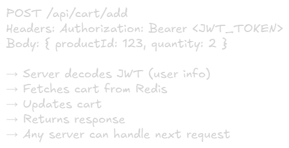

Stateless vs Stateful Architecture
===

# Overview
State refers to data that an application needs to remember between requests. How you handle state determines your system's scalability and complexity.

# Stateless Architecture

## Definition
Server doesn't store any client session data. Each request contains all information needed to process it.

## How it Works

All servers are **interchangeable** - no server "knows" the user

## Characteristics
- Each request is **independent**
- Server doesn't remember previous requests
- Session data stored **externally** (DB, cache, client)
- Any server can handle any request

## Pros
- **Easy to scale horizontally** (just add servers)
- **High availability** (server fails? Route to another)
- **Load balancing is simple** (any algorithm works)
- **No sticky session** needed
- **Easier deployment** (restart servers anytime)
- **Better fault tolerance**

## Cons
- Need external storage (Redis, DB)
- Network overhead (fetch state every request)
- Slightly higher latency
- More complex architecture initially

## Where State Lives
1. **Client-side:** JWT tokens, cookies
2. **External cache:** Redis, Memcached
3. **Database:** Session store
4. **URL/Headers:** Request contains everything

# Stateful Architecture

## Definition
Server stores client session data in memory. Same user must hit same server.

## How It Works

Requires **Sticky sessions** (session affinity) at load balancer

## Characteristics
- Server **remembers** user data
- User must retunr to **same server**
- State stored in **server memory**
- **Faster** access (no external calls)

## Pros
- **Faster** (no network calls for state)
- **Simpler code** (state in memory)
- **Lower latency** for repeated requests
- Good for **real-time** connections (WebSockets)

## Cons
- **Hard to scale** (can't easily add servers)
- **sticky sessions** reqired (complex load balancing)
- **Data loss** if server crashes
- **Uneven load distribution**
- **Difficult deployments** (lose active sessions)
- **Can't auto-scale** easily

# Key Differences
|Aspect|Stateless|Stateful|
|-|-|-|
|**Session Storage**|External|Server memory|
|**Horizontal Scaling**|Easy|Difficult|
|**Server Failure**|No data loss|Lose sessions|
|**Load Balancing**|Any algorithm|Sticky sessions|
|**Deployment**|Zero downtime|Disruptive|
|**Latency**|Slightly higher|Lower|
|**Complexity**|Moderate|Low(initially)|
|**Auto-scaling**|Yes|Limited|

# Real-World Examples

## Stateless: E-commerce API


**Why stateless?**
- Millions of users
- Need to scale horizontally
- Can deploy anytime without losing carts

## Stateful: WebSocket Char Server


**Why Sateful?**
- Real-time bidirectional communication
- Connection inherently stateful
- Low latency critical

# Common Patterns

## 1. Session Management (Stateless)

### ❌ Bad: Store in server memory
```js
// Server stores session
let sessions = {};
sessions[userId] = { cart: [...], preferences: {...} }
// Problem: Lost if server restarts, can't scale
```

### ✅ Good: Store in Redis
```js
// Store in Redis
await redis.set(`session:${userId}`, JSON.stringify(sessionData), 'EX', 3600)
// Any server can fetch it
```

## 2. Authentication (Stateless)
### ❌ Bad: Server-side sessions
```js
// Login creates session in server memory
sessions[userId] = { loggedIn: true, role: 'admin' }
// Requires sticky sessions
```
### ✅ Good: JWT tokens
```js
// Token contains all info, signed by server
const token = jwt.sign({ userId, role: 'admin' }, SECRET)
// Client sends token with each request
// Any server can verify and decode
```

## 3. Upload Progress (Hybrid)
**Stateful component** for active upload:
```js
// WebSocket connection tracks upload progress
// Same server handles chunked upload
// Connection-specific state
```

Stateless metadata:
```js
// Store final result in DB
// Any server can query upload status
```

# Making Stateful Systems Scale

## 1. Session Replication
Sync state across servers (slow, complex) 


## 2. Sticky Sessions
Load balanceer routes user to same server


**Problem:** Uneven load, hard to scale down

## 3. Externalize State (Make it Stateless)
Move state out of server


**Best approach** for most cases

# Hybrid Approach (Real World)
Most systems are **mostly stateless** with **some stateful components:**


# Decision Guide

## Choose Stateless When:
- Building REST APIs
- Need Horizontal scaling
- Want high availability
- Planning for cloud/auto-scaling
- Multiple instance required
- **Default choice for most web apps**

## Choose Stateful When:
- WebSocket/real-time connections
- Gaming servers (session-based games)
- Media streaming (maintain buffer)
- Complex workflows (multi-step processes)
- **Performance critical** + limited scale

## Warning Signs You Need Stateless:
- "Users get logged out when we deploy"
- "Can't add servers during traffic spikes"
- "Load balancer config is a nightmare"
- "Server crashes = user lose data"

# Migration Path: Stateful → Stateless

## Phase 1: Identify State
> What data is in server memory?
> - User sessions
> - Shopping carts
> - Temporary data

## Phase 2: Externalize
> Move to:
> - Redis for sessions
> - Database for persistent data
> - JWT for authentication

## Phase 3: Remove Dependencies
> Ensure any server can handle any request\
> Test by randomly routing requests

## Phase 4: Deploy
> Enable auto-scaling\
> Remove sticky sessions\
> Monitor and optimize

# Critical Concepts for Interviews

## CAP Theorem Connection
- Stateless scales easier (eventual consistency OK)
- Stateful needs strong consistency (harder to distribute)

## Cloud-Native = Stateless
- Containers die and restart → need stateless
- Auto-scaling requires stateless design
- Kubernetes assumes stateless pods

## Performance Trade-off
- Stateless: +1 network call per request
- But: Scales to millions of requests
- **Scale > Speed** in most cases

# Quick Rules
> If you can make it stateless, make it stateless

1. Storesession data externally (Redis)
2. Use tokens (JWT) for authentication
3. Design APIs to be self-contained
4. Only keep state in memory if:
   - Real-time connection required
   - Performance absolutely critical
   - Scale requirements are know and limited
  
**Modern best practice:** Stateless application tier + Stateful data tier