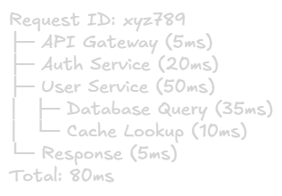

Monitoring and Alerting
===

## What is Monitoring?
**Monitoring** is the continuous process of collecting, analyzing, and visualizing system metrics, logs, and traces to understand system health, performance, and behavior.

**Alerting** is the automated notification system that triggers when predefined conditions or thresholds are met, indicating potential issues.

### Why Monitor?
1. **Detect issues before users do:** Proactive problem identifiaction
2. **Understand system behavior:** Know what's normal vs abnormal
3. **Capacity planning:** Predict when to scale
4. **Debugging and troubleshooting:** Identify root causes faster
5. **Measure SLAs/SLOs:** Track service level commitments
6. **Performance optimization:** Find bottlenecks and inefficiencies

## The Four Golden Signals (Google SRE)
These four metrics should be monitored for every user-facing system:

### 1. Latency
Time to serve a request.

**What to measure:**
- Average latency (mean)
- p50, p90, p99, p99.9 latency
- Distinguish between successful and failed requests

**Example metrics:**
> http_request_duration_seconds\
> api_response_time_ms\
> database_query_latency_ms

**Why it matters:** High latency directly impacts user experience

### 2. Traffic
Measure of demand on your system.

**What to measure:**
- Requests per second (RPS)
- Transaction per second (TPS)
- Bandwidth usage (MB/s)
- Active users/connections

**Example metrics:**
> http_request_total\
> active_connections\
> bytes_transmitted_total

**Why it matters:** Understanding load helps with capacity planning and identifying unusal patterns

### 3. Errors
Rate of failed requests.

**What to measure:**
- HTTP 5xx errors
- HTTP 400 errors (sometimes)
- Failed transactions
- Exceptions/crashes
- Timeouts

**Example metrics:**
> http_request_total{status="5xx"}\
> error_rate_percentage\
> failed_transactions_total

**Why it matters:** Errors directly indicate service quality degradation

### 4. Saturation
How "full" your service is.

**What to measure:**
- CPU utilization
- Memory usage
- DISK I/O
- Network bandwith
- Database connection pool usage
- Queue depth

**Example metrics:**
> cpu_usage_percentage\
> memory_used_percentage\
> disk_io_utilization\
> connection_pool_active / connection_pool_max

**Why it matters:** Saturation predicts future problems before they occur

## The Three Pillars of Observability
Modern observability expands beyond traditional monitoring:

### 1. Metrics
Numerical measurements aggregated over time.

**Characteristics:**
- Time-series data
- Aggregatable (sum, average, percentile)
- Low storage cost
- Good for dashboards and alerts

**Examples:**
- CPU usage over time
- Request count per minute
- Error rate percentage

**Tools:** Prometheus, Graphite, InfluxDB, Datadog, CloudWatch

### 2. Logs
Discrete events with contextual information.

**Characteristics:**
- Text-based records
- High cardinality
- Detailed context
- Higher storage cost
- Good for debugging specific issues

**Examples:**
> 2026-01-17 10:30:45 ERROR User authentication failed for user_id=12345\
> 2026-01-17 10:30:46 INFO Payment processed: transaction_id=abc123, amount=$99.99

**Log Levels:**
- **FATAL/CRITICAL:** Application crash
- **ERROR:** Significant problem but application continues
- **WARN:** Potential issue, degraded functionality
- **INFO:** Important business events
- **DEBUG:** Detailed information for troubleshooting
- **TRACE:** Very detailed, usually disabled in production

**Tools:** ELK Stack (Elasticsearch, Logstash, Kibana), Splunk, Loki, CloudWatch Logs

### 3. Traces
End-to-end journey of a request through distributed systems.

**Characteristics:**
- Shows request flow across services
- Identifies bottlenecks
- Helps understand dependencies
- Correlates events across services

**Example trace:**\

**Tools:** Jaeger, Zipkin, AWS X-Ray, Google Cloud Trace, Datadog APM

## Key Metrics by Component

### Application Metrics
- Request rate (RPS)
- Error rate (%)
- Response time (p50, p90, p99)
- Active users/sessions
- Business metrics (order/min, signups/hour)

### Database Metrics
- Query latency
- Queries per second (QPS)
- Connection pool usage
- Cache hit rate
- Slow query count
- Replication lag
- Disk usage

### Cache Metrics
- Cache hit rate
- Cache miss rate
- Eviction rate
- Memory usage
- Get/Set latency

### Queue Metrics
- Queue depth/size
- Message processing rate
- Message age
- Dead letter queue size

### Infrastructure Metrics
- CPU usage (%)
- Memory usage (%)
- Disk I/O (IOPS, throughput)
- Network I/O (bandwidth, packet loss)
- Disk space usage

## Monitoring Best Practices

### 1. Use the USE Method (Utilization, Saturation, Errors)
For every resource, monitor:
- **Utilization:** % of time resource is busy
- **Saturation:** Degree of queued work
- **Errors:** Count of error events

### 2. Use the RED Method (Rate, Errors, Duration)
For every service, monitor:
- **Rate:** Requests per second
- **Errors:** Number of failed requests
- **Duration:** Time per reqeuest (latency)

### 3. Monitor What Matters 
- Focus on user-facing metrics first
- Monitor business KPIs (revenue, conversions)
- Don't monitor everything (causes alert fatigue)

### 4. Establish Baselines
- Know what "normal" looks like
- Track trends over time
- Identify seasonal patterns

### 5. Use Dashoards Effectively
> Executive Dasboard: High-level business metrics\
> Operations Dashboard: System health, golden signals\
> Debug Dashboard: Detailed metrics for troubleshooting

