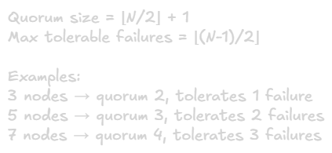
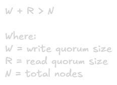

Consensus Algorithms
===

## What is Consensus?
Consensus is getting multiple nodes to agree on a single value or decision, even when some nodes may fail or the network is unreliable.

**Core Problem:** How can independent computers, communicating only through unreliable networks, collectively make a decision they all agree on?

## Why Consensus is Necessary

### Maintaining Consistency Across Replicas
All replicas must process operations in the same order to stay consistent.\
**Example:** When replicating database writes across 3 servers, all must agree on the order of transactions.

### Leader Election
Nodes must agree on exactly one leader to avoid split-brain scenarios.\
**Example:** Primary database selection in replication cluster.

### Distributed Transactions
All participants must agree to commit or abort together.\
**Example:** Two-phases commit across multiple databases.

### Configuration Management
All nodes must see the same system configuration.\
**Example:** Cluster membership changes, routing rules.

## The FLP Impossibility Result
**Fischer-Lynch-Paterson Theorem:** In an asynchronous distributed system where even one node can fail, no consensus algorithm can guarantee termination in all cases.

**Why?** Cannot distinguish between a failed node and an extremely slow one with certainty.

**Practical Implication:** Real consensus algorithms work around by:
- Using timing assumptions (partial synchrony)
- Accepting rare non-termination cases
- Using randomization

## Paxos
Classic consensus algorithm by Leslie Lamport. Famous for being correct but difficult to understand and implement.

### Roles
- **Proposers:** Suggest values
- **Acceptors:** Vote on proposals
- **Learners:** Learn the chosen value

### Two-Phase Process
**Phase 1: Prepare**
1. Proposer selects unique proposal number N
2. Sends prepare(N) to acceptors
3. Acceptor promises not to accept proposals < N
4. Acceptor returns any previously accepted value

**Phase 2: Accept**
1. If proposer gets majority responses, sends accept(N, value)
2. Value must be from highest-numbered prior proposal, or proposers choice
3. Acceptors accept unless they promised to reject this number
4. If majority accepts, value is chosen

**Key Properties**
- Once a value is chosen, all future proposals must propose the same value
- Guarantees safety (at most one value chosen)
- Requires majority (quorum) to make decisions

**Problems**
- Complex to implement correctly
- Livelock possible when multiple proposers compete
- Abstract and mathematically dense
- Led to many incorrect implementations

## Raft
Designed explicitly to be more understandable than Paxos while providing equivalent guarantees.

### Core Concpets
**Terms:** Time divided into numbered terms, Each term begins with an election.

**States:** Each node is either
- **Leader:** Handles all client requests
- **Follower:** Passive, responds to leader
- **Candidate:** Seeking votes to become leader

**Replicated Log:** Leader appends commands to log, replicates to followers.

### Leader Election
1. Follower's election timeout expires → becomes candidate
2. Candidate increments term, votes for itself, requests votes
3. Other nodes vote if:
    - haven't voted this term yet
    - Candidate's log is at least as up-to-date
4. Candidate with majority votes becomes leader
5. Leader sends heartbeats to prevent new elections

**Split Vote Handling:** Randomized timeouts make split votes unlikely. If occurs, timeout expires and new election starts.

### Log Replication
1. Leader receives command from client
2. Leader appends to its log
3. Leader sends AppendEntries to all followers
4. Followers append and acknowledge
5. Leader commits when majority acknowledges
6. Leader applies to state machine, notifies followers
7. Follower apply committed entries

### Safety Guarantees
- **Election Safety:** At most one leader per term
- **Leader Append-Only:** Leader never overwrites its log
- **Log Matching:** If logs contain same entry at same index, they're identical up to that point
- **Leader Completeness:** If entry committed in a term, it's in all future leader logs
- **State Machine Safety:** If node applies entry at index, no other node applies different entry at that index

### Handling Failures
- **Follower Failure:** Leader tracks next index for each follower, sends missing entries when follower recovers.
- **Leader Failure:** Election timeout triggers new election. New leader's log contains all committed entries (guaranteed by voting rules).
- **Uncommitted Entries:** May be lost if not replicated to majority. Acceptable since never acknowledged to clients.

## Paxos vs Raft Comparison
|Aspect|Paxos|Raft|
|-|-|-|
|**Understandability**|Complex, abstract|Designed for clarity|
|**Implementation**|Difficult, error-prone|More straightforward|
|**Leadership**|Optional, multi-leader possible|Strong single leader|
|**Log Structure**|Not explicitly defined|Core to algorithm|
|**Flexibility**|Very flexible|More opinionated|
|**Industry Adoption**|Many variations exist|Increasingly popular|
|**Use Cases**|Google Chubby, Spanner|etcd, Consul, CockroachDB|

**Both guarantee:**
- Safety in face of failures
- Tolerate up to (N-1)/2 failures in N-node cluster
- Require majority for decisions

## Byzantine Fault Tolerance (BFT)
Handles malicious or compromised nodes that actively try to disrupt the protocol

**Byzantine General Problem:** Generals must coordinate attack but some are traitors sending conflicting messages.

### PBFT (Practical Byzantine Fault Tolerance)
- Tolerates up to (N-1)/3 Byzantine failures in N nodes
- Requires 3f+1 nodes to tolerate f failures
- Three-phase protocol: pre-prepare, prepare, commit
- More complex and resource-intensive than crash-fault-tolerant algorithms

### When Needed
- Cryptocurrency networks (financial incentive to cheat)
- Systems crossing trust boundaries
- Security-critical applications

### Not Needed For
- Most enterprise systems (trust internal nodes)
- Performance-critical systems (overhead too high)
- When crash failures are only concern

## Quorum and Majorities

### Standard Quorum

**Why majority?** Any two majorities must overlap, guaranteeing consistency.\
**Why odd numbers?** 4-node cluster (quorum=3) tolerates same failures as 3-node cluster but costs more

### Flexible Quorums
Read and write quorums can differ if they overlap:

**Example:** 5 nodes, W=4, R=2
- Writes must reach 4 nodes (high durability)
- Reads only need 2 nodes (lower latency)
- Overlap guaranteed (4+2 > 5)

## Consensus in Practice
Popular Implementations:

### etcd (Raft)
- Key-value store for Kubernetes
- Leader election, distributed locking
- Strong consistency guarantees

### ZooKeeper (ZAB - Paxos variant)
- Coordination service for Hadoop ecosystem
- Configuration management, naming, synchronization
- Widely adopted, battle-tested

### Consul (Raft)
- service discovery and configuration
- Built-in health checking
- Multi-datacenter support

### Usage Pattern
Application use these as "consensus as a service" rather than implementing consensus themselves

## Performance Characteristics

### Latency
- Requires multiple network round trips
- Raft: 1 RTT from leader to followers and back
- Increases with geographic distribution
- Typical: Single-digit to tens of milliseconds

### Throughput
- Limited by leader's processing capacity
- Can pipeline/batch requests for better throughput
- Network bandwidth between nodes matters
- Typical: Thousands to tens of thousands ops/sec

### Factors Affecting Performance
- Network latency between nodes
- Disk I/O (persisting log entries)
- CPU for cryptographic operations (if used)
- Cluster size (larger = more communication overhead)

## When to Use Consensus

### Use When:
- Need strong consistency guarantees
- Coordinating distributed operations
- Leader election required
- Distributed locking needed
- Critical metadata management

### Avoid When:
- Eventual consistency acceptable (use simpler replication)
- Can tolerate stale reads (read from followers)
- Performance cost too high
- Can design system without coordination (CDRTs, append-only)

### Alternatives to Consider
- **Eventual Consistency:** Simpler, more available, better performance
- **CRDTs:** Conflict-free replicated data types, no consensus needed
- **Operational Transforms:** Real-time collaboration without consensus
- **Single-Leader with Async Replication:** Good enough for many use cases

## Common Consesus Use Cases
1. **Leader Election:** Ensure single leader for database, job scheduler
2. **Distributed Locking:** Coordinate exclusive access to resources
3. **Service Discovery:** Agree on avialable service instances
4. **Configuration Management:** Consistent cluster configuration
5. **Transaction Coordination:** Distributed transaction commit/abort
6. **Sequence Number Generation:** Globally unique, ordered IDs

## Key Takeaways
1. **Consensus ensures agreement** despite failures and network issues
2. **Safety vs Liveness:** Algorithms guarantee safety but liveness only under assumptions
3. **Majority required:** Enables fault tolerance while ensuring consistency
4. **Raft more understandable** than Paxos, both provide same guarantees
5. **Byzantine tolerance expensive:** Only use when malicious behavior possible
6. **Use existing implementations:** etcd, ZooKeeper, Consul instead of build your own
7. **Performance cost:** Consensus requires coordination, adds latency
8. **Not always necessary:** Consider if simpler alternatives work for your use case

## Summary Table 
|Algorithm|Fault Model|Tolerance|Complexity|Common Use|
|-|-|-|-|-|
|**Paxos**|Crash|(N-1)/2|High|Google Chubby|
|**Raft**|Crash|(N-1)/2|Medium|etcd, Consul|
|**PBFT**|Byzantine|(N-1)/3|Very High|Blockchains|
|**ZAB**|Crash|(N-1)/2|Medium|Zookeper|
