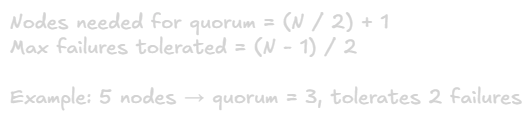

Distributed Systems Basics
===

## What is a Distributed System?
A distributed system is a collection of independent computers that work together by communicating over a network to achieve a common goal. Each computer (node) has its own memory and processor, and they coordinate only by passing messages.

**Example:** A web application with separate database servers, application servers, and cache servers working together.

## Why Use Distributed Systems?

### Scalability
Single machines have limits. Distributed systems let you scale horizontally by adding more machines, which is often cheaper than buying one massive machine.

**Example:** Handle 1 million requests/second by using 100 servers instead of one impossibly expensive super-computer.

### Reliability and Fault Tolerance
If one machine fails, others continue working. Redundancy across multiple nodes prevents total system failure.

**Example:** Store data on 3 servers so if 1 fails, you still have 2 copies.

### Geographic Distribution
Place servers closer to user worldwide to reduce latency.

**Example:** Netflix has servers in multiple continents to serve local users quickly.

### Performance Through Parallelism
Process tasks simultaneously across many machines.

**Example:** Analyze 1 billion images by distribting work across 1000 machines.

## Fundamental Challenges

### 1. Network Unreliability
Networks lose messages, delay them, duplicate them, or deliver them out of order. When you don't get a response, you can't tell if the request was lost, the server crashed, or the response was lost.

**Implication:** Must handle retries, timeouts, and idempotency.

### 2. Partial Failures
Some nodes fail while others keep working. Unlike single machines where everything fails together, distributed systems are simultaneously healthy and broken.

**Implication:** Cannot distinguish between slow nodes and crashed nodes just by observing network behavior.

### 3. Clock Synchronization
Each node has its own clock that drifts at different rates. Even with NTP, clocks are only accurate to within milliseconds at best.

**Implication:** Cannot realiably order events across different machines using timestamps alone.

### 4. Consistency
When data is replicated across nodes, keeping all copies in sync is hard. Updates take time to propagate, creating temporary inconsistencies.

**Implication:** Must choose between strong consistency (slower) and eventual consistency (faster but temporarily inconsistent).

## The CAP Theorem
**States:** In a distributed system, you can have at most 2 of 3 guarantees:

- **Consistency (C):** All nodes see the same data at the same time
- **Availability (A):** Every request gets a response (success or failure)
- **Partition Tolerance (P):** System works despoite network partitions

Since network partitions WILL happen, you must choose between C or A during partitions.

### CP Systems (Consistency + Partition Tolerance)
Refuse requests during partitions to maintain consistency. Sacrifice availability.

**Examples:** HBase, MongoDB (default), ZooKeeper, banking systems\
**When to use:** Correctness matters more than availability

### AP Systems (Availability + Partition Tolerance)
Keep serving requests during partitions but may return stale data. Sacrifice consistency.

**Examples:** Cassandra, DynamoDB, Riak, social media feeds\
**When to use:** Availability matters more than always having latest data

### CA Systems 
Not possible in distributed systems because partitions are inevitable. Only works on single machine (not distributed).

## Communication Patterns

### Synchronous (Request-Response)
Sender waits for response before continuing.

**Pros:** Simple, immediate feedback\
**Cons:** Sender blocked, both services must be up simultaneously\
**Example:** HTTP REST API calls

### Asynchronous (Message Queue)
Sender doesn't wait, continues immediately.
**Pros:** Decouples services, resilient to temporary failures\
**Cons:** More complex, delayed feedback\
**Example:** RabbitMQ, Kafka, SQS

### Publish-Subscribe
Publishers send to topics, subscribers receive from topics they're interested in.
**Pros:** Loose coupling, dynamic scaling\
**Cons:** Harder to debug\
**Example:** Kafka topics, Redis Pub/Sub

## Data Replication Strategies

### Single-Leader Replication
One leader accepts all writes, replicates to followers.

**Pros:** Simple, clear ordering\
**Cons:** Leader is bottleneck and single point of failure for writes\
**Example:** MySQL primary-replica setup 

### Multi-Leader Replication
Multiple leaders accept writes, sync between each other.

**Pros:** Better write availability, good for multi-region\
**Cons:** Must handle write conflicts\
**Example:** Multi-region database deployments

### Leaderless Replication
Write to any node, use quorum for reads/writes.

**Pros:** High availability, no single leader to fail\
**Cons:** Comple conflict resolution\
**Example:**  Cassandra, DynamoDB

## Replication Lag & Consistency Models

### Read-After-Write Consistency
Users see their own writes immediately.\
**Use case:** User updates profile and refreshes page

### Monotonic Reads
If user sees data at time T, later reads won't show older data.\
**Use case:** Prevent seeing your own post disappear on refresh

### Consistent Prefix Reads
See casually related writes in correct order.\
**Use case:** See question before answer in comment threads

## Partitioning (Sharding)
Split data across multiple nodes when it's too large for one machine.

### Key-Range Partitioning
Assign continuous key ranges to partitions (A-F, G-M, N-Z).

**Pros:** Efficient range queries\
**Cons:** Can be unbalanced, hot spots\
**Example:** User database partitioned by last name

### Hash Partitioning
Hash the key, distribute by hash value.

**Pros:** Even distribution\
**Cons:** Range queries inefficient\
**Example:** Consistent hashing in Cassandra

### Consistent Hashing
Special hash technique minimizing data movement when adding/removing nodes.

**Pros:** Adding nodes only requires moving small fraction of data\
**Cons:** More complex implementation\

## State Management

### Stateless Services
No data stored between requests. Each request has all needed information.

**Pros:** Easy to scale (add instances), easy failure recovery\
**Cons:** Cannot maintain session state locally\
**Example:** Modern web application servers

### Stateful Services
Maintain data across requests.

**Pros:** Can cache data, maintain sessions\
**Cons:** Harder to scale, need replication for reliability\
**Example:** Databases, caches, session stores

**Best Practice:** Keep application tier stateless, push state to specialized data stores.

## Failure Detection Timeout-Based

### Timeout-Based
No response within time = failed.\
**Challenge:** Choosing timeout value (too short = false postivies, too long = slow detection)

### Heartbeat 
Nodes send periodic "I'm alive" messages.\
**Better:** Establis baseline for expected behavior

### Failure Detectors
Algorithms that probabilistically detect failures.\
**Properties:** Completeness (eventually detect failures) + Accurace (don't mark healthy nodes as failed)

## Key Formulas

### Little's Law

### Quorum Calculation

## Common Patterns
- **Load Balancing:** Distribute requests across multiple servers.
- **Service Discovery:** Find availabile service instances dynamically.
- **Circuit Breaker:** Stop calling failing services to prevent cascade failures.
- **Retry with Backoff:** Retry failed requests with increasing delays.
- **Bulkhead:** Isolate resources to prevent total system failure.

## Summary Table
|Aspect|Single Machine|Distributed System|
|-|-|-|
|**Scaling**|Vertical (bigger machine)|Horizontal (more machines)|
|**Failure Mode**|Everything fails together|Partial failures common|
|**Consistency**|Always consistent|Must choose consistency level|
|**Latency**|Microseconds|Milliseconds (network)|
|**Complexity**|Low|High|
|**Cost at Scale**|Very expensive|More cost-effective|

## When to use Distributed Systems

**Use when:**
- Single machine cannot handle the load
- Need geographic distributin
- Require fault tolerance beyond single machine
- Data too large for one machine

**Avoid when:**
- Starting small (single machine is simpler)
- Strong consistency required with low latency (hard in distributed systems)
- Team lacks distributed systems expertise
- Operational complexity not justified

## Key Takeaways
1. Distributed systems trade simplicity for scalability and reliability
2. Network failures and partial failures are inevitable
3. CAP theorem forces choice between consistency and availability during partitions
4. Replication provides fault tolerance but introduces consistency challenges
5. Partitioning enables scaling beyond single machine limits
6. Keep application layer stateless when possible
7. Failure detection is probabilistic, not perfect
8. Chooose the right consistency model for your use case