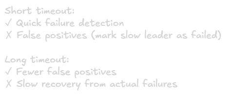

Leader Election and Coordination
===

## What is Leader Election?
Process where distributed nodes choose one node to act as coordinator/leader. The leader has special responsibilities like making decisions, coordinating operations, or being the single point of contact.

**Goal:** Ensure exactly one leader exists at any time, even during failures.

## Why Leader Election Matters

### Simplifies Coordination
Single leader makes decisions, avoiding complex multi-node coordination for every operation.\
**Example:** Database writes go through one primary node that decides order and coordinates replication.

### Prevents Split-Brain
Ensures multiple nodes don't simultaneously think they'te in charge and issue conflicting commands.\
**Example:** Two database primaries both accpeting writes for same record creates unresolvable conflicts.

### Common Use Cases
- Database primary election
- Distributed lock management
- Job scheduling coordination
- Metadata management
- Configuration updates

## Basic Requirements
- **Safety:** At most **one** leader at any time. Never multiple simultaneous leaders.
- **Liveness:** Eventually a leader will be elected if enough nodes are available (cannot guarantee in all scnearios due to FLP)
- **Agreement:** All nodes must agree on who the leader is.

## Leader Election Algorithms

### 1. Bully Algorithm
Nodes have unique, ordered IDs. Higher ID nodes "bully" lower ID nodes.

**Process:**
1. Node detects leader failure → initiates election
2. Sends election message to all higher-ID nodes
3. If no higher-ID node responds → declares itself leader
4. If higher-ID node responds → that node takes over election
5. Highest-ID available node becomes leader

**Pros:**
- Simple to implement
- Deterministic (Highest ID wins)

**Cons:**
- High message traffic
- Poor partition handling (can create split-brain)
- Higher-priority node always wins (even if just recovered)

**Best for:** Small clusters with reliable networks

### 2. Ring Algorithm
Nodes arranged in logical ring. Election message travels around ring collecting node IDs.

**Process:**
1. Node detects failure → sends election message with its ID
2. Each node adds its ID and forward to successor
3. Message completes circle → highest ID becomes leader
4. Coordinator message announce new leader

**Pros:**
- less message traffic than bully
- Predictable behavior

**Cons:**
- Depends on ring structure staying intact
- Slow if ring is large

**Best for:** static topologies with predictable membership

### 3. Consensus-Based (Raft/Paxos)
Uses consensus algorithms for leader election with strong guarantees.

**Raft Process:**
1. Follower timeout expires → becomes candidate
2. Increment terms, vote for self, request votes
3. Nodes vote if haven't voted this term + candidate log is up-to-date
4. Candidate with majority becomes leader
5. Leader sends heartbeats to maintain authority

**Pros:**
- Strong safety guarantees
- Handles partitions correctly
- No split-brain even during network partitions

**Cons:**
- More complex
- Requires majority to elect leader

**Best for:** Production systems requiring strong guarantees

### 4. Lease-Based Leadership
Node acquires time-limited lease from coordination service.

**Process:**
1. Node creates ephermal node in coordination service (ZooKeepre/etcd)
2. Node with lowest sequence number = leader
3. Leader maintains session/lease
4. If session expires → ephermal node deleted → new election
5. Other nodes watch for changes

**Pros:**
- Automatic failure handling (lease expiration)
- Clean abstraction
- Leverages battle-tested coordination services

**Cons:**
- Depends on coordination service availability
- Clock synchronization important

**Best for:** Systems already using coordination services

### Comparison Table 
|Algorithm|Complexity|Network Partitions|Message Overhead|Best Use Case|
|-|-|-|-|-|
|**Bully**|Low|Poor|High|Small, stable clusters|
|**Ring**|Low|Poor|Medium|Static topologies|
|**Raft/Paxos**|High|Excellent|Medium|Production systems|
|**Leases-Based**|Medium|Good|Low|With coordination services|

## Coordination Services
Rather than implementing leader election from scratch, use specialized coordination services.

### ZooKeeper
- Paxos-variant (ZAB) consensus
- Ephermal nodes and watches for leader election
- Widely used in Hadoop ecosystem
- Battle-tested and reliable

### etcd
- Raft-based consensus
- Clean REST/gRPC API
- Lease mechanism for leader election
- Popular in Kubernetes ecosystem

### Consul
- Raft-based
- Built-in leader election and locking
- Service discovery integration
- Multi-datacenter support

### Why use them:
- Extensively tested
- Handle edge cases correctly
- Provide primitives (ephermal nodes, leases, wathces)
- Reduce implementation risk

## Leader Responsibilities Patterns

### 1. Single-Writer Pattern
Leader is only node accepting writes.\
**Example:** Database primary handles all writes, replicates to replicas\
**Benefit:** No write conflicts, simple consistency

### 2. Coordinator Pattern
Leader coordinates operations without storing data.\
**Example:** Transaction coordinator for two-phase commit\
**Benefit:** Centralized coordination logic

### 3. Work Distribution Pattern
Leader assigns tasks to workers.\
**Example:** Job scheduler distributing indexing tasks\
**Benefit:** Prevents duplicate work, load balancing

### 4. Metadata Management
Leader manages cluster metadata.\
**Example:** HDFS NameNode managing file system metadata\
**Benefit:** Single source of truth for cluster state

## Failure Detection
Leader election depends on detecting when current leader fails.

**Heartbeat Mechanisms**\
Leader periodically send "I'm alive" messages to followers.

**Timeout Tuning:**\


**Best Practice:** Adaptive timeouts based on observed network latency

**Failure Detection Challenges**
- Cannot distinguish failed vs slow vs partitioned node with certainty
- False positives cause unecessary elections
- False negatives delay recovery

## Graceful Leadership Transfer
When leader needs to step down (planned maintenance, upgrade), transfer leadership gracefully instead of disappearing.

**Raft Transfer Process:**
1. Current leader stops accepting new requests
2. Leader ensures chosen follower is caught up
3. Leader grants permission to start immediate election
4. Chosen follower becomes candidate and wins quickly

**Benefits:**
- Minimal downtime (seconds vs waiting for timeout)
- Predictable transition
- No data loss

## Coordination Beyond Leader Election

### Distributed Locks
Exclusive access to resources across nodes.

**Implementation:**
- Create lease/ephermal node in coordination service
- Hold lock while lease valid
- Automatic release on failure/timeout

**Use case:** Prevent multiple nodes from processing same job

### Barriers
Synchronize start of operations across nodes.

**Process:**
- All nodes register at barrier
- Wait until required count reached
- All proceed simultaneously

**Use case:** Coordinated phase transitions in distributed algorithms

### Group Membership
Track set of active nodes in cluster.

**Mechanism**
- Nodes register with coordination service
- Maintain heartbeats
- Consistent view of membership

**Use case:** Know which nodes are available for replication

#### Configuration Management
Ensure all nodes have consistent configuration.

**Features:**
- Atomic configuration updates
- Watch notifications on changes
- Versioned configurations

**Use case:** Cluster-wide setting changes

## Best Practices

### 1. Use Existing Coordination Services
Don't implement leader election from scratch. Use etcd, ZooKeeper, or Consul.\
**Why:** Extensively tested, handled edge cases, reduce bugs

### 2. Deploy in Odd Numbers
3 or 5 nodes typically. Never use even numbers.
>3 nodes: quorum=2, tolerates 1 failure\
>4 nodes: quorum=3, tolerates 1 failure (same as 3!)\
>5 nodes: quorum=3, tolerates 2 failures

### 3. Implement Backoff and Jitter
Add randomization to election retries to prevent all nodes simultaneously competing.
```py
retry_delay = base_delay * (2 ** attempt) + random(0, 1000ms)
```

### 4. Monitor Leadership Changes
Frequent leader changes indicate problems:
- Network intability
- Resource contention
- Configuration issues
- Node failures

**Alert on:** >2 leadershop changes per hour

### 5. Handle Leaderless Periods Gracefully
Design for brief periods without leader:
- Timeout and retry operations requiring leader
- Server reads from followers (if stale reads acceptable)
- Queue writes for when leader is available

### 6. Set Appropriate Timeouts
Balance quick failure detection vs false positives:
> Election timeout: 150-300ms (randomized)\
> Heartbeat interval: 50ms\
> Session timeout: 10-30s

### 7. Test Partition Scenarios
Regularly test:
- Leader failure
- Network partitions
- Split-brain prevention
- Rapid leadership changes

## Comon Pitfalls
1. **Not using quorum:** Allows split-brain during partitions
2. **Even-numbered clusters:** Waste resources, same fault tolerance as N-1
3. **No backoff/jitter:** Election storms when all nodes retry simultaneously
4. **Ignoring lease expiration:** Stale leader continues acting after losing lease
5. **Synchronous dependencies:** leader election blocks critical operations
6. **No monitoring:** Leadership instability goes unnoticed
7. **DY implementation:** Subtle bugs lead to split-brain or data loss

## Summary
Leader election ensures single coordinator despite failures by using algorithms that guarantee safety (at most one leader) while attempting to maintain liveness (eventually elect a leader). Different algorithms trade complexity for stronger guarantees:
- **Simple algorithms** (Bully, Ring): Easy but poor partition handling
- **Consensus-based** (Raft, Paxos): Complex but strong guarantees
- **Lease-based:** Practical approach using coordination services

**Key Insight:**
1. Majority/quorum prevents split-brain during partitions
2. Use proven coordination services instead of DIY
3. Deploy odd-numbered clusters (3 or 5 nodes)
4. Monitor leadership stability
5. Graceful transfer minimizes downtime
6. Design for brief leaderless periods

**Production Recommendation:** Use etcd, ZooKeeper, or Consul for leader eleection rather than implementing from scratch. They Handle edge cases correctly and provide battle-tested implementations.