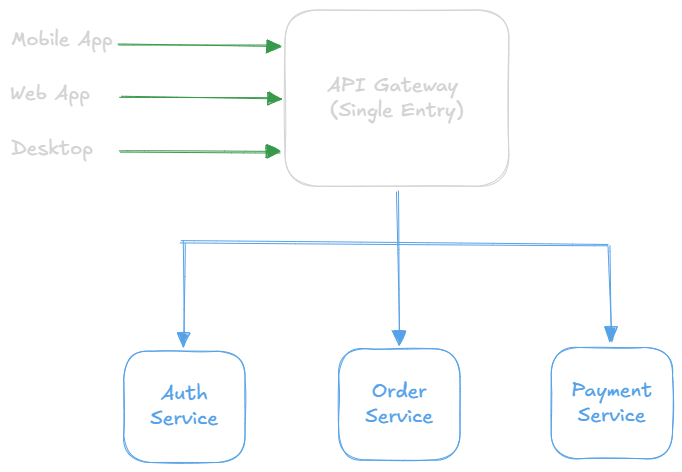

API Gateway
===

## What is an API Gateway?
An **API Gateway** is a single entry point for all client requests in a microservices architecture. It sits between clients and backend services, routing requests, aggregating responses, and providing cross-cutting concerns like authentication, rate limiting, and logging.

## The Problem Without API Gateway

**Direct Client to Service Communication**\


**Problems:**
- Clients must know all service locations
- Multiple network calls from client
- Each service implements auth separately
- No centralized rate limiting
- CORS issues with browser clients
- Difficult to version APIs
- Security exposure (internal services)

**With API Gateway**\


**Benefits:**
- Single endpoint for clients
- Centralized authentication
- Request aggregation
- Protocol translation
- Service abstraction
- Unified API versioning

## Core Features

### 1. Request Routing
Route requests to appropriate backend services based on URL path, headers, or method.

```go
package main

import (
    "net/http"
    "net/http/httputil"
    "net/url"
)

type Gateway struct {
    routes map[string]*httputil.ReverseProxy
}

func NewGateway() *Gateway {
    return &Gateway{
        routes: make(map[string]*httputil.ReverseProxy),
    }
}

// Register a route
func (g *Gateway) AddRoute(path string, targetURL string) error {
    target, err := url.Parse(targetURL)
    if err != nil {
        return err
    }
    
    proxy := httputil.NewSingleHostReverseProxy(target)
    g.routes[path] = proxy
    return nil
}

// Route requests
func (g *Gateway) ServeHTTP(w http.ResponseWriter, r *http.Request) {
    // Match route based on path prefix
    for path, proxy := range g.routes {
        if len(r.URL.Path) >= len(path) && r.URL.Path[:len(path)] == path {
            // Strip gateway prefix
            r.URL.Path = r.URL.Path[len(path):]
            proxy.ServeHTTP(w, r)
            return
        }
    }
    
    http.Error(w, "Service not found", http.StatusNotFound)
}

func main() {
    gateway := NewGateway()
    
    // Register routes
    gateway.AddRoute("/auth", "http://auth-service:8001")
    gateway.AddRoute("/orders", "http://order-service:8002")
    gateway.AddRoute("/payments", "http://payment-service:8003")
    
    http.ListenAndServe(":8080", gateway)
}
```

### 2. Authentication & Authorization
Centralized authentication to avoid implementing it in every service.

```go
package main

import (
    "context"
    "encoding/json"
    "net/http"
    "strings"
    "time"
    
    "github.com/golang-jwt/jwt/v5"
)

type contextKey string

const UserContextKey contextKey = "user"

// JWT Claims
type Claims struct {
    UserID string   `json:"user_id"`
    Email  string   `json:"email"`
    Role   string   `json:"role"`
    jwt.RegisteredClaims
}

// Authentication middleware
func AuthMiddleware(secret []byte) func(http.Handler) http.Handler {
    return func(next http.Handler) http.Handler {
        return http.HandlerFunc(func(w http.ResponseWriter, r *http.Request) {
            // Extract token from Authorization header
            authHeader := r.Header.Get("Authorization")
            if authHeader == "" {
                http.Error(w, "Missing authorization header", http.StatusUnauthorized)
                return
            }
            
            // Parse "Bearer <token>"
            parts := strings.Split(authHeader, " ")
            if len(parts) != 2 || parts[0] != "Bearer" {
                http.Error(w, "Invalid authorization header", http.StatusUnauthorized)
                return
            }
            
            tokenString := parts[1]
            
            // Parse and validate JWT
            claims := &Claims{}
            token, err := jwt.ParseWithClaims(tokenString, claims, func(token *jwt.Token) (interface{}, error) {
                return secret, nil
            })
            
            if err != nil || !token.Valid {
                http.Error(w, "Invalid token", http.StatusUnauthorized)
                return
            }
            
            // Add user info to context
            ctx := context.WithValue(r.Context(), UserContextKey, claims)
            
            // Forward user info to backend services
            r.Header.Set("X-User-ID", claims.UserID)
            r.Header.Set("X-User-Email", claims.Email)
            r.Header.Set("X-User-Role", claims.Role)
            
            next.ServeHTTP(w, r.WithContext(ctx))
        })
    }
}

// Role-based authorization
func RequireRole(role string) func(http.Handler) http.Handler {
    return func(next http.Handler) http.Handler {
        return http.HandlerFunc(func(w http.ResponseWriter, r *http.Request) {
            claims, ok := r.Context().Value(UserContextKey).(*Claims)
            if !ok {
                http.Error(w, "Unauthorized", http.StatusUnauthorized)
                return
            }
            
            if claims.Role != role {
                http.Error(w, "Forbidden", http.StatusForbidden)
                return
            }
            
            next.ServeHTTP(w, r)
        })
    }
}
```

### 3. Rate Limiting
Protect backend services from overload and abuse.
```go
package main

import (
    "net/http"
    "sync"
    "time"
)

// Token bucket rate limiter
type RateLimiter struct {
    visitors map[string]*Visitor
    mu       sync.RWMutex
    rate     int           // requests per minute
    burst    int           // max burst size
}

type Visitor struct {
    limiter  *TokenBucket
    lastSeen time.Time
}

type TokenBucket struct {
    tokens    int
    maxTokens int
    refillRate time.Duration
    lastRefill time.Time
    mu        sync.Mutex
}

func NewRateLimiter(rate, burst int) *RateLimiter {
    rl := &RateLimiter{
        visitors: make(map[string]*Visitor),
        rate:     rate,
        burst:    burst,
    }
    
    // Cleanup old visitors every 5 minutes
    go rl.cleanupVisitors()
    
    return rl
}

func (rl *RateLimiter) GetVisitor(ip string) *TokenBucket {
    rl.mu.Lock()
    defer rl.mu.Unlock()
    
    visitor, exists := rl.visitors[ip]
    if !exists {
        limiter := &TokenBucket{
            tokens:     rl.burst,
            maxTokens:  rl.burst,
            refillRate: time.Minute / time.Duration(rl.rate),
            lastRefill: time.Now(),
        }
        
        rl.visitors[ip] = &Visitor{
            limiter:  limiter,
            lastSeen: time.Now(),
        }
        
        return limiter
    }
    
    visitor.lastSeen = time.Now()
    return visitor.limiter
}

func (tb *TokenBucket) Allow() bool {
    tb.mu.Lock()
    defer tb.mu.Unlock()
    
    // Refill tokens
    now := time.Now()
    elapsed := now.Sub(tb.lastRefill)
    tokensToAdd := int(elapsed / tb.refillRate)
    
    if tokensToAdd > 0 {
        tb.tokens = min(tb.tokens+tokensToAdd, tb.maxTokens)
        tb.lastRefill = now
    }
    
    // Check if request allowed
    if tb.tokens > 0 {
        tb.tokens--
        return true
    }
    
    return false
}

func (rl *RateLimiter) cleanupVisitors() {
    for {
        time.Sleep(5 * time.Minute)
        
        rl.mu.Lock()
        for ip, visitor := range rl.visitors {
            if time.Since(visitor.lastSeen) > 10*time.Minute {
                delete(rl.visitors, ip)
            }
        }
        rl.mu.Unlock()
    }
}

// Rate limiting middleware
func RateLimitMiddleware(limiter *RateLimiter) func(http.Handler) http.Handler {
    return func(next http.Handler) http.Handler {
        return http.HandlerFunc(func(w http.ResponseWriter, r *http.Request) {
            // Get client IP
            ip := r.RemoteAddr
            if xff := r.Header.Get("X-Forwarded-For"); xff != "" {
                ip = xff
            }
            
            visitor := limiter.GetVisitor(ip)
            
            if !visitor.Allow() {
                w.Header().Set("X-RateLimit-Retry-After", "60")
                http.Error(w, "Rate limit exceeded", http.StatusTooManyRequests)
                return
            }
            
            next.ServeHTTP(w, r)
        })
    }
}

func min(a, b int) int {
    if a < b {
        return a
    }
    return b
}
```

### 4. Request/Response Transformation
Modify requests and responses as they pass through the gateway.

```go
package main

import (
    "bytes"
    "encoding/json"
    "io"
    "net/http"
)

// Request transformation middleware
func RequestTransformMiddleware(next http.Handler) http.Handler {
    return http.HandlerFunc(func(w http.ResponseWriter, r *http.Request) {
        // Add custom headers
        r.Header.Set("X-Gateway-Version", "1.0")
        r.Header.Set("X-Request-ID", generateRequestID())
        
        // Transform request body if needed
        if r.Method == "POST" || r.Method == "PUT" {
            body, err := io.ReadAll(r.Body)
            if err != nil {
                http.Error(w, "Failed to read body", http.StatusBadRequest)
                return
            }
            
            // Parse and modify JSON
            var data map[string]interface{}
            if err := json.Unmarshal(body, &data); err == nil {
                // Add timestamp
                data["gateway_timestamp"] = time.Now().Unix()
                
                // Re-encode
                modified, _ := json.Marshal(data)
                r.Body = io.NopCloser(bytes.NewReader(modified))
                r.ContentLength = int64(len(modified))
            }
        }
        
        next.ServeHTTP(w, r)
    })
}

// Response transformation
type ResponseTransformer struct {
    writer http.ResponseWriter
    body   *bytes.Buffer
}

func NewResponseTransformer(w http.ResponseWriter) *ResponseTransformer {
    return &ResponseTransformer{
        writer: w,
        body:   &bytes.Buffer{},
    }
}

func (rt *ResponseTransformer) Header() http.Header {
    return rt.writer.Header()
}

func (rt *ResponseTransformer) Write(b []byte) (int, error) {
    return rt.body.Write(b)
}

func (rt *ResponseTransformer) WriteHeader(statusCode int) {
    rt.writer.WriteHeader(statusCode)
}

func (rt *ResponseTransformer) Transform() []byte {
    var data map[string]interface{}
    
    if err := json.Unmarshal(rt.body.Bytes(), &data); err == nil {
        // Wrap response in standard format
        wrapped := map[string]interface{}{
            "success":   true,
            "data":      data,
            "timestamp": time.Now().Unix(),
        }
        
        modified, _ := json.Marshal(wrapped)
        return modified
    }
    
    return rt.body.Bytes()
}

func ResponseTransformMiddleware(next http.Handler) http.Handler {
    return http.HandlerFunc(func(w http.ResponseWriter, r *http.Request) {
        transformer := NewResponseTransformer(w)
        next.ServeHTTP(transformer, r)
        
        // Transform and write response
        transformed := transformer.Transform()
        w.Header().Set("Content-Length", fmt.Sprintf("%d", len(transformed)))
        w.Write(transformed)
    })
}
```

### 5. Request Aggregation
Combine multiple backend service calls into single client request.

```go
package main

import (
    "encoding/json"
    "fmt"
    "net/http"
    "sync"
)

type AggregatedResponse struct {
    User    interface{} `json:"user"`
    Orders  interface{} `json:"orders"`
    Profile interface{} `json:"profile"`
}

// Aggregate data from multiple services
func aggregateUserData(userID string) (*AggregatedResponse, error) {
    result := &AggregatedResponse{}
    var wg sync.WaitGroup
    errChan := make(chan error, 3)
    
    // Fetch user data
    wg.Add(1)
    go func() {
        defer wg.Done()
        
        resp, err := http.Get(fmt.Sprintf("http://user-service:8001/users/%s", userID))
        if err != nil {
            errChan <- err
            return
        }
        defer resp.Body.Close()
        
        var userData interface{}
        json.NewDecoder(resp.Body).Decode(&userData)
        result.User = userData
    }()
    
    // Fetch orders
    wg.Add(1)
    go func() {
        defer wg.Done()
        
        resp, err := http.Get(fmt.Sprintf("http://order-service:8002/orders?user_id=%s", userID))
        if err != nil {
            errChan <- err
            return
        }
        defer resp.Body.Close()
        
        var orders interface{}
        json.NewDecoder(resp.Body).Decode(&orders)
        result.Orders = orders
    }()
    
    // Fetch profile
    wg.Add(1)
    go func() {
        defer wg.Done()
        
        resp, err := http.Get(fmt.Sprintf("http://profile-service:8003/profiles/%s", userID))
        if err != nil {
            errChan <- err
            return
        }
        defer resp.Body.Close()
        
        var profile interface{}
        json.NewDecoder(resp.Body).Decode(&profile)
        result.Profile = profile
    }()
    
    // Wait for all requests
    wg.Wait()
    close(errChan)
    
    // Check for errors
    if len(errChan) > 0 {
        return nil, <-errChan
    }
    
    return result, nil
}

// Aggregation endpoint
func aggregationHandler(w http.ResponseWriter, r *http.Request) {
    userID := r.URL.Query().Get("user_id")
    if userID == "" {
        http.Error(w, "user_id required", http.StatusBadRequest)
        return
    }
    
    data, err := aggregateUserData(userID)
    if err != nil {
        http.Error(w, "Failed to aggregate data", http.StatusInternalServerError)
        return
    }
    
    w.Header().Set("Content-Type", "application/json")
    json.NewEncoder(w).Encode(data)
}
```

### 6. Service Discovery Integration
Dynamically discover backend service locations

```go
package main

import (
    "fmt"
    "math/rand"
    "net/http"
    "net/http/httputil"
    "net/url"
    
    consulapi "github.com/hashicorp/consul/api"
)

type DynamicGateway struct {
    consul *consulapi.Client
}

func NewDynamicGateway(consulAddr string) (*DynamicGateway, error) {
    config := consulapi.DefaultConfig()
    config.Address = consulAddr
    
    client, err := consulapi.NewClient(config)
    if err != nil {
        return nil, err
    }
    
    return &DynamicGateway{consul: client}, nil
}

// Discover and proxy to service
func (dg *DynamicGateway) ProxyToService(serviceName string) http.HandlerFunc {
    return func(w http.ResponseWriter, r *http.Request) {
        // Discover service instances
        services, _, err := dg.consul.Health().Service(serviceName, "", true, nil)
        if err != nil {
            http.Error(w, "Service discovery failed", http.StatusServiceUnavailable)
            return
        }
        
        if len(services) == 0 {
            http.Error(w, "No healthy instances", http.StatusServiceUnavailable)
            return
        }
        
        // Load balance (random)
        instance := services[rand.Intn(len(services))]
        targetURL := fmt.Sprintf("http://%s:%d",
            instance.Service.Address,
            instance.Service.Port)
        
        // Create reverse proxy
        target, _ := url.Parse(targetURL)
        proxy := httputil.NewSingleHostReverseProxy(target)
        
        // Proxy request
        proxy.ServeHTTP(w, r)
    }
}

func main() {
    gateway, err := NewDynamicGateway("localhost:8500")
    if err != nil {
        panic(err)
    }
    
    // Dynamic routing with service discovery
    http.HandleFunc("/auth/", gateway.ProxyToService("auth-service"))
    http.HandleFunc("/orders/", gateway.ProxyToService("order-service"))
    http.HandleFunc("/payments/", gateway.ProxyToService("payment-service"))
    
    http.ListenAndServe(":8080", nil)
}
```

## Complete API Gateway Example
**Full Featured Gateway**
```go
package main

import (
    "context"
    "encoding/json"
    "fmt"
    "log"
    "net/http"
    "net/http/httputil"
    "net/url"
    "strings"
    "sync"
    "time"
    
    "github.com/golang-jwt/jwt/v5"
    "github.com/google/uuid"
)

// Gateway configuration
type Config struct {
    Port         string
    JWTSecret    []byte
    RateLimit    int
    RateBurst    int
    ReadTimeout  time.Duration
    WriteTimeout time.Duration
}

// Main gateway struct
type APIGateway struct {
    config      *Config
    routes      map[string]*Route
    rateLimiter *RateLimiter
    mu          sync.RWMutex
}

type Route struct {
    Path        string
    Target      string
    Methods     []string
    AuthRequired bool
    RequiredRole string
    RateLimit   *int
}

func NewAPIGateway(config *Config) *APIGateway {
    return &APIGateway{
        config:      config,
        routes:      make(map[string]*Route),
        rateLimiter: NewRateLimiter(config.RateLimit, config.RateBurst),
    }
}

// Register a route
func (gw *APIGateway) RegisterRoute(route *Route) {
    gw.mu.Lock()
    defer gw.mu.Unlock()
    gw.routes[route.Path] = route
}

// Main handler
func (gw *APIGateway) ServeHTTP(w http.ResponseWriter, r *http.Request) {
    // Add request ID
    requestID := uuid.New().String()
    r.Header.Set("X-Request-ID", requestID)
    
    // Log request
    log.Printf("[%s] %s %s", requestID, r.Method, r.URL.Path)
    
    // Find matching route
    route := gw.findRoute(r.URL.Path)
    if route == nil {
        http.Error(w, "Route not found", http.StatusNotFound)
        return
    }
    
    // Check HTTP method
    if !gw.isMethodAllowed(route, r.Method) {
        http.Error(w, "Method not allowed", http.StatusMethodNotAllowed)
        return
    }
    
    // Apply middleware chain
    handler := gw.buildHandler(route)
    handler.ServeHTTP(w, r)
}

// Find matching route
func (gw *APIGateway) findRoute(path string) *Route {
    gw.mu.RLock()
    defer gw.mu.RUnlock()
    
    for routePath, route := range gw.routes {
        if strings.HasPrefix(path, routePath) {
            return route
        }
    }
    return nil
}

// Check if HTTP method is allowed
func (gw *APIGateway) isMethodAllowed(route *Route, method string) bool {
    if len(route.Methods) == 0 {
        return true
    }
    
    for _, m := range route.Methods {
        if m == method {
            return true
        }
    }
    return false
}

// Build middleware chain
func (gw *APIGateway) buildHandler(route *Route) http.Handler {
    // Base handler - proxy to target
    handler := gw.proxyHandler(route)
    
    // Apply middleware in reverse order
    
    // 3. Rate limiting
    handler = gw.rateLimitMiddleware(handler)
    
    // 2. Authentication
    if route.AuthRequired {
        handler = gw.authMiddleware(handler, route.RequiredRole)
    }
    
    // 1. Logging & recovery (first to execute, last to wrap)
    handler = gw.loggingMiddleware(handler)
    handler = gw.recoveryMiddleware(handler)
    
    return handler
}

// Proxy handler
func (gw *APIGateway) proxyHandler(route *Route) http.Handler {
    return http.HandlerFunc(func(w http.ResponseWriter, r *http.Request) {
        target, err := url.Parse(route.Target)
        if err != nil {
            http.Error(w, "Invalid target", http.StatusInternalServerError)
            return
        }
        
        // Create reverse proxy
        proxy := httputil.NewSingleHostReverseProxy(target)
        
        // Modify request
        r.URL.Path = strings.TrimPrefix(r.URL.Path, route.Path)
        r.URL.Host = target.Host
        r.URL.Scheme = target.Scheme
        r.Host = target.Host
        
        // Proxy the request
        proxy.ServeHTTP(w, r)
    })
}

// Recovery middleware
func (gw *APIGateway) recoveryMiddleware(next http.Handler) http.Handler {
    return http.HandlerFunc(func(w http.ResponseWriter, r *http.Request) {
        defer func() {
            if err := recover(); err != nil {
                log.Printf("Panic recovered: %v", err)
                http.Error(w, "Internal server error", http.StatusInternalServerError)
            }
        }()
        next.ServeHTTP(w, r)
    })
}

// Logging middleware
func (gw *APIGateway) loggingMiddleware(next http.Handler) http.Handler {
    return http.HandlerFunc(func(w http.ResponseWriter, r *http.Request) {
        start := time.Now()
        
        // Wrap response writer to capture status code
        wrapped := &responseWriter{ResponseWriter: w, statusCode: http.StatusOK}
        
        next.ServeHTTP(wrapped, r)
        
        duration := time.Since(start)
        log.Printf("[%s] %s %s - %d (%v)",
            r.Header.Get("X-Request-ID"),
            r.Method,
            r.URL.Path,
            wrapped.statusCode,
            duration)
    })
}

type responseWriter struct {
    http.ResponseWriter
    statusCode int
}

func (rw *responseWriter) WriteHeader(code int) {
    rw.statusCode = code
    rw.ResponseWriter.WriteHeader(code)
}

// Authentication middleware
func (gw *APIGateway) authMiddleware(next http.Handler, requiredRole string) http.Handler {
    return http.HandlerFunc(func(w http.ResponseWriter, r *http.Request) {
        // Extract token
        authHeader := r.Header.Get("Authorization")
        if authHeader == "" {
            http.Error(w, "Missing authorization", http.StatusUnauthorized)
            return
        }
        
        parts := strings.Split(authHeader, " ")
        if len(parts) != 2 || parts[0] != "Bearer" {
            http.Error(w, "Invalid authorization", http.StatusUnauthorized)
            return
        }
        
        // Parse JWT
        claims := &Claims{}
        token, err := jwt.ParseWithClaims(parts[1], claims, func(token *jwt.Token) (interface{}, error) {
            return gw.config.JWTSecret, nil
        })
        
        if err != nil || !token.Valid {
            http.Error(w, "Invalid token", http.StatusUnauthorized)
            return
        }
        
        // Check role
        if requiredRole != "" && claims.Role != requiredRole {
            http.Error(w, "Forbidden", http.StatusForbidden)
            return
        }
        
        // Add user info to headers
        r.Header.Set("X-User-ID", claims.UserID)
        r.Header.Set("X-User-Email", claims.Email)
        r.Header.Set("X-User-Role", claims.Role)
        
        next.ServeHTTP(w, r)
    })
}

// Rate limiting middleware
func (gw *APIGateway) rateLimitMiddleware(next http.Handler) http.Handler {
    return http.HandlerFunc(func(w http.ResponseWriter, r *http.Request) {
        ip := r.RemoteAddr
        if xff := r.Header.Get("X-Forwarded-For"); xff != "" {
            ip = strings.Split(xff, ",")[0]
        }
        
        visitor := gw.rateLimiter.GetVisitor(ip)
        if !visitor.Allow() {
            w.Header().Set("X-RateLimit-Retry-After", "60")
            http.Error(w, "Rate limit exceeded", http.StatusTooManyRequests)
            return
        }
        
        next.ServeHTTP(w, r)
    })
}

// Health check endpoint
func (gw *APIGateway) healthHandler(w http.ResponseWriter, r *http.Request) {
    w.Header().Set("Content-Type", "application/json")
    json.NewEncoder(w).Encode(map[string]string{
        "status": "healthy",
        "time":   time.Now().Format(time.RFC3339),
    })
}

// Start gateway
func (gw *APIGateway) Start() error {
    // Register health check
    http.HandleFunc("/health", gw.healthHandler)
    
    // Register main handler
    http.Handle("/", gw)
    
    // Create server
    server := &http.Server{
        Addr:         ":" + gw.config.Port,
        ReadTimeout:  gw.config.ReadTimeout,
        WriteTimeout: gw.config.WriteTimeout,
    }
    
    log.Printf("API Gateway starting on port %s", gw.config.Port)
    return server.ListenAndServe()
}

func main() {
    // Configuration
    config := &Config{
        Port:         "8080",
        JWTSecret:    []byte("your-secret-key"),
        RateLimit:    100,  // requests per minute
        RateBurst:    10,   // burst size
        ReadTimeout:  10 * time.Second,
        WriteTimeout: 10 * time.Second,
    }
    
    // Create gateway
    gateway := NewAPIGateway(config)
    
    // Register routes
    gateway.RegisterRoute(&Route{
        Path:         "/api/auth",
        Target:       "http://auth-service:8001",
        Methods:      []string{"POST"},
        AuthRequired: false,
    })
    
    gateway.RegisterRoute(&Route{
        Path:         "/api/orders",
        Target:       "http://order-service:8002",
        Methods:      []string{"GET", "POST"},
        AuthRequired: true,
    })
    
    gateway.RegisterRoute(&Route{
        Path:         "/api/admin",
        Target:       "http://admin-service:8003",
        Methods:      []string{"GET", "POST", "PUT", "DELETE"},
        AuthRequired: true,
        RequiredRole: "admin",
    })
    
    // Start gateway
    if err := gateway.Start(); err != nil {
        log.Fatal(err)
    }
}
```

## Common Patterns

### 1. API Versioning
Support multiple API versions simultaneously.
```go
type VersionedRoute struct {
    Version string
    Path    string
    Target  string
}

func (gw *APIGateway) RegisterVersionedRoute(vr *VersionedRoute) {
    versionedPath := fmt.Sprintf("/%s%s", vr.Version, vr.Path)
    gw.RegisterRoute(&Route{
        Path:   versionedPath,
        Target: vr.Target,
    })
}

// Usage
gateway.RegisterVersionedRoute(&VersionedRoute{
    Version: "v1",
    Path:    "/users",
    Target:  "http://user-service-v1:8001",
})

gateway.RegisterVersionedRoute(&VersionedRoute{
    Version: "v2",
    Path:    "/users",
    Target:  "http://user-service-v2:8002",
})

// Clients call:
// GET /v1/users - routes to user-service-v1
// GET /v2/users - routes to user-service-v2
```

### 2. Circuit Breaker
Prevent cascading failures.

```go
type CircuitBreaker struct {
    maxFailures  int
    resetTimeout time.Duration
    failures     int
    lastFailure  time.Time
    state        string
    mu           sync.Mutex
}

func NewCircuitBreaker(maxFailures int, resetTimeout time.Duration) *CircuitBreaker {
    return &CircuitBreaker{
        maxFailures:  maxFailures,
        resetTimeout: resetTimeout,
        state:        "closed",
    }
}

func (cb *CircuitBreaker) Execute(fn func() error) error {
    cb.mu.Lock()
    
    if cb.state == "open" {
        if time.Since(cb.lastFailure) > cb.resetTimeout {
            cb.state = "half-open"
        } else {
            cb.mu.Unlock()
            return fmt.Errorf("circuit breaker is open")
        }
    }
    
    cb.mu.Unlock()
    
    err := fn()
    
    cb.mu.Lock()
    defer cb.mu.Unlock()
    
    if err != nil {
        cb.failures++
        cb.lastFailure = time.Now()
        
        if cb.failures >= cb.maxFailures {
            cb.state = "open"
        }
        return err
    }
    
    cb.failures = 0
    cb.state = "closed"
    return nil
}

// Use in gateway
func (gw *APIGateway) proxyWithCircuitBreaker(route *Route) http.Handler {
    cb := NewCircuitBreaker(5, 30*time.Second)
    
    return http.HandlerFunc(func(w http.ResponseWriter, r *http.Request) {
        err := cb.Execute(func() error {
            // Proxy request
            target, _ := url.Parse(route.Target)
            proxy := httputil.NewSingleHostReverseProxy(target)
            proxy.ServeHTTP(w, r)
            return nil
        })
        
        if err != nil {
            http.Error(w, "Service unavailable", http.StatusServiceUnavailable)
        }
    })
}
```

### 3. Request Caching
Cache response to reduce backend load.
```go
type CacheEntry struct {
    Response   []byte
    StatusCode int
    Headers    http.Header
    Expiry     time.Time
}

type ResponseCache struct {
    cache map[string]*CacheEntry
    mu    sync.RWMutex
    ttl   time.Duration
}

func NewResponseCache(ttl time.Duration) *ResponseCache {
    rc := &ResponseCache{
        cache: make(map[string]*CacheEntry),
        ttl:   ttl,
    }
    
    // Cleanup expired entries
    go rc.cleanup()
    
    return rc
}

func (rc *ResponseCache) Get(key string) (*CacheEntry, bool) {
    rc.mu.RLock()
    defer rc.mu.RUnlock()
    
    entry, exists := rc.cache[key]
    if !exists || time.Now().After(entry.Expiry) {
        return nil, false
    }
    
    return entry, true
}

func (rc *ResponseCache) Set(key string, entry *CacheEntry) {
    rc.mu.Lock()
    defer rc.mu.Unlock()
    
    entry.Expiry = time.Now().Add(rc.ttl)
    rc.cache[key] = entry
}

func (rc *ResponseCache) cleanup() {
    ticker := time.NewTicker(1 * time.Minute)
    defer ticker.Stop()
    
    for range ticker.C {
        rc.mu.Lock()
        now := time.Now()
        for key, entry := range rc.cache {
            if now.After(entry.Expiry) {
                delete(rc.cache, key)
            }
        }
        rc.mu.Unlock()
    }
}

// Caching middleware
func CacheMiddleware(cache *ResponseCache) func(http.Handler) http.Handler {
    return func(next http.Handler) http.Handler {
        return http.HandlerFunc(func(w http.ResponseWriter, r *http.Request) {
            // Only cache GET requests
            if r.Method != "GET" {
                next.ServeHTTP(w, r)
                return
            }
            
            // Generate cache key
            cacheKey := r.URL.Path + "?" + r.URL.RawQuery
            
            // Check cache
            if entry, found := cache.Get(cacheKey); found {
                // Serve from cache
                for k, v := range entry.Headers {
                    w.Header()[k] = v
                }
                w.Header().Set("X-Cache", "HIT")
                w.WriteHeader(entry.StatusCode)
                w.Write(entry.Response)
                return
            }
            
            // Capture response
            recorder := &responseRecorder{
                ResponseWriter: w,
                body:          &bytes.Buffer{},
                statusCode:    http.StatusOK,
            }
            
            next.ServeHTTP(recorder, r)
            
            // Cache successful responses
            if recorder.statusCode == http.StatusOK {
                entry := &CacheEntry{
                    Response:   recorder.body.Bytes(),
                    StatusCode: recorder.statusCode,
                    Headers:    recorder.Header(),
                }
                cache.Set(cacheKey, entry)
            }
            
            w.Header().Set("X-Cache", "MISS")
            w.Write(recorder.body.Bytes())
        })
    }
}

type responseRecorder struct {
    http.ResponseWriter
    body       *bytes.Buffer
    statusCode int
}

func (rr *responseRecorder) Write(b []byte) (int, error) {
    rr.body.Write(b)
    return rr.ResponseWriter.Write(b)
}

func (rr *responseRecorder) WriteHeader(code int) {
    rr.statusCode = code
    rr.ResponseWriter.WriteHeader(code)
}
```

### 4. CORS Handling
Enable cross-origin requests for browser clients.
```go
func CORSMiddleware(allowedOrigins []string) func(http.Handler) http.Handler {
    return func(next http.Handler) http.Handler {
        return http.HandlerFunc(func(w http.ResponseWriter, r *http.Request) {
            origin := r.Header.Get("Origin")
            
            // Check if origin is allowed
            allowed := false
            for _, allowedOrigin := range allowedOrigins {
                if allowedOrigin == "*" || allowedOrigin == origin {
                    allowed = true
                    break
                }
            }
            
            if allowed {
                w.Header().Set("Access-Control-Allow-Origin", origin)
                w.Header().Set("Access-Control-Allow-Methods", "GET, POST, PUT, DELETE, OPTIONS")
                w.Header().Set("Access-Control-Allow-Headers", "Content-Type, Authorization")
                w.Header().Set("Access-Control-Max-Age", "86400")
            }
            
            // Handle preflight
            if r.Method == "OPTIONS" {
                w.WriteHeader(http.StatusOK)
                return
            }
            
            next.ServeHTTP(w, r)
        })
    }
}

// Usage
handler = CORSMiddleware([]string{
    "https://example.com",
    "https://app.example.com",
})(handler)
```

## Security Best Practices

### 1. Input Validation
```go
func ValidateRequestMiddleware(next http.Handler) http.Handler {
    return http.HandlerFunc(func(w http.ResponseWriter, r *http.Request) {
        // Validate Content-Type for POST/PUT
        if r.Method == "POST" || r.Method == "PUT" {
            contentType := r.Header.Get("Content-Type")
            if !strings.Contains(contentType, "application/json") {
                http.Error(w, "Invalid Content-Type", http.StatusBadRequest)
                return
            }
        }
        
        // Validate request size
        if r.ContentLength > 10*1024*1024 { // 10MB
            http.Error(w, "Request too large", http.StatusRequestEntityTooLarge)
            return
        }
        
        next.ServeHTTP(w, r)
    })
}
```

### 2. Request Timeout
```go
func TimeoutMiddleware(timeout time.Duration) func(http.Handler) http.Handler {
    return func(next http.Handler) http.Handler {
        return http.HandlerFunc(func(w http.ResponseWriter, r *http.Request) {
            ctx, cancel := context.WithTimeout(r.Context(), timeout)
            defer cancel()
            
            done := make(chan struct{})
            go func() {
                next.ServeHTTP(w, r.WithContext(ctx))
                close(done)
            }()
            
            select {
            case <-done:
                return
            case <-ctx.Done():
                http.Error(w, "Request timeout", http.StatusGatewayTimeout)
            }
        })
    }
}
```

### 3. Security Headers
```go
func SecurityHeadersMiddleware(next http.Handler) http.Handler {
    return http.HandlerFunc(func(w http.ResponseWriter, r *http.Request) {
        // Prevent clickjacking
        w.Header().Set("X-Frame-Options", "DENY")
        
        // XSS protection
        w.Header().Set("X-Content-Type-Options", "nosniff")
        w.Header().Set("X-XSS-Protection", "1; mode=block")
        
        // HSTS
        w.Header().Set("Strict-Transport-Security", "max-age=31536000; includeSubDomains")
        
        // Content Security Policy
        w.Header().Set("Content-Security-Policy", "default-src 'self'")
        
        next.ServeHTTP(w, r)
    })
}
```

## Monitoring and Observability

### Metrics Collection
```go
import (
    "github.com/prometheus/client_golang/prometheus"
    "github.com/prometheus/client_golang/prometheus/promhttp"
)

var (
    requestDuration = prometheus.NewHistogramVec(
        prometheus.HistogramOpts{
            Name:    "gateway_request_duration_seconds",
            Help:    "Request duration in seconds",
            Buckets: prometheus.DefBuckets,
        },
        []string{"method", "path", "status"},
    )
    
    requestCount = prometheus.NewCounterVec(
        prometheus.CounterOpts{
            Name: "gateway_requests_total",
            Help: "Total number of requests",
        },
        []string{"method", "path", "status"},
    )
)

func init() {
    prometheus.MustRegister(requestDuration)
    prometheus.MustRegister(requestCount)
}

func MetricsMiddleware(next http.Handler) http.Handler {
    return http.HandlerFunc(func(w http.ResponseWriter, r *http.Request) {
        start := time.Now()
        
        recorder := &responseWriter{ResponseWriter: w, statusCode: 200}
        next.ServeHTTP(recorder, r)
        
        duration := time.Since(start).Seconds()
        status := fmt.Sprintf("%d", recorder.statusCode)
        
        requestDuration.WithLabelValues(r.Method, r.URL.Path, status).Observe(duration)
        requestCount.WithLabelValues(r.Method, r.URL.Path, status).Inc()
    })
}

// Expose metrics endpoint
func main() {
    http.Handle("/metrics", promhttp.Handler())
    // ... rest of setup
}
```

## Common Pitfalls

### 1. Not Handling Timeouts
```go
// Bad: No timeout
proxy.ServeHTTP(w, r)

// Good: With timeout
ctx, cancel := context.WithTimeout(r.Context(), 30*time.Second)
defer cancel()
proxy.ServeHTTP(w, r.WithContext(ctx))
```

### 2. Exposing Internal Errors
```go
// Bad: Expose internal details
http.Error(w, err.Error(), http.StatusInternalServerError)

// Good: Generic error message, log details
log.Printf("Internal error: %v", err)
http.Error(w, "Internal server error", http.StatusInternalServerError)
```

### 3. Not Validating Upstream Responses
```go
// Bad: Trust upstream blindly
proxy.ServeHTTP(w, r)

// Good: Validate response
proxy.ModifyResponse = func(resp *http.Response) error {
    if resp.StatusCode >= 500 {
        return fmt.Errorf("upstream error: %d", resp.StatusCode)
    }
    return nil
}
```

### 4. Single Point of Failure
```go
// Bad: Single gateway instance
// Solution: Deploy multiple gateway instances behind load balancer

// Good: Multiple instances
// Gateway 1 (192.168.1.10)
// Gateway 2 (192.168.1.11)
// Gateway 3 (192.168.1.12)
// Load Balancer distributes traffic
```

### 5. No Circuit Breaker
```go
// Bad: Keep calling failing service
for {
    resp, err := http.Get(serviceURL)
    // Keeps hammering failed service
}

// Good: Circuit breaker stops calls
cb := NewCircuitBreaker(5, 30*time.Second)
err := cb.Execute(func() error {
    resp, err := http.Get(serviceURL)
    return err
})
```

## Key Takeways

### When to Use API Gateway
- Microservices architecture
- Need centralized authentication
- Multiple client types (web, mobile, IoT)
- Cross-cutting concerns (logging, rate limiting)
- Need request aggregation
- API versioning required

### When Not to Use
- Single monolithic application
- Single client type
- Internal only APIs
- Very low latency requirements
- Small team without ops experience

### Best Practices
1. **Keep it stateless** - Enable horizontal scaling
2. **Implement health checks** - Monitoring gateway health
3. **Use timeouts** - Prevent hanging requests
4. **Add circuit breakers** - Protect against cascading failures
5. **Rate limit** - Protect backend services
6. **Cache responses** - Reduce backend load
7. **Monitor everything** - Requests, latency, errors
8. **Security first** - Authentication, input validation, HTTPS
9. **Version APIs** - Support multiple versions
10. **Graceful degradation** - Return cached/default dataon failure

### Popular API Gateway Solutions
- **Kong** - Open source, plugin-based
- **NGINX** - High performance, widely used
- **Traefik** - Cloud-native, automatic service discovery
- **AWS API Gateway** - Managed service
- **Envoy** - Modern, service mesh ready

### Summary
API Gateway is the **single entry point** for client requests in microservices, providing:
- **Routing** to backend services
- **Authentication & Authorization** centralized
- **Rate Limiting** to protect services
- **Request Aggregation** to reduce client calls
- **Protocol Transaltion** (HTTP → gRPC, etc.)
- **Monitoring & Logging** for observability

**Key Design Principle:** Keep the gateway thin, don't add business logic. Its job is to route, authenticate, and protect, not to implement features.