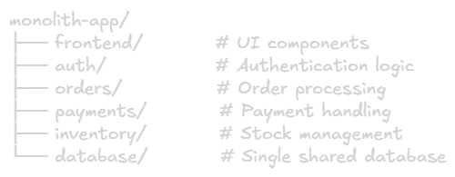
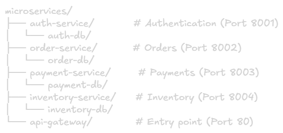
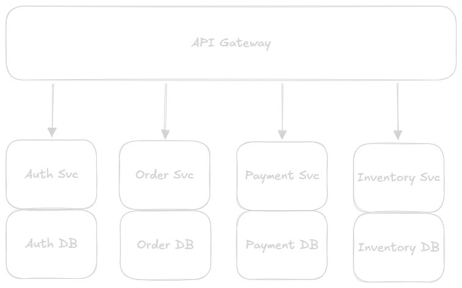
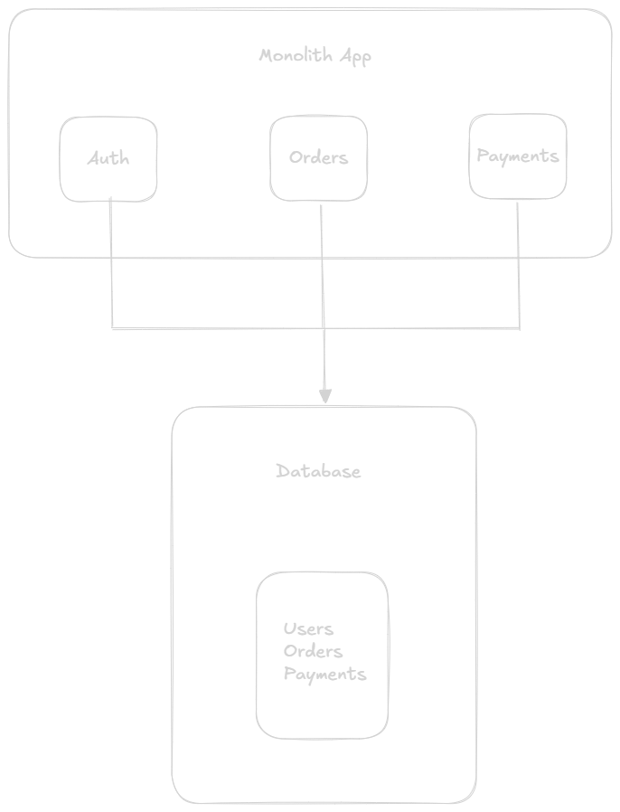
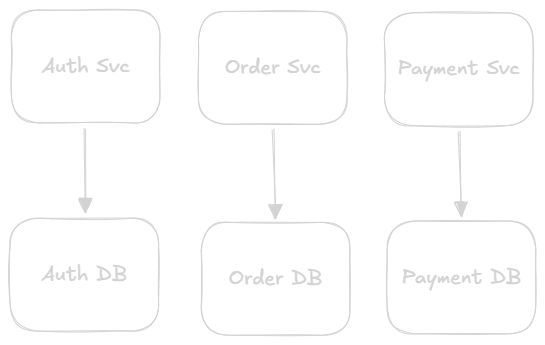
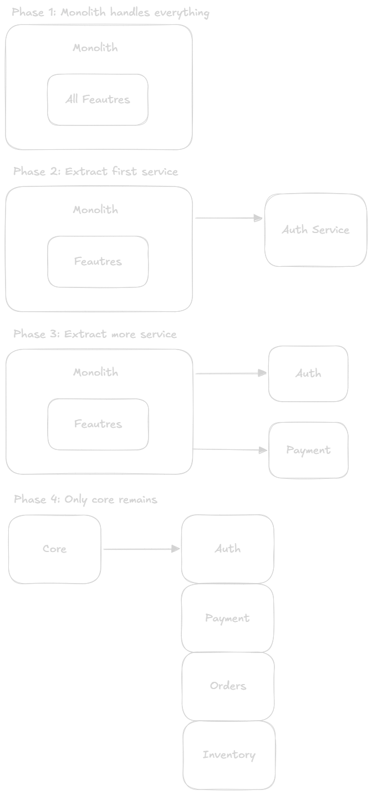
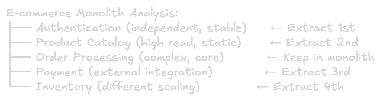
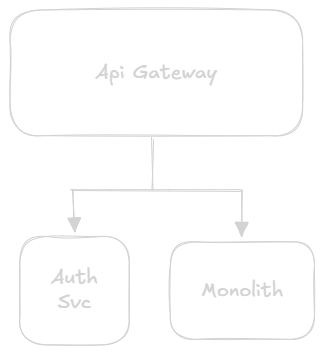
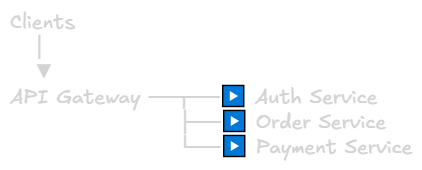

Monolith vs Microservices
===

## What is a Monolith?
A **monolith** is a single, unified application where all components (UI, business logic, data acess) are tightly coupled and deployed as one unit.

### Characteristics
- **Single codebase:** All code in one repository
- **Single deployment:** Deploy entire application together
- **Shared database:** One database for all functionality
- **Tight coupling:** Components depend on each other directly
- **Single process:** Runs as one process or application

### Example Structure


All deployed together as one application.

## What is Microservices?
**Microservices** architecture breaks application into small, independent services that communicate over network. Each service handles one specific business capability.

### Characteristics
- **Multiple codebases:** Separate repository per service
- **Independent deployment:** Deploy services individually
- **Distributed data:** Each service has its own database
- **Loose coupling:** Services communicate via APIs
- **Multiple processes:** Each service runs independently

### Example Structure


Each service deployed independently with its own database.

## Visual Comparison

### Monolith Architecture


### Microservices Architecture


## Detailed Comparison

### 1. Development

#### Monolith
**Advantages:**
- Simple to develop initially
- Easy to understand (everything in one place)
- Easy to debug (single process)
- Straightforward testing
- IDE support excellent (one codebase)

**Disadvantages:**
- Large codebase hard to navigate
- Long build times (rebuild everything)
- Tight coupling (changes ripple through)
- Hard to onboard new developers
- Difficult to understand all parts

#### Microservices
**Advantages:**
- Small, focused codebase
- Easy to understand individual service
- Fast build times per service
- Team autonomy (own services)
- Technology flexibility per service

**Disadvantages:**
- Distributed system complexity
- Requires DevOps expertise
- Hard to debug across services
- Network latency overhead
- Distributed transactions complex

### 2. Deployment
#### Monolith
**Process:**
> Code Change → Build → Test → Deploy Entire App → Restart

**Advantages:**
- Simple deployment process
- Single deployment artifact
- Easy rollback (one version)
- No coordination needed

**Disadvantages:**
- Downtime during deployment
- Risk affects entire application
- Long deployment times
- Can't deploy one feature independently
- Small change = full redeployment

**Example:**
```bash
# Deploy monolith
git pull
mvn clean package
systemctl restart app
# All features deployed together
```
#### Microservcies
**Process:**
> Code Change in Service A → Build Service A → Deploy Service A\
> Other services continue running

**Advantages:**
- Independent deployments
- Zero downtime possible
- Fast deployments (only changed service)
- Isolated failure impact
- Can deploy multiple times per day

**Disadvantages:**
- Complex deployment orchestration 
- API versioning challenges
- Service compatibility issues
- Requires CI/CD pipeline
- Rollback more complex

**Example:**
```bash
# Deploy only payment service
cd payment-service
docker build -t payment:v2
kubectl set image deployment/payment payment=payment:v2
# Other services unaffected
```

### 3. Scaling

#### Monolith
**Scaling Stragey:** Vertical or horizontal scaling of entire application
> Low Load:\
> [Instance 1]
> 
> High Load:\
> [Instance 1] [Instance 2] [Instance 3]\
> (All components scaled together)

**Advantages:**
- Simple to scale 
- No service discovery needed
- Load balancer handles distribution

**Disadvantages:**
- Scale everything even if only one part needs it
- Inefficient resource usage
- Expensive (scaling unused components)
- Can't optimize for specific needs

**Example:**
> Black Friday → High order volume\
> Must scale ENTIRE app (including rarely-used admin features)\
> Cost: High (scaling everything)

#### Microservices
**Scaling Strategy:** Scale individual services based on demand
> Normal Load:\
> [Auth: 2 instances]\
> [Order: 2 instances]\
> [Payment: 2 instances]
> 
> Black Friday (Order spike):\
> [Auth: 2 instances]\
> [Order: 10 instances]  ← Scale only this\
> [Payment: 3 instances]

**Advantages:**
- Scale only what needs scaling
- Cost-efficient (targeted scaling)
- Optimize resources per service
- Handle different load patterns

**Disadvantages:**
- Requires monitoring per service
- Auto-scaling configuration complex
- Service discovery needed
- Load balancing per service

**Example:**
> // Scale only order service during Black Friday\
> kubectl scale deployment order-service --replicas=10\
> // Other services unchanged

### 4. Technology Stack

#### Monolith
**Constraint:** Single technology for entire application
> Application Stack:
> - Language: Java
> - Framework: Spring Boot
> - Database: PostgreSQL
> - Cache: Ehcache (in-process)

**Advantages:**
- Consistent technology
- Team expertise focused
- Simpler hiring
- Shared library easy

**Disadvantages:**
- Stuck with initial choices
- Hard to adopt new technologies
- Not optimized for specific tasks
- Legacy technology burden

#### Microservices
**Flexibility:** Different technology per service
> Auth Service:     Node.js + MongoDB\
> Order Service:    Java + PostgreSQL\
> Payment Service:  Go + MySQL\
> Search Service:   Python + Elasticsearch

**Advantages:** 
- Right tool for right job
- Easy to adopt new technologies
- Optimize per service needs
- Experiment safely

**Disadvantages:**
- Multiple technologies to maintain
- Requires diverse expertise
- Harder to hire (need polyglots)
- More operational overhead

### 5. Data Management
#### Monolith
**Pattern:** Single shared database


**Advantages:** 
- ACID transactions across tables
- Joins are easy and fast
- Data consistency guaranteed
- Simple backup/recovery
- Foreign keys enforce integrity

**Disadvantages:**
- Database becomes bottleneck
- Tight coupling via database
- Hard to scale writes
- Schema changes affect everything
- Can't use different database types

**Example:**
```sql
-- Easy transaction across tables
BEGIN TRANSACTION;
  INSERT INTO orders (...);
  UPDATE inventory SET stock = stock - 1;
  INSERT INTO payments (...);
COMMIT;
```

#### Microservices
**Pattern:** Database per service


**Advantages:** 
- Service independence
- Different database types possible
- Easier to scale per service
- Schema changes isolated
- No single database bottleneck

**Disadvantages:**
- No ACID across services
- Distributed transactions needed
- Data duplication required
- Eventual consistency
- Complex queries across services

**Example:**
```js
// Distributed transaction (Saga pattern)
try {
  // 1. Create order
  await orderService.createOrder(orderData);
  
  // 2. Process payment
  await paymentService.charge(paymentData);
  
  // 3. Update inventory
  await inventoryService.decreaseStock(items);
} catch (error) {
  // Compensating transactions
  await orderService.cancelOrder(orderId);
  await paymentService.refund(paymentId);
}
```

### 6. Team Structure

#### Monolith
**Organization:** Typically by technical layer
> Frontend Team  →  UI Layer\
> Backend Team   →  Business Logic\
> Database Team  →  Data Layer

**Advantages:** 
- Clear technical expertise
- Easy to standardize
- Simple reporting structure

**Disadvantages:**
- Cross-team coordination needed for features
- Slower feature delivery
- Handoffs between teams
- Unclear ownership

#### Microservices
**Organization:** By business capability (cross-functional teams)
> Payments Team  →  Payment Service (Full Stack)\
> Orders Team    →  Order Service (Full Stack)\
> Auth Team      →  Auth Service (Full Stack)

**Advantages:** 
- Team autonomy
- Faster feature delivery
- Clear ownership
- End-to-end responsibility

**Disadvantages:**
- Requries full-stack developers
- Duplication across teams
- Coordination for cross-service features
- Potential inconsistency

### 7. Failure Handling
#### Monolith
**Failure Impact:** All or nothing
> Any components fails → Entire application down

**Advantages:** 
- Simpler failure modes
- Easier to debug
- Clear state (up or down)

**Disadvantages:**
- Single point of failure
- One bug can crash everything
- No partial degradation
- Higher blast radius

**Example:**
> Payment module bug → Entire app crashses\
> Users can't access ANY feauter 

#### Microservices
**Failure Impact:** Isolated failures
> Payment service fails → Other services continue

**Advantages:** 
- Fault isolation 
- Graceful degradation possible
- Partial availability
- Smaller blast radius

**Disadvantages:**
- Complex failure scenarios
- Cascade failures possible
- Harder to debug
- Requires circuit breakers

**Example**
> Payment service down → Disable checkout\
> But users can still:
> - Browse products
> - Add to cart
> - View account

## When to Use What?

### Use Monolith When:

#### 1. Starting New Project
**Reason: Unkown requirements, need speed**
> Week 1-12: Build MVP as monolith\
> Week 13+: If success, consider microservices

**Why:**
- Faster initial development
- Less infrastructure complexity
- Easy to pivot
- Lower operational cost

#### 2. Small Team (< 10 developers)
**Reason:** Not enough people to manage multiple services

**Indicators:**
- Single team can understand entire codebase
- No specialized roles needed
- Simple deployment is priority

#### 3. Simple Application
**Reason:** Doesn't justify microservices overhead

**Examples:**
- Internal tools
- CRUD applications
- Content management systems
- Small e-commerce sites

#### 4. Tight Budget
**Reason:** Microservices require more infrastucture

**Costs:**
- More servers (each service needs hosting)
- Service mesh, API gateway
- Monitoring tools
- DevOps expertise

#### 5. Unkown Domain
**Reason:** Boundaries unclear initially

**Better approach:**
1. start monolith
2. Learn domain
3. Identify boundaries
4. Extract microservices

### Use Microservices When:

#### 1. Large Application
**Reason:** Monolith becomes unmanageable

**Indicators:**
- Codebase > 100K lines
- Build time > 30 minutes
- Deploy time > 1 hour
- Hard to understand full system

#### 2. Large Team (> 15 developers)
**Reason:** Coordination overhead in monolith

**Structure:**
> 15+ developers = 3-4 teams\
> Each team owns 2-3 services

#### 3. Different Scaling Needs
**Reason:** Optimize resources per component

**Example:**
> Product Catalog: 10 instances (high read)\
> Checkout: 3 instances (moderate)\
> Admin: 1 instances (low usage)

#### 4. Technology Diversity Needed
**Reason:** Optimize per use case

**Example:**
> Search Service:     Python + Elasticsearch\
> Real-time Chat:     Node.js + WebSocket\
> Analytics:          Scala + Spark\
> Core Business:      Java + Spring Boot

#### 5. Independent Deployment Critical
**Reason:** Deploy features without full system downtime

**Example:**
> Deploy new payment provider → Only payment service\
> Black Friday prep → Scale only order service

#### 6. Complex Business Domain
**Reason:** Clear bounded contexts

**Example:**
> E-commerce Platform:
> - User Management (separate domain)
> - Product Catalog (separate domain)
> - Order Processing (separate domain)
> - Shipping (separate domain)
> - Analytics (separate domain)

## Migration Strategy: Monolith to Microservices

### The Strangler Fig Pattern
Gradually replace monolith with microservices (don't rewrite everything at once)



### Migration Steps

#### Step 1: Identify Boundaries
Analyze monolith to find natural boundaries

**Look for:**
- loosely coupled modules
- Clear interfaces
- Independent data
- Different scaling needs

**Example:**



#### Step 2: Extract Non-Critical Service First
Start with least risky component

**Good first candidates:**
- New features (no migration needed)
- Leaf services (no dependencies)
- Clearly bounded contexts
- Non-critical functionality

**Example:**
```js
// Extract: Email notification service
// Before: Part of monolith
monolith.sendEmail(user, message);

// After: Separate service
await emailService.send({
  to: user.email,
  subject: 'Order Confirmation',
  body: message
});

// Monolith now calls email service
```
#### Step 3: Add API Layer


**Routing logic:**
```js
// API Gateway routes requests
router.use('/auth', authServiceProxy);      // → Auth Service
router.use('/products', monolithProxy);     // → Monolith
router.use('/orders', monolithProxy);       // → Monolith
```

#### Step 4: Migrate Data Gradually
Don't move all data at once

**Dual-Write pattern:**
```js
// Phase 1: Write to both, read from monolith DB
async function updateUser(userId, data) {
  await monolithDB.users.update(userId, data);
  await authServiceDB.users.update(userId, data);
  return monolithDB.users.findOne(userId);
}

// Phase 2: Write to both, read from service DB
async function updateUser(userId, data) {
  await monolithDB.users.update(userId, data);
  await authServiceDB.users.update(userId, data);
  return authServiceDB.users.findOne(userId);  // Changed
}

// Phase 3: Write only to service, stop using monolith
async function updateUser(userId, data) {
  await authServiceDB.users.update(userId, data);
  return authServiceDB.users.findOne(userId);
}
```

#### Step 5: Monitor and Validate
Ensure extracted service works correctly

**Metrics to track:**
- Error rate (should not increase)
- Latency (might increase slightly due to network)
- Throughput (should maintain)
- Data consistency (monolith vs service)

#### Step 6: Repeat for Next Service
Continue extracting services one by one

**Typical order:**
1. Authentication (2-3 months)
2. Email/Notifications (1 month)
3. Product Catalog (3-4 months)
4. Payment (2-3 months)
5. Orders (4-6 months - complex)
6. Inventory (2-3 months)

## Common Pitfalls

### 1. Premature Microservices
**Mistake:** Start with microservices for new project

**Why bad:**
- Unkown requirements → wrong boundaries
- Overhead not justified for small app
- Slows initial development
- Waste resources

**Better:**
> Start: Monolith MVP (3-6 months)\
> Validate: Product-market fit\
> Then: Consider microservices if needed

### 2. Too Small Services (Nano-service)
**Mistake:** Create service for every function

**Bad example:**
> getUserById()      → User-Getter-Service\
> updateUserEmail()  → Email-Update-Service\
> validateUser()     → User-Validator-Service

**Result:**
- 100+ services to manage
- Network overhead dominates
- Deployment nightmare

**Better:**
> User-Service handles all user operations\
> Payment-Service handles all payment operations

### 3. Shared Database
**Mistake:** Microservices using same database

**Why bad:**
- Tight coupling via database
- No independent deployment
- Schema changes affect all services
- Defeats purpose of microservices

**Fix**:  Each service owns its data

### 4. Distributed Monolith
**Mistake:** Split monolith without proper boundaries

**Characteristics:**
- Service tightly coupled
- Changes require updating multiple services
- Sycnhronous calls everywhere
- Shared libraries with business logic

**Example:**
```js
// Order Service calls Payment Service
const payment = await paymentService.process(data);

// Payment Service calls Inventory Service
const stock = await inventoryService.check(items);

// Inventory Service calls Order Service (circular!)
const order = await orderService.getDetails(orderId);
```

**Result:** Worst of both worlds
- Monolith complexity (coupled)
- Microservices overhead (network, deployment)

### 5. No API Gateway
**Mistake:** Clients call services directly


**Problems:**
- Clients know service locations
- No centralized authentication
- No rate limitng
- Hard to change service boundaries

**Fix:** Use API Gateway



### 6. Not Handling Failures
**Mistake:** Assume network calls always succeed
```js
// Bad: No error handling
const user = await authService.getUser(userId);
const orders = await orderService.getOrders(user.id);
```

**What happens:**
- Auth service down → Entire flow fails
- Cascade failures
- Poor user experience

**Fix:** Handle failures gracefully
```js
// Good: Circuit breaker, fallback
try {
  const user = await circuitBreaker.call(() =>
    authService.getUser(userId)
  );
  
  if (!user) {
    return cachedUserData(userId);
  }
  
  const orders = await orderService.getOrders(user.id);
  return { user, orders };
  
} catch (error) {
  logger.error('Service failure', error);
  return {
    user: cachedUserData(userId),
    orders: []  // Graceful degradation
  };
}
```

### 7. Ignoring Operational Complexity
**Mistake:** Focus only on development, ignore opeartions

**Microservices require:**
- Service discovery
- Load balancing per service
- Distributed tracing
- Centralized logging
- Monitoring per service
- CI/CD pipelines
- Container orchestration (Kubernetes)

**Cost:** 3-5x operational overhead vs monolith

**Reality Check:**
>Monolith:
>- 1 deployment pipeline
>- 1 monitoring dashboard
>- 1 log file
>
>10 Microservices:
>- 10 deployment pipelines
>- 10+ monitoring dashboards
>- Distributed tracing needed
>- Service mesh complexity

## Real-World Examples

### Example 1: Netflix 
**Started:** Monolith (DVD rental business)

**Pain points:**
- Frequent outages
- Hard to scale for streaming
- Slow feature delivery
- Database bottleneck

**Migration:** 2008 - 2012 (took 4 years)

**Result:**\
> 700+ microservices
> - Recommendation Service
> - Video Encoding Service
> - Payment Service
> - User Service
> - Content Delivery Service

**Benefits:**
- Deploy 1000+ times per day
- Scale services independently
- Global availability
- Team autonomy

**Challenge overcome:**
- Built Eureka (service discovery)
- Created Hystrix (circuit breaker)
- Developed Chaos Monkey (failure testing)

### Example 2: Amazon

**Started:** Monolith (2001)

**Problem:**
> "Obidos" monolith:
> - 12 million lines of code
> - 10+ minute build times
> - Frequent conflicts
> - Can't scale teams

**Solution:** Two Pizza Teams
- Each team max 10 people
- Own entire service
- Independent deployment

**Result:**
> 100s of microservices
> - Retail Service
> - AWS Services (EC2, S3, etc.)
> - Alexa Services
> - Prime Video Services

## Decision Framework

### Checklist: Should You Use Microservices?
Answer these questions:

**Team Size**
- Do you have 15+ developers?
- Can you form 3+ autonomous teams?
- Do you have DevOps expertise?

**No to any?** → Stick with monolith

**Application Complexity**
- Is the domain complex with clear boundaries?
- Do different parts have different scaling needs?
- Do you need independent deployments?

**No to all?** → Monolith is fine

**Operational Readiness**
- Do you have monitoring infrastructure?
- Can you implement distributed tracing?
- Is your CI/CD pipeline mature?

**No to any?** → Not ready for microservices

**Business Requirements**
- Is high availability critical? (99.99%+)
- Do you deploy multiple times per day?
- Do you need technology diversity?

**No to all?** → Microservices overhead not justified

### Scoring
- **Yes to 8+:** Microservices beneficial
- **Yes to 4-7:** Consider hybrid approach
- **Yes to 0-3:** Stay with monolith

## Key Takeaways
1. Start with monolith
2. Keep it modular (prepare for extraction)
3. Learn the domain
4. Extract microservices only when needed

## Summary Table
|Aspect|Monolith|Microservices|
|-|-|-|
|**Best For**|MVPs, small teams|Large scale, big teams|
|**Complexity**|Low|High|
|**Development Speed**|Fast initially|Slower initially|
|**Deployment**|Simple, risky|Complex, safer|
|**Scaling**|Uniform|Targeted|
|**Technology**|Uniform|Diverse|
|**Data**|Single DB, ACID|Multiple DBs, eventual|
|**Team Size**|< 15 devs|15+ devs|
|**Testing**|Easy|Hard (integration)|
|**Debugging**|Easy|Hard (distributed)|
|**Cost**|Lower|Higher|
|**When to Use**|Starting out|After validation|

**Golden Rule:** Start with a **well-structured monolith**, and extract microservices **only when you have concrete problems** that microservices solve better than alternatives