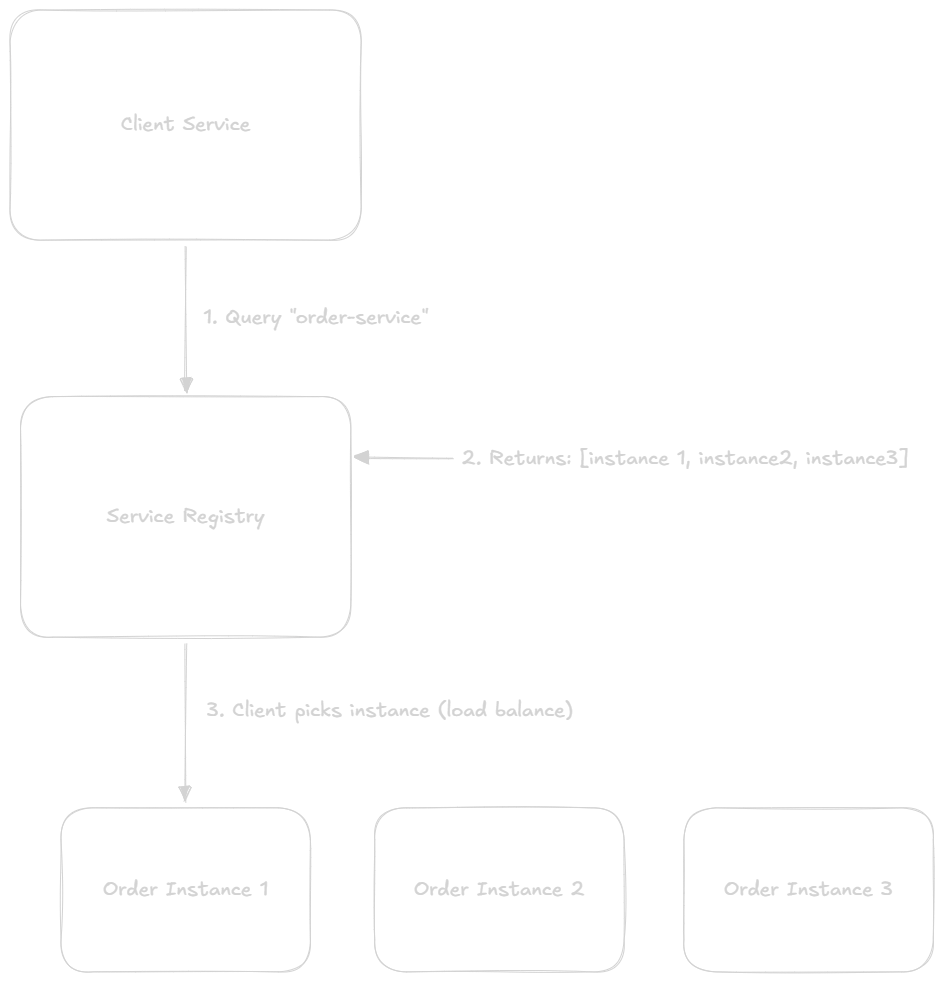
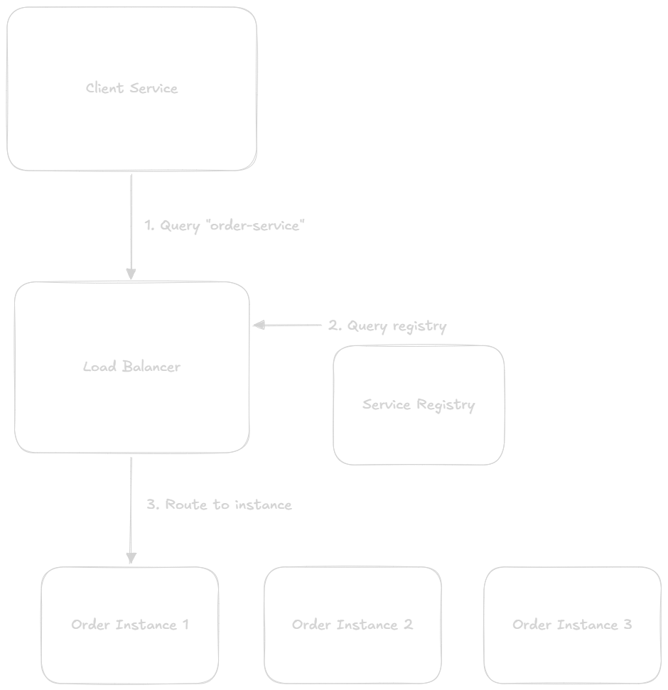
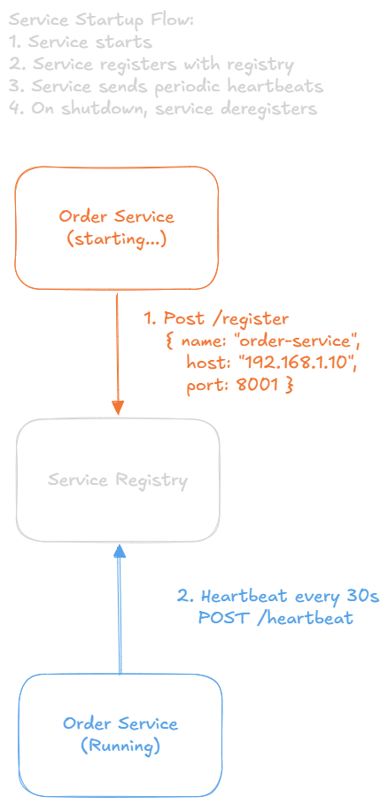
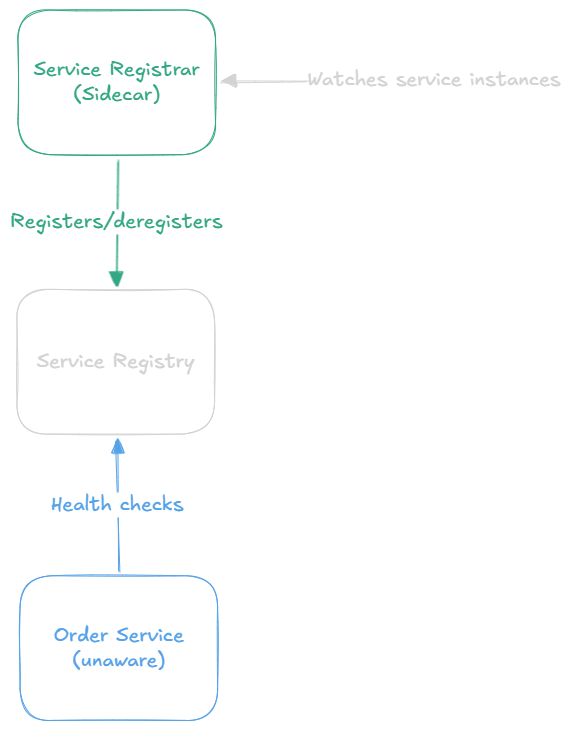
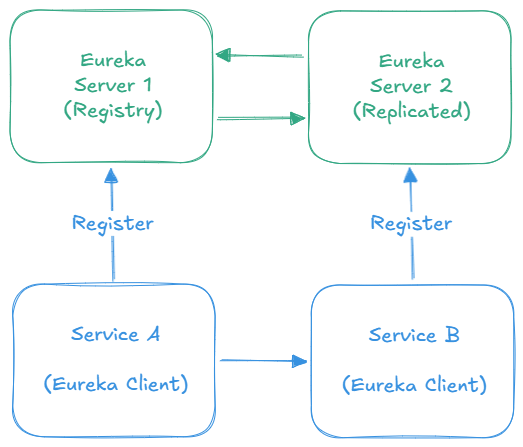
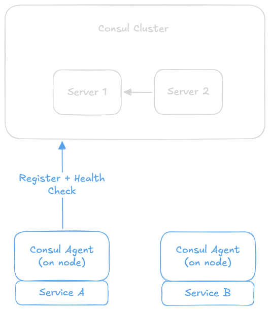
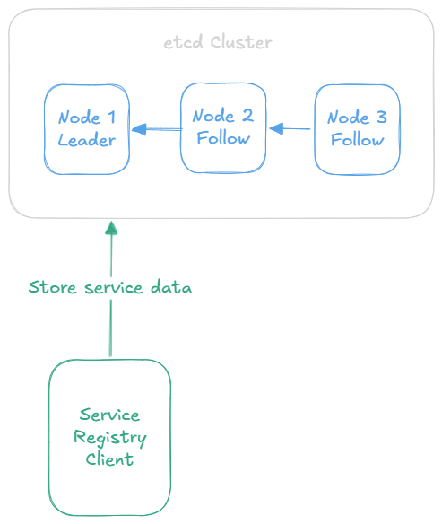
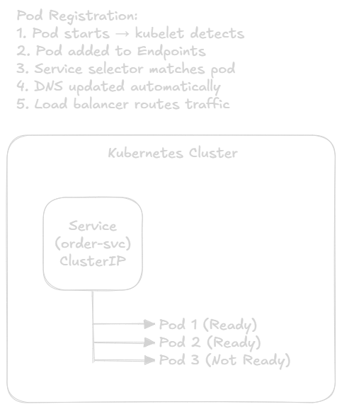

Service Discovery
===

## What is Service Discovery?
**Service Discovery** is the automatic detection of services in a network. It allows services to find and communicate with each other without hardcoding network locations (IP addresses and ports).

### The Problem Without Service Discovery
**Traditional Approach (Hardcoded)**
```go
// Bad: Hardcoded service locations
const orderServiceURL = "http://192.168.1.10:8001"
const paymentServiceURL = "http://192.168.1.15:8002"

// What if server crashes and moves to 192.168.1.20?
// What if we scale to 5 order service instances?
// Need to update code and redeploy!
```

**Problems:**
- Service can move (IP changes)
- Services can scale (multiple instances)
- Services can fail (needed failover)
- Manual updates required (error-prone)
- Doesn't work with auto-scaling

**With Service Discovery**
```go
// Good: Dynamic service discovery
orderService := discovery.GetService("order-service")
paymentService := discovery.GetService("payment-service")

// Returns: Available healthy instance automatically
// Handles: Multiple instances, failures, scaling
```

**Benefits:**
- Dynamic instances discovery
- Automatic failover
- Load balancing
- Health checking
- Works with auto-scaling

## Core Concepts

### Service Registry
Central database that stores information about available services.

**Stored information:**
- Service name (`order-service`)
- Network location (`192.168.1.10:8001`)
- Health status (`healthy`, `unhealthy`)
- Metadata (version, region, tags)

**Example registry data:**
```json
{
  "order-service": [
    {
      "id": "order-1",
      "address": "192.168.1.10",
      "port": 8001,
      "status": "healthy",
      "version": "2.1.0",
      "region": "us-east-1"
    },
    {
      "id": "order-2",
      "address": "192.168.1.11",
      "port": 8001,
      "status": "healthy",
      "version": "2.1.0",
      "region": "us-east-1"
    }
  ],
  "payment-service": [
    {
      "id": "payment-1",
      "address": "192.168.1.20",
      "port": 8002,
      "status": "healthy"
    }
  ]
}
```

### Service Registration
Process where service register themselves with the registry.

**Two patterns:**
1. **Self-Registration:** Service registers itself
2. **Third-Party Registration:** External system registers services

### Service Discovery
Process where services lookup other services in the registry.

**Two patterns:**
1. **Client-Side Discovery:** Client queries registry
2. **Server-Side Discovery:** Load balancer queries registry

## Service Discovery Patterns

### 1. Client-Side Discovery

**How It Works**\
Client is responsible for determining network location of available service instances.


**Implementation Example**
```go
// Client-side discovery with Consul
package main

import (
    "fmt"
    "math/rand"
    "net/http"
    "time"
    
    consulapi "github.com/hashicorp/consul/api"
)

type ServiceDiscovery struct {
    client *consulapi.client
}

func NewServiceDiscovery(consulAddr string) (*ServiceDiscovery, error) {
    config := consulapi.DefaultConfig()
    config.Address = consulAddr
    
    client, err := consulapi.NewClient(config)
    if err != nil {
        return nil, err
    }
    
    return &ServiceDiscovery{client: client}, nil
}

// Discover service instances
func (sd *ServiceDiscovery) GetService(serviceName string) (string, error) {
    // 1. Query Consul for healthy instances
    services, _, err := sd.client.Health().Service(serviceName, "", true, nil)
    if err != nil {
        return "", err
    }
    
    if len(services) == 0 {
        return "", fmt.Errorf("no healthy instances of %s", serviceName)
    }
    
    // 2. Load balance (round-robin/random)
    instance := services[rand.Intn(len(services))]
    
    // 3. Return service URL
    url := fmt.Sprintf("http://%s:%d", 
        instance.Service.Address, 
        instance.Service.Port)
    
    return url, nil
}

func main() {
    // Initialize discovery client
    discovery, err := NewServiceDiscovery("localhost:8500")
    if err != nil {
        panic(err)
    }
    
    // Get order service URL
    orderServiceURL, err := discovery.GetService("order-service")
    if err != nil {
        panic(err)
    }
    
    // Make request
    resp, err := http.Get(orderServiceURL + "/orders/123")
    if err != nil {
        panic(err)
    }
    defer resp.Body.Close()
    
    fmt.Println("Order fetched successfully")
}
```

**Advantages:**
- Simple architecture (no intermediary)
- Client controls load balancing
- Direct connection (lower latency)
- Client can implement custom logic

**Disdvantages:**
- Client complexity
- Tight coupling to registry
- Must implement in every client
- Language-specific client libraries

**When to Use:**
- Homogeneous environment (same language)
- Need custom load balancing logic
- Want direct client to service communication
- Have control over all cleints

### 2. Server-Side Discovery

**How It Works**\
Client makes request to load balancer, which queries registry and routes to instance.



**Implementation Example**
```go
// Server-side discovery with Kubernetes
// Client doesn't know about service discovery at all

// main.go - Simple HTTP client
package main

import (
    "fmt"
    "io"
    "net/http"
)

func main() {
    // Kubernetes Service DNS name
    // Kubernetes automatically routes to healthy pods
    resp, err := http.Get("http://order-service/orders/123")
    if err != nil {
        panic(err)
    }
    defer resp.Body.Close()
    
    body, _ := io.ReadAll(resp.Body)
    fmt.Println(string(body))
}
```
```yaml
# Kubernetes Service YAML
apiVersion: v1
kind: Service
metadata:
  name: order-service
spec:
  selector:
    app: order-service
  ports:
    - protocol: TCP
      port: 80
      targetPort: 8001
  type: ClusterIP
```

**Advantages:**
- Simple client (just hostname)
- Language-agnostic
- Centralized load balancing
- No client library needed
- Load balancer can add features (SSL, caching)

**Disdvantages:**
- Additional network hop (load balancer)
- Load balancer is single point of failure
- Load balancer can become bottleneck
- More infrastructure to manage

**When to Use:**
- Polygot environment (multiple languages)
- Want simple clients
- Already using load balancer
- Platform provides it (Kubernetes, AWS ECS)

## Service Registration Patterns

### 1. Self-Registration Pattern
Service instance registers itself with registry on startup



**Implementation Example**
```go
// Self-registration with Consul
package main

import (
    "context"
    "fmt"
    "log"
    "net/http"
    "os"
    "os/signal"
    "syscall"
    "time"
    
    consulapi "github.com/hashicorp/consul/api"
)

const (
    ServiceName = "order-service"
    ServicePort = 8001
)

type Server struct {
    consul   *consulapi.Client
    serviceID string
}

func NewServer(consulAddr string) (*Server, error) {
    config := consulapi.DefaultConfig()
    config.Address = consulAddr
    
    client, err := consulapi.NewClient(config)
    if err != nil {
        return nil, err
    }
    
    serviceID := fmt.Sprintf("%s-%d", ServiceName, os.Getpid())
    
    return &Server{
        consul:    client,
        serviceID: serviceID,
    }, nil
}

// Register service with Consul
func (s *Server) Register() error {
    registration := &consulapi.AgentServiceRegistration{
        ID:      s.serviceID,
        Name:    ServiceName,
        Port:    ServicePort,
        Address: "192.168.1.10",
        Tags:    []string{"v1", "orders"},
        Check: &consulapi.AgentServiceCheck{
            HTTP:                           fmt.Sprintf("http://192.168.1.10:%d/health", ServicePort),
            Interval:                       "10s",
            Timeout:                        "5s",
            DeregisterCriticalServiceAfter: "1m",
        },
    }
    
    err := s.consul.Agent().ServiceRegister(registration)
    if err != nil {
        return err
    }
    
    log.Printf("Service registered: %s", s.serviceID)
    return nil
}

// Deregister service from Consul
func (s *Server) Deregister() error {
    err := s.consul.Agent().ServiceDeregister(s.serviceID)
    if err != nil {
        return err
    }
    
    log.Printf("Service deregistered: %s", s.serviceID)
    return nil
}

// Health check endpoint
func healthHandler(w http.ResponseWriter, r *http.Request) {
    w.Header().Set("Content-Type", "application/json")
    w.WriteHeader(http.StatusOK)
    w.Write([]byte(`{"status":"UP"}`))
}

// Business endpoint
func ordersHandler(w http.ResponseWriter, r *http.Request) {
    w.Header().Set("Content-Type", "application/json")
    w.Write([]byte(`{"orderId":"123","status":"completed"}`))
}

func main() {
    // Create server
    server, err := NewServer("localhost:8500")
    if err != nil {
        log.Fatal(err)
    }
    
    // Register with Consul
    if err := server.Register(); err != nil {
        log.Fatal(err)
    }
    
    // Setup HTTP handlers
    http.HandleFunc("/health", healthHandler)
    http.HandleFunc("/orders/", ordersHandler)
    
    // Start HTTP server
    httpServer := &http.Server{
        Addr:    fmt.Sprintf(":%d", ServicePort),
        Handler: http.DefaultServeMux,
    }
    
    // Graceful shutdown
    go func() {
        sigChan := make(chan os.Signal, 1)
        signal.Notify(sigChan, syscall.SIGINT, syscall.SIGTERM)
        <-sigChan
        
        log.Println("Shutting down gracefully...")
        
        // Deregister from Consul
        server.Deregister()
        
        // Shutdown HTTP server
        ctx, cancel := context.WithTimeout(context.Background(), 5*time.Second)
        defer cancel()
        httpServer.Shutdown(ctx)
        
        os.Exit(0)
    }()
    
    log.Printf("Order service running on port %d", ServicePort)
    if err := httpServer.ListenAndServe(); err != http.ErrServerClosed {
        log.Fatal(err)
    }
}
```

**Advantages:**
- Service controls its lifecycle
- Service knows when it's ready
- Simple architecture

**Disadvantages:**
- Service must implement registration logic
- Coupled to registry implementation
- Must implement in every service

### 2. Third-Party Registration
External System (registrar) monitors services and registers them.



**Implementation Example**
```yaml
# Third-party registration with Kubernetes
# Service doesn't register itself!

apiVersion: apps/v1
kind: Deployment
metadata:
  name: order-service
spec:
  replicas: 3
  selector:
    matchLabels:
      app: order-service
  template:
    metadata:
      labels:
        app: order-service
    spec:
      containers:
      - name: order-service
        image: order-service:latest
        ports:
        - containerPort: 8001
        livenessProbe:
          httpGet:
            path: /health
            port: 8001
          initialDelaySeconds: 30
          periodSeconds: 10
        readinessProbe:
          httpGet:
            path: /ready
            port: 8001
          initialDelaySeconds: 5
          periodSeconds: 5
```
**Kubernetes automatically:**
1. Detects new pods
2. Registers them in internal DNS
3. Routes traffic to healthy pods
4. Deregisters failed pods
 
**Advantages:**
- Service doesn't need registration logic
- Decoupled from registry
- Platform handles it
- Language-agnostic

**Disadvantages:**
- Requires platform support
- Less control
- Platform specific

## Popular Service Discovery Tools

### 1. Netflix Eureka
**Characteristics**
- Client-side discovery
- Self registration
- Java focused (Netflix OSS)
- RESTful API

**Architecture**\


**Configuration**
```yaml
# Eureka Server application.yml
server:
  port: 8761

eureka:
  client:
    registerWithEureka: false
    fetchRegistry: false
  server:
    enableSelfPreservation: false
```

**When to Use**
- Spring Boot ecosystem
- Java applications 
- Need client-side discovery
- Netflix stack already in use


### 2. Consul (Hashicorp)
**Characteristics**
- Both client and server side discovery
- Built-in health checking
- Key-value store
- Multi-datacenter support
- DNS interface

**Architecture**\


**Features**
```bash
# Register service
curl -X PUT http://consul:8500/v1/agent/service/register \
  -d '{
    "Name": "order-service",
    "Port": 8001,
    "Check": {
      "HTTP": "http://localhost:8001/health",
      "Interval": "10s"
    }
  }'

# Discover service via DNS
dig @consul order-service.service.consul

# Discover via HTTP API
curl http://consul:8500/v1/catalog/service/order-service
```

**When to Use**
- Need DNS interface
- Multi-datacenter setup
- Want key-value store
- Polyglot environment
- HashiCorp ecosystem

### 3. etcd

**Characteristics**
- Distributed key-value store
- Raft consensus
- Strong consistency
- Used by Kubernetes

**Architecture**\


**Usage**
```bash
# Register service
etcdctl put /services/order-service/instance1 \
  '{"host":"192.168.1.10","port":8001}'

# Discover services
etcdctl get --prefix /services/order-service/

# Watch for changes
etcdctl watch --prefix /services/
```

**When to Use**
- Using Kubernetes
- Need strong consistency
- Building custom service discovery
- Go ecosystem

### 4. Kubernetes (Built-in)

**Characteristics**
- Server-side discovery
- Third-party registration
- DNS-based
- Automatic

**How It Works**\


**Configuration**
```yaml
# Service discovery is automatic
apiVersion: v1
kind: Service
metadata:
  name: order-service
spec:
  selector:
    app: order
  ports:
  - port: 80
    targetPort: 8001

---
apiVersion: apps/v1
kind: Deployment
metadata:
  name: order-deployment
spec:
  replicas: 3
  selector:
    matchLabels:
      app: order
  template:
    metadata:
      labels:
        app: order
    spec:
      containers:
      - name: order
        image: order-service:latest
```

**DNS Resolution**
```js
// Automatic DNS-based discovery
const response = await fetch('http://order-service/orders');
// Kubernetes DNS resolves 'order-service' automatically
// Returns ClusterIP of Service
// kube-proxy load balances to pods
```

**When to Use**
- Already using Kubernetes
- Want platform-managed discovery
- Need automatic registration
- Container-based architecture

### Comparison Table
|Tool|Discovery Type|Registration|Best For|Complexity|
|-|-|-|-|-|
|**Eureka**|Client-side|Self|Spring Boot, Java|Medium|
|**Consul**|Both|Self/Agent|Multi-DC, polyglot|Medium|
|**etcd**|Custom|Self|Kubernetes, Go|Medium|
|**Kubernetes**|Server-side|Automatic|Containers, K8s|Low (for users)|
|**Zookeeper**|Custom|Self|Hadoop ecosystem|High|

## Health Checking
Registry must know which instances are healthy to avoid routing to dead services.

### Health Check Types

#### 1. HTTP Health Check
```go
package main

import (
    "database/sql"
    "encoding/json"
    "net/http"
    "time"
    
    "github.com/go-redis/redis/v8"
)

// Simple health endpoint
func simpleHealthHandler(w http.ResponseWriter, r *http.Request) {
    w.Header().Set("Content-Type", "application/json")
    w.WriteHeader(http.StatusOK)
    json.NewEncoder(w).Encode(map[string]interface{}{
        "status":    "UP",
        "timestamp": time.Now().Format(time.RFC3339),
    })
}

// Comprehensive health check
type HealthCheck struct {
    Status string `json:"status"`
}

type HealthResponse struct {
    Status    string                 `json:"status"`
    Checks    map[string]HealthCheck `json:"checks"`
    Timestamp string                 `json:"timestamp"`
}

func comprehensiveHealthHandler(db *sql.DB, rdb *redis.Client) http.HandlerFunc {
    return func(w http.ResponseWriter, r *http.Request) {
        checks := make(map[string]HealthCheck)
        
        // Check database
        if err := db.Ping(); err == nil {
            checks["database"] = HealthCheck{Status: "UP"}
        } else {
            checks["database"] = HealthCheck{Status: "DOWN"}
        }
        
        // Check Redis
        if _, err := rdb.Ping(r.Context()).Result(); err == nil {
            checks["cache"] = HealthCheck{Status: "UP"}
        } else {
            checks["cache"] = HealthCheck{Status: "DOWN"}
        }
        
        // Determine overall status
        allHealthy := true
        for _, check := range checks {
            if check.Status != "UP" {
                allHealthy = false
                break
            }
        }
        
        status := "UP"
        statusCode := http.StatusOK
        if !allHealthy {
            status = "DOWN"
            statusCode = http.StatusServiceUnavailable
        }
        
        response := HealthResponse{
            Status:    status,
            Checks:    checks,
            Timestamp: time.Now().Format(time.RFC3339),
        }
        
        w.Header().Set("Content-Type", "application/json")
        w.WriteHeader(statusCode)
        json.NewEncoder(w).Encode(response)
    }
}
```

#### 2. TCP Health Check
Registry tries to establish TCP connection to service port.
```yaml
# Consul TCP check
{
  "check": {
    "tcp": "localhost:8001",
    "interval": "10s",
    "timeout": "2s"
  }
}
```

#### 3. TTL (Time-To-Live) Health Check
Service must send heartbeat within TTL period
```yaml
# Consul TTL check
{
  "check": {
    "ttl": "30s",
    "deregister_critical_service_after": "1m"
  }
}
```
```go
// Send heartbeat every 10 seconds
package main

import (
    "log"
    "time"
    
    consulapi "github.com/hashicorp/consul/api"
)

func sendHeartbeat(client *consulapi.Client, checkID string) {
    ticker := time.NewTicker(10 * time.Second)
    defer ticker.Stop()
    
    for range ticker.C {
        err := client.Agent().UpdateTTL(checkID, "", consulapi.HealthPassing)
        if err != nil {
            log.Printf("Failed to send heartbeat: %v", err)
        }
    }
}
```

### Health Check Best Practices

#### 1. Check Dependencies
```go
package main

import (
    "context"
    "database/sql"
    "net/http"
    "time"
    
    "github.com/go-redis/redis/v8"
)

type HealthStatus struct {
    Status string `json:"status"`
    Error  string `json:"error,omitempty"`
}

func checkHealth(db *sql.DB, rdb *redis.Client) HealthStatus {
    ctx, cancel := context.WithTimeout(context.Background(), 5*time.Second)
    defer cancel()
    
    // Check database
    if err := db.PingContext(ctx); err != nil {
        return HealthStatus{
            Status: "DOWN",
            Error:  err.Error(),
        }
    }
    
    // Check Redis
    if _, err := rdb.Ping(ctx).Result(); err != nil {
        return HealthStatus{
            Status: "DOWN",
            Error:  err.Error(),
        }
    }
    
    // Check external API (with timeout)
    client := &http.Client{
        Timeout: 2 * time.Second,
    }
    resp, err := client.Get("https://external-api/health")
    if err != nil {
        return HealthStatus{
            Status: "DOWN",
            Error:  err.Error(),
        }
    }
    defer resp.Body.Close()
    
    if resp.StatusCode != http.StatusOK {
        return HealthStatus{
            Status: "DOWN",
            Error:  "External API unhealthy",
        }
    }
    
    return HealthStatus{Status: "UP"}
}
```

#### 2. Separate Liveness and Readiness
**Liveness:** Is service running?
```go
// GET /health/live
func livenessHandler(w http.ResponseWriter, r *http.Request) {
    w.Header().Set("Content-Type", "application/json")
    w.WriteHeader(http.StatusOK)
    w.Write([]byte(`{"status":"UP"}`))
}
```

**Readiness:** Is service ready to handle traffic?
```go
// GET /health/ready
func readinessHandler(db *sql.DB, rdb *redis.Client) http.HandlerFunc {
    return func(w http.ResponseWriter, r *http.Request) {
        ctx, cancel := context.WithTimeout(r.Context(), 5*time.Second)
        defer cancel()
        
        dbReady := db.PingContext(ctx) == nil
        cacheReady := false
        if _, err := rdb.Ping(ctx).Result(); err == nil {
            cacheReady = true
        }
        
        if dbReady && cacheReady {
            w.Header().Set("Content-Type", "application/json")
            w.WriteHeader(http.StatusOK)
            w.Write([]byte(`{"status":"READY"}`))
        } else {
            w.Header().Set("Content-Type", "application/json")
            w.WriteHeader(http.StatusServiceUnavailable)
            w.Write([]byte(`{"status":"NOT_READY"}`))
        }
    }
}
```

#### 3. Appropriate Intervals
>Health check interval: 10s\
>Timeout: 5s\
>Unhealthy threshold: 3 consecutive failures\
>Healthy threshold: 2 consecutive successes
>
>Timeline:\
>00:00 → Check (success)\
>00:10 → Check (success)\
>00:20 → Check (fail) - count: 1\
>00:30 → Check (fail) - count: 2\
>00:40 → Check (fail) - count: 3 → Mark UNHEALTHY\
>00:50 → Check (success) - count: 1\
>01:00 → Check (success) - count: 2 → Mark HEALTHY

#### 4. Don't Check Too Deep
```go
// Bad: Too deep, slow health check
func badHealthHandler(w http.ResponseWriter, r *http.Request) {
    runFullDatabaseMigration()
    generateMonthlyReports()
    validateAllUserData()
    w.Write([]byte(`{"status":"UP"}`))
}

// Good: Fast, essential checks
func goodHealthHandler(db *sql.DB) http.HandlerFunc {
    return func(w http.ResponseWriter, r *http.Request) {
        ctx, cancel := context.WithTimeout(r.Context(), 1*time.Second)
        defer cancel()
        
        // Quick ping
        if err := db.PingContext(ctx); err != nil {
            w.WriteHeader(http.StatusServiceUnavailable)
            return
        }
        
        w.WriteHeader(http.StatusOK)
        w.Write([]byte(`{"status":"UP"}`))
    }
}
```

## Load Balancing Strategies
When multiple instances exist, how to choose which one?

### 1. Round Robin
```go
package main

type RoundRobinBalancer struct {
    currentIndex int
}

func NewRoundRobinBalancer() *RoundRobinBalancer {
    return &RoundRobinBalancer{currentIndex: 0}
}

func (rb *RoundRobinBalancer) SelectInstance(instances []ServiceInstance) ServiceInstance {
    instance := instances[rb.currentIndex]
    rb.currentIndex = (rb.currentIndex + 1) % len(instances)
    return instance
}

// Usage
instances := discovery.GetInstances("order-service")
instance := balancer.SelectInstance(instances)
```

**Pros:** Simple, fair distribution\
**Cons:** Ignores instance load

### 2. Random
```go
import "math/rand"

func SelectRandom(instances []ServiceInstance) ServiceInstance {
    index := rand.Intn(len(instances))
    return instances[index]
}
```

**Pros:** Simple, good distribution at scale\
**Cons:** Can be uneven short-term

### 3. Least Connections
```go
type ServiceInstance struct {
    ID                string
    URL               string
    ActiveConnections int
}

func SelectLeastConnections(instances []ServiceInstance) ServiceInstance {
    least := instances[0]
    for _, instance := range instances[1:] {
        if instance.ActiveConnections < least.ActiveConnections {
            least = instance
        }
    }
    return least
}
```

**Pros:** Load-aware\
**Cons:** Requires tracking connections

### 4. Weighted
```go
type WeightedInstance struct {
    ID     string
    URL    string
    Weight int
}

func SelectWeighted(instances []WeightedInstance) WeightedInstance {
    // Calculate total weight
    totalWeight := 0
    for _, instance := range instances {
        totalWeight += instance.Weight
    }
    
    // Random selection based on weights
    random := rand.Intn(totalWeight)
    
    for _, instance := range instances {
        random -= instance.Weight
        if random < 0 {
            return instance
        }
    }
    
    return instances[0]
}

// Instance config
instances := []WeightedInstance{
    {ID: "1", Weight: 3}, // Gets 60% of traffic (3/5)
    {ID: "2", Weight: 2}, // Gets 40% of traffic (2/5)
}
```
### 5. Zone-Aware
```go
type ZoneInstance struct {
    ID   string
    URL  string
    Zone string
}

func SelectSameZone(instances []ZoneInstance, clientZone string) ZoneInstance {
    // Prefer instances in same zone (lower latency)
    var sameZone []ZoneInstance
    for _, instance := range instances {
        if instance.Zone == clientZone {
            sameZone = append(sameZone, instance)
        }
    }
    
    if len(sameZone) > 0 {
        return SelectRandom(sameZone)
    }
    
    // Fallback to any instance
    return SelectRandom(instances)
}
```