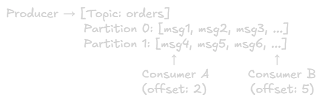

Kafka and RabbitMQ
===
Two of the most widely used messaging systems, but built for different purposes. Understanding when to use which is the key.

## High Level Comparison
||Kafka|RabbitMQ|
|-|-|-|
|**Type**|Distributed event log / streaming|Message broker (queue based)|
|**Model**|Pull based (consumers pull)|Push based (broker pushes)|
|**Message retention**|Retained for a configurable time (days/weeks)|Deleted after ACK|
|**Ordering**|Guaranteed within a partition|Guaranteed within a queue|
|**Throughput**|Very high(millions msg/sec)|High (tense of thousands msg/sec)|
|**Use case**|Event streaming, audit logs, data pipelines|Task queues, RPC, job workers|
|**Consumers**|Multiple independent consumers, each replay from offset|Competing consumers share the queue|
|**Complexity**|Higher (needs ZooKeeper or KRaft)|Lower, easier to set up|


## Apache Kafka

### Core Idea
Kafka is a **distributed, append only log**. Producers write events to topics. Consumers read from topics independently at their own pace by tracking an **offset** (position in the log).



Consumers don't delete messages, they just advance their offset. This means **multiple independent consumers can read the same data**.

### Key Concepts
- **Topic:** A named stream of records. Like a category/channel. e.g., `orders`, `user-events`.
- **Partition:** Topics are split into partitions for parallelism. More partitions = more thorughput. Messages within a partition are strictly ordered.
- **Offset:** An interger index pointing to a message's position in a partition. Consumers track their own offset. Kafka doesn't track it for them (stored in `__consumer_offset`) topic or externally.
- **Consumer Group:** A group of consumers that together consume a topic. Kafka assigns each partition to exactly one consumer in the group, enabling parallel processing without duplication.

> Topic (3 partitions) + Consumer Group (3 consumers):
> 
> Partition 0 → Consumer A\
> Partition 1 → Consumer B\
> Partition 2 → Consumer C

if you have more consumers than partitions, some consumers sit idle. Scale partitions, not just consumers.

- **Broker:** A single Kafka server. A Kafka cluster has multiple brokers for fault tolerance and load distribution.
- **Replication Factor:** Each partition is replicated across N brokers. If one broker dies, another takes over. Typically set to 3 in production.
- **Retention:** Messages are kept for a configured time (e.g., 7 days) or size regardless of whether they've been consumed this enables **replay**, reprocessing historical data.

### Kafka Message Flow
1. Producer sends message to Topic → routed to a Partition (by key hash or round robin)
2. Broker writes to the partition log (append only)
3. Replicated to follower brokers
4. Consumer polls for new messages using its offset
5. After processing, consumer commits the offset

**Key decision: when to commit offset?**
- Commit before processing → **at-most-once** (risk losing messages on crash)
- Commit after processing → **at-least-once** (risk duplicates on crash)
- Use idempotent processing + transactions → **exactly-once**

### Go Example: Kafka Producer & Consumer
```go
// go get github.com/segmentio/kafka-go

package main

import (
	"context"
	"fmt"
	"log"
	"time"

	"github.com/segmentio/kafka-go"
)

// Producer: write messages to Kafka
func produce() {
	writer := kafka.NewWriter(kafka.WriterConfig{
		Brokers:  []string{"localhost:9092"},
		Topic:    "orders",
		Balancer: &kafka.LeastBytes{},
	})
	defer writer.Close()

	for i := 1; i <= 5; i++ {
		err := writer.WriteMessages(context.Background(),
			kafka.Message{
				Key:   []byte(fmt.Sprintf("order-%d", i)),
				Value: []byte(fmt.Sprintf(`{"order_id": %d, "item": "widget"}`, i)),
			},
		)
		if err != nil {
			log.Fatal("failed to write:", err)
		}
		fmt.Printf("[Producer] Sent order-%d\n", i)
		time.Sleep(200 * time.Millisecond)
	}
}

// Consumer: read messages from Kafka using a consumer group
func consume() {
	reader := kafka.NewReader(kafka.ReaderConfig{
		Brokers:  []string{"localhost:9092"},
		Topic:    "orders",
		GroupID:  "order-processors", // consumer group
		MinBytes: 1,
		MaxBytes: 10e6,
	})
	defer reader.Close()

	for {
		msg, err := reader.ReadMessage(context.Background())
		if err != nil {
			log.Fatal("failed to read:", err)
		}
		fmt.Printf("[Consumer] offset=%d key=%s value=%s\n",
			msg.Offset, string(msg.Key), string(msg.Value))
		// ReadMessage auto-commits offset after successful read
	}
}

func main() {
	go produce()
	time.Sleep(500 * time.Millisecond)
	consume()
}
```

### When to Use Kafka

**Use when:**
- Event streaming / event sourcing
- Audit logs (need message replay)
- Data pipelines (feeding multiple downstream systems from one stream)
- High throughput ingestion (IoT, clickstreams, metrics)
- Multiple independent consumers need to read the same events

**Don't use when:**
- Not ideal for simple task queues
- Overkill for low volume systems
- Harder to implement request/reply (RPC) patterns

## RabbitMQ

### Core Idea
RabbitMQ is a **message broker** built around the AMQP protocol. Producers send messages to an **Exchange**, which routes them to **Queues** based on routing rules. Consumers subscribe to queues.


Unlike Kafka, once a message is ACKed by a consumer, it's **gone**. RabbitMQ is designed for task distribution, not event streaming.

### Key Concepts
**Exchange** Receives messages from producers and routes them to queues. There are 4 types:

|Exchange Type|Routing Logic|Use Case|
|-|-|-|
|**Direct**|Route by exact routing key|Task queues, point to point|
|**Fanout**|Broadcast to all bound queues|Notifications, pub/sub|
|**Topic**|Route by pattern matching (`*.error`,`order.#`)|Flexible routing|
|**Headers**|Route by message headers|Rarely used|

