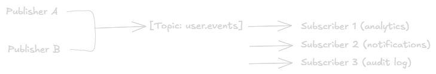

Pub/Sub Model
===

## What is Pub/Sub?
**Publish/Subscribe** is a messaging pattern where:
- **Publishers** send messages to a **topic/channel**, they don't know who will receive it.
- **Subscribers** express interest in a topic and receive all messages published to it, they don't know who sent it.

The key trait: **publishers and subscribers are fully decoupled.** Neither knows about each other.



Every subscriber gets its own copy of the message (broadcast), unlike a task queue where only one consumer gets each message.

## Pub/Sub vs Message Queue

||Pub/Sub|Message Queue|
|-|-|-|
|**Delivery**|Broadcast, all subscribers receive the message|Point to point, one consumer gets the message|
|**Coupling**|Publishers doesn't know subscribers|Producer targets a specific queue|
|**Use case**|Event notifications, fan-out|Task distribution, job workers|
|**Message retention**|Usually not retained after delivery|Retained until ACKed|

> In practice, systems like Kafka and RabbitMQ (fanout exchange) **implement** pub/sub. Pub/Sub is a pattern, not a specific tool.

## Core Concepts
- **Topic:** A named channel that publishers write to and subscribers listen on. E.g., `user.registered`, `order.complete`.
- **Subscription:** A subscriber's registered interest in a topic. Each subscription typically gets its own copy of every message.
- **Fan out:** One message → delivered to N subscribers simultaneously. THis is the defining behavior of pub/sub.
- **Filtering:** Some pub/sub systems let subscribers filter messages by attributes, so they only receive relevant events.

>Topic: payments\
  Subscriber A filter: amount > 1000  → only gets high-value transactions\
  Subscriber B filter: status = failed → only gets failed payments\
  Subscriber C (no filter)             → gets everything

## Pub/Sub Delivery Models

### 1. Push
The broker pushes messages to subscribers as they arrive. Subscribers expose an endpoint (HTTP webhook or callback).
> Broker → HTTP POST → Subscriber endpoint

Low latency. Subscriber must be available andeable to handle the rate.

### 2. PULL
Subscribers poll the broker for new messages at their own pace.
> Subscriber → poll → Broker → return messages

Better for rate control. Subscriber processes as its own speed.

## At least Once and Idempotency
- Most pub/sub systems guarantee **at-least-once delivery**, under retries or failures, a subscriber may receive the same message more than once.
- **Always design subscribers to be idempotent**, processing the same message tiwce must produce the same result as processing it once.

```go
// Bad: double-charging on duplicate
func handlePayment(msg PaymentMsg) {
    chargeUser(msg.UserID, msg.Amount) // what if this runs twice?
}

// Good: idempotent with deduplication key
func handlePayment(msg PaymentMsg) {
    if alreadyProcessed(msg.ID) {
        return
    }
    chargeUser(msg.UserID, msg.Amount)
    markAsProcessed(msg.ID)
}
```

## Example:
### Pub/Sub with Goroutines and Channels
A simple in process pub/sub broker to understand the pattern:
```go
package main

import (
	"fmt"
	"sync"
)

// Broker manages topics and subscribers
type Broker struct {
	mu          sync.RWMutex
	subscribers map[string][]chan string
}

func NewBroker() *Broker {
	return &Broker{subscribers: make(map[string][]chan string)}
}

// Subscribe returns a channel that receives messages on a topic
func (b *Broker) Subscribe(topic string) <-chan string {
	b.mu.Lock()
	defer b.mu.Unlock()
	ch := make(chan string, 10)
	b.subscribers[topic] = append(b.subscribers[topic], ch)
	return ch
}

// Publish sends a message to all subscribers of a topic
func (b *Broker) Publish(topic, message string) {
	b.mu.RLock()
	defer b.mu.RUnlock()
	for _, ch := range b.subscribers[topic] {
		ch <- message // fan-out: every subscriber gets a copy
	}
}

func main() {
	broker := NewBroker()

	// Three independent subscribers on the same topic
	analytics := broker.Subscribe("order.created")
	notifications := broker.Subscribe("order.created")
	auditLog := broker.Subscribe("order.created")

	var wg sync.WaitGroup

	recv := func(name string, ch <-chan string, count int) {
		defer wg.Done()
		for i := 0; i < count; i++ {
			msg := <-ch
			fmt.Printf("[%s] received: %s\n", name, msg)
		}
	}

	wg.Add(3)
	go recv("Analytics", analytics, 2)
	go recv("Notifications", notifications, 2)
	go recv("AuditLog", auditLog, 2)

	// Publisher
	broker.Publish("order.created", `{"order_id": 1, "amount": 99.99}`)
	broker.Publish("order.created", `{"order_id": 2, "amount": 149.00}`)

	wg.Wait()
}
```

**Output:**
```
[Analytics]     received: {"order_id": 1, "amount": 99.99}
[Notifications] received: {"order_id": 1, "amount": 99.99}
[AuditLog]      received: {"order_id": 1, "amount": 99.99}
[Analytics]     received: {"order_id": 2, "amount": 149.00}
...
```

### Pub/Sub with Google Cloud Pub/Sub

```go
// go get cloud.google.com/go/pubsub

package main

import (
	"context"
	"fmt"
	"log"

	"cloud.google.com/go/pubsub"
)

const projectID = "my-project"
const topicID = "order-events"
const subID = "analytics-sub"

// Publisher
func publish(ctx context.Context, client *pubsub.Client) {
	topic := client.Topic(topicID)
	defer topic.Stop()

	result := topic.Publish(ctx, &pubsub.Message{
		Data: []byte(`{"order_id": 1, "status": "created"}`),
		Attributes: map[string]string{
			"source": "checkout-service",
		},
	})

	// Block until the message is sent
	id, err := result.Get(ctx)
	if err != nil {
		log.Fatal("Failed to publish:", err)
	}
	fmt.Printf("[Publisher] Published message ID: %s\n", id)
}

// Subscriber (pull-based)
func subscribe(ctx context.Context, client *pubsub.Client) {
	sub := client.Subscription(subID)

	err := sub.Receive(ctx, func(ctx context.Context, msg *pubsub.Message) {
		fmt.Printf("[Subscriber] Data: %s | Attrs: %v\n", msg.Data, msg.Attributes)
		msg.Ack() // ACK after successful processing
	})
	if err != nil {
		log.Fatal("Receive error:", err)
	}
}

func main() {
	ctx := context.Background()
	client, err := pubsub.NewClient(ctx, projectID)
	if err != nil {
		log.Fatal(err)
	}
	defer client.Close()

	publish(ctx, client)
	subscribe(ctx, client)
}
```

### Pub/Sub with Redis (lightweight alternative)

```go
// go get github.com/redis/go-redis/v9

package main

import (
	"context"
	"fmt"
	"time"

	"github.com/redis/go-redis/v9"
)

func main() {
	ctx := context.Background()
	rdb := redis.NewClient(&redis.Options{Addr: "localhost:6379"})

	// Subscriber (start first)
	sub := rdb.Subscribe(ctx, "order.created")
	defer sub.Close()

	// Publisher (in a goroutine)
	go func() {
		time.Sleep(100 * time.Millisecond)
		rdb.Publish(ctx, "order.created", `{"order_id": 42}`)
		fmt.Println("[Publisher] Published event")
	}()

	// Receive messages
	for msg := range sub.Channel() {
		fmt.Printf("[Subscriber] channel=%s payload=%s\n", msg.Channel, msg.Payload)
		break // just receive one for demo
	}
}
```
>** Redis Pub/Sub caveat:** Messages are **not persisted**. If no subscriber is connected at publish time, the message is lost. Use Redis Stream if you need durability.

## How Kafka and RabbitMQ Implement Pub/Sub

### Kafka:
- Topic = pub/sub channel
- Each consumer group is an independet subscriber, all groups receive every message
- Single consumer group = point-to-point (task queue behavior)
- Multiple consumer groups = pub/sub fan-out 

> Topic: order.created\
  Consumer Group: analytics → all consumers in group share partitions\
  Consumer Group: notifications → independent, reads from offset 0\
  Consumer Group: audit-log → independent, reads from offset 0

### RabbitMQ:
- Use a **Fanout Exchange** to broadcast to all bound queues
- Each subscriber gets its own queue bound to the exchange
- Publishing once → all queues receive a copy

```go
ch.ExchangeDeclare("order.events", "fanout", true, false, false, false, nil)

// Each subscriber declares its own queue and binds to the exchange
q, _ := ch.QueueDeclare("", false, true, true, false, nil) // exclusive, auto-delete
ch.QueueBind(q.Name, "", "order.events", false, nil)       // no routing key needed for fanout
```

## Common Pitfalls
- **Slow subscriber blocking others:** In push-based systems, a slow subscriber can cause backpressure or message drops. Use async processing or a buffer queue behind the subscriber.
- **No subscriber when message arrives (Redis):** Redis pub/sub has no persistence. Messages published with zero subscribers are lost. Use a durable system (Kafka, GCP Pub/Sub, RabbitMQ) if you can't guarantee subscriber uptime.
- **Thundering herd:** A single high-frequency topic with many subscribers can flood al of them simultaenously. Use subscriber-side rate limting or batching.
- **Topic explosion:** Creating too many fine-grained topics makes the system hard to manage. Group related events into broader topics and use filtering/attributes instead.

## When to Use Pub/Sub
✅ One event needs to trigger multiple independent actions (fan-out)\
✅ Service need to be decoupled, publisher shouldn't care who consumes\
✅ Adding new consumers without changing the publisher\
✅ Event-driven microservice architecture\
✅ Real-time notifiactions, feed updates, activity streams

❌ You need exactly one service to handle each message → use a task queue\
❌ You need request/response (synchronous) → use gRPC or REST\
❌ Message order across multiple subscribers is critical → very hard to guarantee