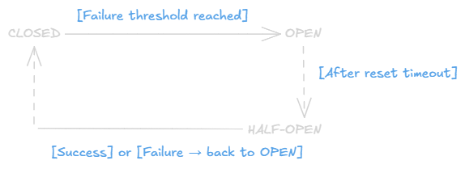

Circuit Breaker Pattern
==

## The Problem: Cascading Failures
In microservices, service depend on each other. If one service is slow or down, the caller gets dragged down too, and that failure keeps spreading until the whole system collapses.

> Order Service → Payment Service (down)\
> Order Service waiting... 30s timeout\
> Order Service requests pile up... RAM exhausted\
> Order Service goes down\
> API Gateway → Order Service (down)\
> API Gateway goes down

This is called a **cascading failure**, one broken point riplles across the entire system.

## The Solution: Circuit Breaker
The idea comes from electrical engineering. When there's a short circuit at home, the breaker trips, cutting off power so the fire doesn't spread. Same concept applies in software.

### Analogy
Think of a friend who's always late. If they've stood you up 5 times in a row, you stop inviting them for a while, not forever, just long enough for them to prove they've changed.

A circuit breaker works exactly like that with a misbehaving service.

### Three States


- **CLOSED:** Normal operation. All requests pass through to the target service. Failures are counted, but as long as the threshold isn't hit, everything keeps running.
- **OPEN:** Service is considered broken. All requests are rejected *immediately* without touching the target service. This is what stops the cascade. After a timeout (e.g. 30 seconds), transitions to Half-Open.
- **HALF-OPEN:** Trial mode. A limited number of request are allowed through to check if the service has recovered. Success → back to Closed. Failure → back to Open.

## Implementation
```go
package circuitbreaker

import (
    "errors"
    "sync"
    "time"
)

type State int

const (
    StateClosed   State = iota
    StateOpen
    StateHalfOpen
)

type CircuitBreaker struct {
    maxFailures   int
    resetTimeout  time.Duration
    halfOpenLimit int // max requests allowed during HalfOpen

    mu             sync.Mutex
    state          State
    failures       int
    lastFailureAt  time.Time
    halfOpenPassed int
}

var ErrCircuitOpen = errors.New("circuit breaker is open")

func New(maxFailures int, resetTimeout time.Duration) *CircuitBreaker {
    return &CircuitBreaker{
        maxFailures:   maxFailures,
        resetTimeout:  resetTimeout,
        halfOpenLimit: 3,
        state:         StateClosed,
    }
}

func (cb *CircuitBreaker) Execute(fn func() error) error {
    cb.mu.Lock()

    switch cb.state {
    case StateOpen:
        // Check if it's time to transition to HalfOpen
        if time.Since(cb.lastFailureAt) < cb.resetTimeout {
            cb.mu.Unlock()
            return ErrCircuitOpen // Reject immediately, don't call the service
        }
        cb.state = StateHalfOpen
        cb.halfOpenPassed = 0

    case StateHalfOpen:
        if cb.halfOpenPassed >= cb.halfOpenLimit {
            cb.mu.Unlock()
            return ErrCircuitOpen // Cap traffic during HalfOpen
        }
    }

    cb.mu.Unlock()

    // Execute the function (call the target service)
    err := fn()

    cb.mu.Lock()
    defer cb.mu.Unlock()

    if err != nil {
        cb.failures++
        cb.lastFailureAt = time.Now()

        if cb.state == StateHalfOpen || cb.failures >= cb.maxFailures {
            cb.state = StateOpen
            cb.failures = 0
        }
        return err
    }

    // Success
    if cb.state == StateHalfOpen {
        cb.halfOpenPassed++
        if cb.halfOpenPassed >= cb.halfOpenLimit {
            cb.state = StateClosed
            cb.failures = 0
        }
    } else {
        cb.failures = 0
    }

    return nil
}

func (cb *CircuitBreaker) State() State {
    cb.mu.Lock()
    defer cb.mu.Unlock()
    return cb.state
}
```

**Usage**
```go
func main() {
    cb := circuitbreaker.New(
        5,               // Open after 5 failures
        30*time.Second,  // Try again after 30 seconds
    )

    callPaymentService := func() error {
        resp, err := http.Get("http://payment-service/charge")
        if err != nil {
            return err
        }
        defer resp.Body.Close()

        if resp.StatusCode >= 500 {
            return fmt.Errorf("payment service error: %d", resp.StatusCode)
        }
        return nil
    }

    err := cb.Execute(callPaymentService)

    switch err {
    case nil:
        fmt.Println("Payment successful")
    case circuitbreaker.ErrCircuitOpen:
        fmt.Println("Payment service is unavailable, please try again later")
        // Show message to user or use fallback
    default:
        fmt.Printf("Error: %v\n", err)
    }
}
```

## Fallback Strategy
A circuit breaker is most powerful when paired with a **fallback**, an alternative response when the circuit is open. Don't just return a raw error to the user.

```go
func getProductPrice(productID string) (float64, error) {
    var price float64

    err := cb.Execute(func() error {
        resp, err := pricingService.GetPrice(productID)
        if err != nil {
            return err
        }
        price = resp.Price
        return nil
    })

    if err == circuitbreaker.ErrCircuitOpen {
        // Fallback 1: use cached price
        if cached, ok := priceCache.Get(productID); ok {
            return cached, nil
        }
        // Fallback 2: return error gracefully
        return 0, fmt.Errorf("pricing service unavailable")
    }

    return price, err
}
```
Common fallback strategies: cached data, default values, simplified responses, or queuing the request for later processing.

## Using a Library (Production)
In production, use a battle-tested library instead of rolling your own. The most popular one in Go is **sony/gobreaker**.

```go
import "github.com/sony/gobreaker"

cb := gobreaker.NewCircuitBreaker(gobreaker.Settings{
    Name:        "payment-service",
    MaxRequests: 3,                // Max requests during HalfOpen
    Interval:    10 * time.Second, // Window for counting failure rate
    Timeout:     30 * time.Second, // Duration of Open before HalfOpen
    ReadyToTrip: func(counts gobreaker.Counts) bool {
        // Open circuit if failure rate > 60% (minimum 5 requests)
        if counts.Requests < 5 {
            return false
        }
        failureRate := float64(counts.TotalFailures) / float64(counts.Requests)
        return failureRate >= 0.6
    },
    OnStateChange: func(name string, from, to gobreaker.State) {
        log.Printf("Circuit breaker '%s': %s → %s", name, from, to)
        // Send alert to monitoring (Prometheus, Datadog, etc.)
    },
})

result, err := cb.Execute(func() (interface{}, error) {
    return paymentService.Charge(request)
})
```

## Monitoring
A good circuit breaker needs to be observable. Metrics to track:

|Metric|Description|
|-|-|
|`circuit_state`|Current state (0=Closed, 1=Open, 2=HalfOpen)|
|`circuit_total_requests`|Total requests processed|
|`circuit_failure`|Number of failures|
|`circuit_rejected_requests`|Requests rejected while Open|
|`circuit_state_changes_total`|How many times the state has changed|

A state change to Open is a strong signal that something is wrong with a downstream service, this should always trigger an alert.

## Key Takeaways

### Why you need a Circuit Breaker:

- Prevents cascading failures in distributed systems
- Gives a struggling service time to recover
- Protects the system from retry storms

### When the circuit should Open:

- High failure rate (e.g. > 50% over the last 10 seconds)
- Extremely high latency, a slow service is just as dangerous as a down one
- Consecutive failures exceed the threshold

### What to do when the circuit is Open:

- Don't just return a raw error to the user
- Prepare a fallback: cache, default value, or graceful degradation
- Log and alert to your monitoring system

### This pattern works best when combined with:

- Retry with backoff (to avoid hammering a recovering service)
- Timeout (to avoid waiting too long)
- Bulkhead (to isolate failures per service)
