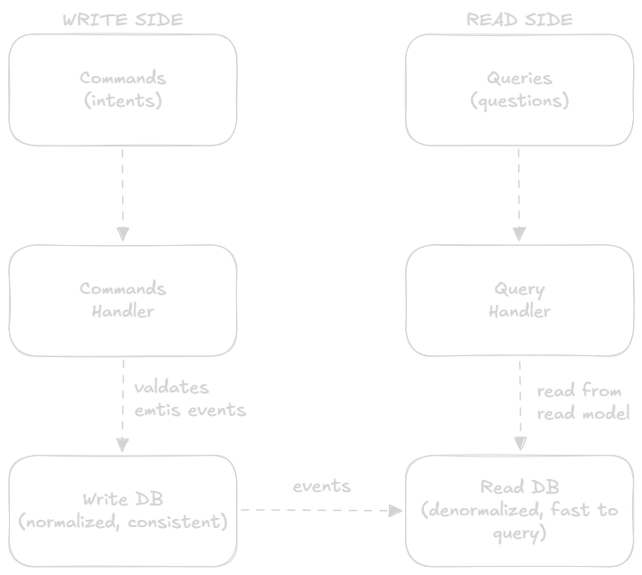

CQRS Pattern
==

**CQRS (Command Query Responsibility Segregation)** is a pattern that **separates read operations from write operations** into two distinct models.
> Instead of one model that handles both reading and writing → you have a **Command side** (writes) and a **Query side** (reads), each optimized for its job.

The name says it all:
- **Command** = change something (create, update, delete), answers nothing, just acts
- **Query** = read something, answers a question, changes nothing.

### Analogy
Think of a **restaurant kitchen vs the menu board**:
- The **kitchen** (command side) handles all the work, chopping, cooking, plating. It's optimized for doing things correctly
- The **menu board** (Query side) shows customers what's available and what's ready. It's optimized for being read fast and looked at from anywhere
- The kitchen doesn't update the menu board directly, a waiter carries the information over (the event). Both do their job independently

## The Problem CQRS Solves
In a traditonal architecture, one model does everything:
```go
// One model, one DB — handles reads AND writes
type OrderRepository struct{ db *sql.DB }

// Write: complex business logic, validation, transactions
func (r *OrderRepository) PlaceOrder(order Order) error {
    // validate, check inventory, charge payment, save...
}

// Read: but now you need a complex JOIN for the dashboard
func (r *OrderRepository) GetOrderDashboard(userID string) ([]OrderSummary, error) {
    return r.db.Query(`
        SELECT o.id, o.status, u.name, p.title, SUM(oi.price)
        FROM orders o
        JOIN users u ON o.user_id = u.id
        JOIN order_items oi ON oi.order_id = o.id
        JOIN products p ON oi.product_id = p.id
        WHERE o.user_id = $1
        GROUP BY o.id, u.name, p.title
        ORDER BY o.created_at DESC
    `, userID)
}
```

**The problems with this:**
- Write model is optimized for **consistency**, heavy validation, transactions
- Read model needs **denormalized, fast queries**, but it's stuck in the same normalized schema
- You can't scale reads and writes independently
- Adding a new view (e.g. analytics dashboard) requires changing the core model

## HOW CQRS Works

### The Two Sides


- Write DB → optimized for **correctness** (normalized, transactional)
- Read DB → optimized for **speed** (pre joined, pre aggregatted views)
- Events flow from write to read side to keep them in sync

### Commands (Write Side)
```go
// Commands express INTENT — they can be rejected
type PlaceOrderCommand struct {
    UserID  string
    Items   []OrderItem
    Address string
}

type CancelOrderCommand struct {
    OrderID string
    Reason  string
}

// Command handler: validates, applies business rules, emits events
type OrderCommandHandler struct {
    writeDB    *sql.DB
    eventBus   EventBus
}

func (h *OrderCommandHandler) Handle(cmd PlaceOrderCommand) error {
    // 1. Validate
    if len(cmd.Items) == 0 {
        return errors.New("order must have at least one item")
    }

    // 2. Apply business logic
    orderID := generateID()
    total   := calculateTotal(cmd.Items)

    // 3. Save to write DB (normalized)
    tx, _ := h.writeDB.Begin()
    tx.Exec(`INSERT INTO orders (id, user_id, status, total) VALUES ($1,$2,'pending',$3)`,
        orderID, cmd.UserID, total)
    for _, item := range cmd.Items {
        tx.Exec(`INSERT INTO order_items (order_id, product_id, qty, price) VALUES ($1,$2,$3,$4)`,
            orderID, item.ProductID, item.Qty, item.Price)
    }
    tx.Commit()

    // 4. Publish event — read side will update itself
    h.eventBus.Publish("order.placed", OrderPlacedEvent{
        OrderID: orderID,
        UserID:  cmd.UserID,
        Items:   cmd.Items,
        Total:   total,
    })

    return nil
}
```

### Queries (Read Side)
```go
// Queries express QUESTIONS — they never modify state
type GetOrdersByUserQuery struct {
    UserID   string
    Page     int
    PageSize int
}

type GetOrderDashboardQuery struct {
    UserID string
}

// Query handler: reads from the pre-built read model — simple and FAST
type OrderQueryHandler struct {
    readDB *sql.DB
}

// No JOINs needed — read model is already denormalized
func (h *OrderQueryHandler) GetOrdersByUser(q GetOrdersByUserQuery) ([]OrderView, error) {
    rows, _ := h.readDB.Query(`
        SELECT id, status, total, item_count, created_at
        FROM order_views
        WHERE user_id = $1
        ORDER BY created_at DESC
        LIMIT $2 OFFSET $3
    `, q.UserID, q.PageSize, q.Page*q.PageSize)
    // ... scan and return
}

// Dashboard query — also pre-built, zero JOINs
func (h *OrderQueryHandler) GetDashboard(q GetOrderDashboardQuery) (*Dashboard, error) {
    var d Dashboard
    h.readDB.QueryRow(`
        SELECT total_orders, total_spent, pending_count, last_order_at
        FROM user_dashboards
        WHERE user_id = $1
    `, q.UserID).Scan(&d.TotalOrders, &d.TotalSpent, &d.PendingCount, &d.LastOrderAt)
    return &d, nil
}
```

### Read Model Projections (Keeping Read Side in Sync)
The read DB needs to stay updated when the write side changes. **Projections** are event handlers that update the read model.

```go
// Projection: listens to events, updates read model
type OrderProjection struct {
    readDB *sql.DB
}

// Called every time "order.placed" is published
func (p *OrderProjection) OnOrderPlaced(event OrderPlacedEvent) {
    // Update order_views table (denormalized, ready to query)
    p.readDB.Exec(`
        INSERT INTO order_views (id, user_id, status, total, item_count, created_at)
        VALUES ($1, $2, 'pending', $3, $4, NOW())
    `, event.OrderID, event.UserID, event.Total, len(event.Items))

    // Update user_dashboards table (pre-aggregated)
    p.readDB.Exec(`
        INSERT INTO user_dashboards (user_id, total_orders, total_spent, pending_count, last_order_at)
        VALUES ($1, 1, $2, 1, NOW())
        ON CONFLICT (user_id) DO UPDATE SET
            total_orders  = user_dashboards.total_orders + 1,
            total_spent   = user_dashboards.total_spent + $2,
            pending_count = user_dashboards.pending_count + 1,
            last_order_at = NOW()
    `, event.UserID, event.Total)
}

// Called when order is shipped
func (p *OrderProjection) OnOrderShipped(event OrderShippedEvent) {
    p.readDB.Exec(`UPDATE order_views SET status='shipped' WHERE id=$1`, event.OrderID)
    p.readDB.Exec(`UPDATE user_dashboards SET pending_count = pending_count - 1 WHERE user_id=$1`,
        event.UserID)
}
```

## CQRS + Event Sourcing Together
These two patterns are often used together. Event Sourcing handles the write side, CQRS adds fast read models on top.
```
Command → Event Store (write, append-only) → Events → Projection → Read DB
                                                              ↓
                                                         Query Handler
                                                              ↓
                                                        Fast query result
```

```go
// Write side: uses Event Sourcing (append events, replay for state)
func (h *OrderCommandHandler) PlaceOrder(cmd PlaceOrderCommand) error {
    // Load aggregate by replaying events
    events, _  := h.eventStore.Load(cmd.UserID)
    userAccount := Rebuild(events)

    // Validate
    if userAccount.IsSuspended() {
        return errors.New("account is suspended")
    }

    // Append event to event store
    h.eventStore.Append(cmd.UserID, Event{
        Type: "order.placed",
        Data: map[string]any{"items": cmd.Items, "total": calculateTotal(cmd.Items)},
    })
    // Event store publishes to bus → projection updates read DB automatically
    return nil
}

// Read side: uses CQRS (pre-built, denormalized, fast)
func (h *OrderQueryHandler) GetOrders(userID string) ([]OrderView, error) {
    // No event replay needed — just a simple SELECT
    return h.readDB.Query(`SELECT * FROM order_views WHERE user_id = $1`, userID)
}
```

## Eventual Consistency
The write and read sides are **eventually consistent**, there's a small delay between when a command is processed and when the read model reflects the change.
```
t=0ms   User places order        → Write DB updated immediately
t=5ms   Event published to bus   → In transit
t=15ms  Projection processes     → Read DB updated
t=15ms+ Query reflects new order → User sees it in list
```

**How to handle this in practice:**
```go
// Option 1: Return the new state from the command (optimistic)
func (h *Handler) PlaceOrder(cmd PlaceOrderCommand) (*OrderView, error) {
    orderID := h.commandHandler.Handle(cmd)

    // Build a temporary view from what we know right now
    // Don't wait for the projection
    return &OrderView{
        ID:     orderID,
        Status: "pending",
        Total:  calculateTotal(cmd.Items),
    }, nil
}

// Option 2: Poll until read model catches up (for critical flows)
func waitForProjection(readDB *sql.DB, orderID string, timeout time.Duration) error {
    deadline := time.Now().Add(timeout)
    for time.Now().Before(deadline) {
        var count int
        readDB.QueryRow(`SELECT COUNT(*) FROM order_views WHERE id=$1`, orderID).Scan(&count)
        if count > 0 {
            return nil  // read model is ready
        }
        time.Sleep(10 * time.Millisecond)
    }
    return errors.New("projection timed out")
}
```

## Multiple Read Models
One of CQRS's biggest advantages, you can hanve **many different read models** built from the same events, each optimized for a different use case.
```
                      ┌──────────────────────┐
  Write DB ──events──►│     Event Bus        │
                      └──────┬───────────────┘
                             │
              ┌──────────────┼──────────────┐
              ▼              ▼              ▼
       order_views    user_dashboards   analytics_facts
       (per-user list) (totals/counts)  (for data team)
              │              │              │
        Mobile API      Web Dashboard  Data Warehouse
        (fast list)     (aggregates)   (heavy queries)
```

**How to handle this in practice:**
```go
// Three projections, three read models — from the same event stream

type MobileProjection struct{}     // builds order_views (paginated list for mobile)
type DashboardProjection struct{}  // builds user_dashboards (summary cards)
type AnalyticsProjection struct{}  // builds analytics_facts (for BI queries)

// All three listen to the same event
func registerProjections(bus EventBus) {
    bus.Subscribe("order.placed", mobileProjection.OnOrderPlaced)
    bus.Subscribe("order.placed", dashboardProjection.OnOrderPlaced)
    bus.Subscribe("order.placed", analyticsProjection.OnOrderPlaced)
}
// Each updates its own table, optimized for its consumer
```

|✅ Pros|❌ Cons|
|:------|:------|
|Read and write sides scale independently|More moving parts, two models, two DBs|
|Read model optimized for each use case|Eventual consistency, small delay|
|Write side stays clean (business logic only)|Projections add operational complexity|
|Easy to add new read models|More code to write and maintain|
|Works naturally with Event Sourcing and EDA|Overkill for simple CRUD apps|
|Separate scaling (reads >> writes in most apps)|Debugging across two sides harder|

## When to Use CQRS

### ✅Use When:
- Read and write loads are **very different** (most apps read far more than they write)
- You need **multiple representations** of the same data for different consumers
- Using **Event Sourcing**, CQRS solves the "querying events is slow" problem
- Complex domain with **heavy business logic** on writes that shouldn't pollute reads
- You need to **scale reads independently** from writes

### ❌Avoid When:
- **Simple CRUD**, you don't need two models for a settings page
- **Small team** without bandwidth to maintain two sides
- **Strong consistency required**, if you can't tolerate even milliseconds of delay
- Just starting out, **validate the domain first**, add CQRS later if needed

## Engineering Takeaways
1.  **Commands change state, queries read state**, never mix the two in one method
2. **Read models are disposable** if a projection breaks, delete and rebuild from events
3. **Design queries first**, start with what the UI needs, build the read model backwards from that
4. **Eventual consistency is usually fine**, most UIs can tolerate 10-50ms of lag
5. **Start simple**, you don't need separate DBS on day one. Even separate code paths in the same DB is a valid start
6. **CQRS != microservices**, you can apply it inside a single service

### notes
- **CQRS != Event Sourcing**, CQRS is about separating reads/writes. ES is about how you sstore state. They compose well but are independent
- **CQRS != two databases**, that's one implementation. You can apply CQRS with one DB by just separating code paths
- **Projection rebuild**, beacuse projections are just event consumers, if you add a new read model, you can backfill it by replaying all historical events. This is the real power combining ES + CQRS
- **Read model consistency:** for user facing UIs, optimistic updates (show the user what they just did immediately, don't wait for the projection) often give better UX than polling