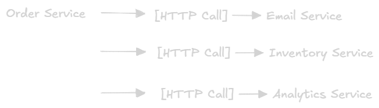
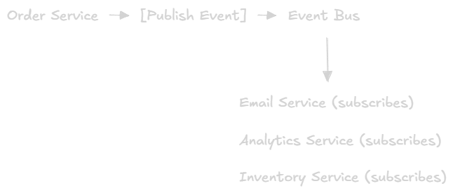
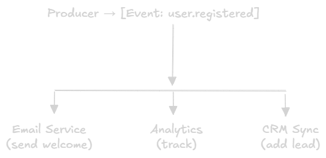
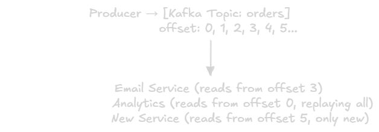

Event-Driven Architecture Basics
==

## What is Event-Driven Architecture?
**Event-Driven Architecture (EDA)** is a software design pattern where components communicate by **producing and consuming events**, rather than calling each other directly.
> Instead of Service A calling Service B → Service A emits an event → Service B reacts to it

An **event** is a record that something happened, "Order placed", "User signed up", "Payment failed". Events are facts, they describe the **past**.

### Analogy
Think of a **newspaper:**
- The journalist (producer) writes and **publishes** an article
- The journalist doesn't know or care who reads it
- Thousands of readers (consumers) can read the same article independently
- If a new reader subscribes tomorrow, the can still get past editions

In EDA: **producers don't know consumers exist, and consumers don't know each other**.

## Core Concepts

### Event
A **message** that describes something that has happened in the system.
```json
{
  "event_type": "order.placed",
  "event_id": "evt-789",
  "timestamp": "2024-01-15T10:30:00Z",
  "data": {
    "order_id": "ord-123",
    "user_id": "usr-456",
    "amount": 99.99,
    "items": ["laptop", "mouse"]
  }
}
```

**Events are:**
- **Immutable:** Once published, never changed
- **Past tense:** They describe what already happened
- **self contained:** Include all the info consumers need

### Producer (Publisher)
The service that **detects** something happened and **emits** an event.

```go
// Order Service — produces an event after saving to DB
func placeOrder(order *Order) error {
    if err := db.Save(order); err != nil {
        return err
    }

    event := OrderEvent{
        Type:    "order.placed",
        OrderID: order.ID,
        UserID:  order.UserID,
        Amount:  order.Amount,
    }

    return eventBus.Publish("orders", event) // Fire and move on
}
```

The producer **doesn't wait** for anyone to process the event. It emits it and continues.

### Consumer (Subscriber)
The service that **lsitens** for events and **reacts** to them.

```go
// Email Service — reacts to order.placed
func onOrderPlaced(event OrderEvent) {
    sendEmail(event.UserID, "Your order is confirmed!")
}

// Inventory Service — also reacts to the same event
func onOrderPlaced(event OrderEvent) {
    reserveStock(event.Items)
}
```

Multiple consumers c can react to the **same event** independently and simultaneously.

### Event Bus / Broker
The **infrastructure** that sits between producers and consumers.
- Receives events from producers
- Routes them to the right consumers
- Often stores events temporarily (or permanently)

Examples: **Kafka**, **RabbitMQ**, **AWS SNS/SQS**, **Redis Streams**.

## Event Driven vs Request Driven

### Traditional: Request Driven (Synchronous)

- Order service must **wait** for each call
- If Email Service is down → Order Service **fails**
- Tight coupling, Order Service knows about every downstream service

### Event Driven (Asynchronous)

- Order Service **fires and forgets** no waiting
- If Email Service is down → Order still succeeds, email processes later
- Loose coupling, Order Service knows nothing about downstream services

## Types of Events

### 1. Domain Events
Describe something that happened in the **business domain**.
- `user.registered`
- `order.placed`
- `payment.failed`
- `shipment.delivered`

### 2. System Events
Describe something that happened in the **infrastructure**.
- `service.started`
- `database.connection.lost`
- `cache.invalidated`
- `health.check.failed`

### 3. Integration Events
Used to **communicate between services** or systems.
- `inventory.stock.updated` (triggers reorder across systems)
- `user.profile.synced` (sync user data to external CRM)

## Common EDA Patterns

### 1. Simple Pub/Sub (Fan-out)
One event, many consumers, each gets a **copy**.


**Use For:** Notifications, broadcasting state changes.

### 2. Event Queue (Competing Consumers)
Many workers compete to process events from a shared queeu, each event processed by **only one** worker.


**Use For:** Background jobs, task distribution, load leveling.

### 3. Event Streaming (Log-Based)
Events are stored as a **durable, ordered log**. Any consumer can read from any position, past or present.


**Use For:** Audit logs, event replay, multiple independent systems.

## Key Properties

### Loose Coupling
Service don't need to know about each other, they only know aobut **events**.
```go
// BAD: Order Service directly knows about Email Service
emailClient.SendOrderConfirmation(order.UserID, order.ID)

// GOOD: Order Service only emits an event
eventBus.Publish("order.placed", OrderPlacedEvent{...})
// Email Service decides what to do with it — Order Service doesn't care
```

### Asynchronous Processing
Producers don't block waiting for consumers. Work happens **in parallel**, in the background.

### Scalability
Add more consumers to handle more events, no changes to producers needed


### Resilience
Consumers can go down temporarily, events wait in the queue and are processed when they come back up.
```
Email Service crashes at 2:00 PM
Events queue up...
Email Service recovers at 2:05 PM
Processes all queued events — no data lost
```

## Trade offs
|✅ Pros|❌ Cons|
|-|-|
|Loose coupling between services|Harder to trace request flow|
|Services can fail independently|Eventual consistency (not imediate)|
|Scale consumers independently|Debugging distributed flows is harder|
|Absorbs traffic spikes via queue|More infrastructure to manage|
|Easy to add new consumers|Duplicate event handling needed|
|Async = faster perceived response|Message ordering tricky|

## When to Use EDA

### ✅ Use When:
- Multiple services need to react to the **same thing**
- Tasks are **long running** and can run in the background
- You need to **decouple** services to allow independent deployment
- System need to handle **traffic spikes** gracefully
- You need **audit logs** or the ability to replay past events

### ❌ Avoid When:
- You need **immediate, synchronous responses** (e.g., login validation)
- The system is **simple**, adding an event bus introduces unnecessary complexity
- **Data consistency** is critical and eventual consistency isn't acceptable
- Small teams without operational experience managing brokers

## A Realistic Example: E-Commerce Order Flow

### Without EDA (Synchronous)
```
User clicks "Buy" → Order Service:
  1. Save order to DB
  2. → Call Email Service (wait 200ms)
  3. → Call Inventory Service (wait 150ms)
  4. → Call Analytics Service (wait 100ms)
  5. → Call Loyalty Service (wait 80ms)
  Return response to user after ~530ms total
  (If ANY service is down → order fails)
```

### With EDA (Asynchronous)
```
User clicks "Buy" → Order Service:
1. Save order to DB
2. Publish "order.placed" event ← fast, non-blocking
    Return response to user in ~50ms

Meanwhile, in parallel:
    Email Service → processes event → sends confirmation email
    Inventory Service → processes event → reserve stock
    Analytics Service → processes event → records sale
    Loyalty Service → processes event → adds reward points
```

**Result:** Faster response to user, services are independent, adding new behavior (like a fraud detection service) just means subscribing, no changes to Order Service.

## Engineering Takeaways
1. **Events are facts:** name them in past tense (`order.placed`, not `place.order`).
2. **Make events self contained:** consumers shouldn't need to call back for more info.
3. **Idempotency is critical:** events may be delivered more than once, handle duplicates.
4. **Monitor consumer lag:** if consuemrs fall behind, the queue grows silently.
5. **EDA doesn't replace everything:** use HTTP for queries, EDA for reactions.
6. **Start simple:** you don't need Kafka on day one, even Redis pub/sub or a simple queue works.

## Notes
- **EDA** complements microservices but works in monoliths too (internal event buses)
- **Event** vs **Message:** Events describe facts, messages are just data transfers. Events are a *type* of message
- **Eventual consistency** is the main trade-off, services react asynchronously, so state across services converges *eventually*, not instantly
